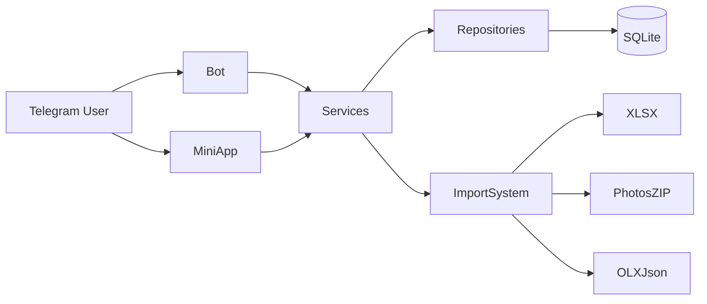
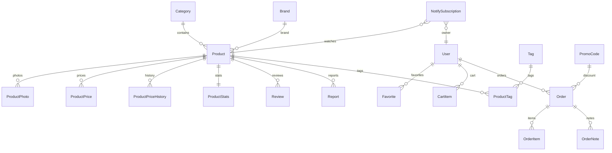
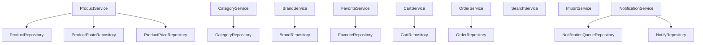
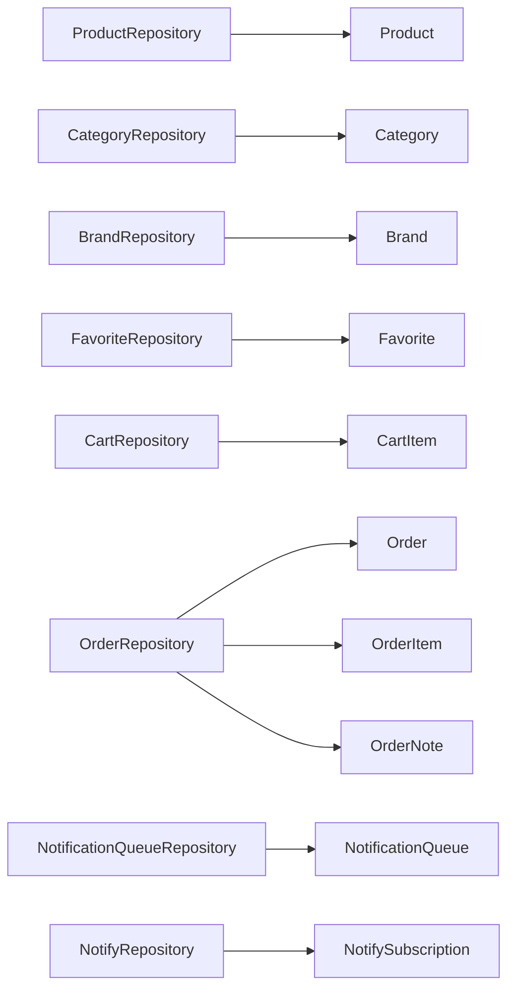
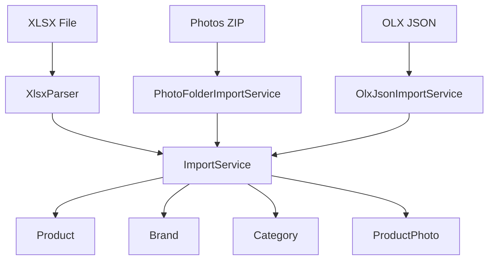
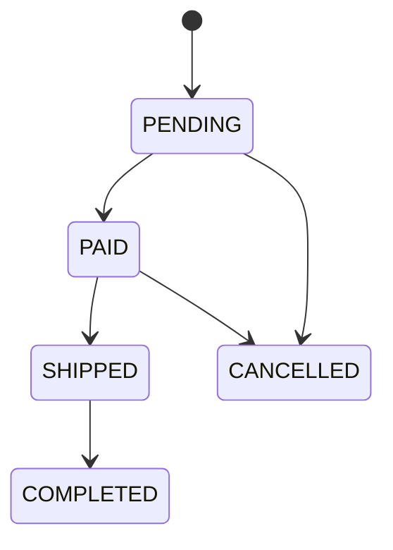
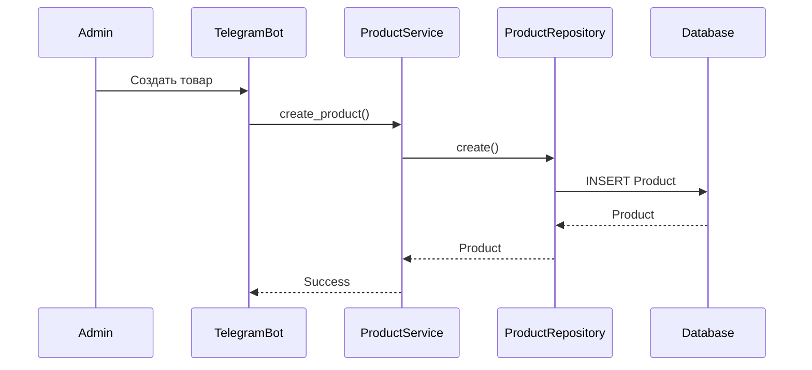
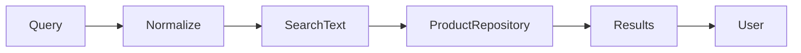

1. Общая архитектура

```mermaid
flowchart LR

User[Telegram User]

User --> Bot

User --> MiniApp

Bot --> Services

MiniApp --> Services

Services --> Repositories

Repositories --> Database[(SQLite)]

Services --> ImportSystem

ImportSystem --> XLSX

ImportSystem --> PhotosZIP

ImportSystem --> OLXJson
```

Получается:

2. Domain Model

```mermaid
erDiagram

Category ||--o{ Product : contains

Brand ||--o{ Product : brand

Product ||--o{ ProductPhoto : photos

Product ||--o{ ProductPrice : prices

Product ||--o{ ProductPriceHistory : history

Product ||--|| ProductStats : stats

User ||--o{ Favorite : favorites

User ||--o{ CartItem : cart

User ||--o{ Order : orders

Order ||--o{ OrderItem : items

Order ||--o{ OrderNote : notes

Product ||--o{ Review : reviews

Product ||--o{ Report : reports

Tag ||--o{ ProductTag : tags

Product ||--o{ ProductTag : tags

PromoCode ||--o{ Order : discount

NotifySubscription }o--|| Product : watches

NotifySubscription }o--|| User : owner
```
3. Service Layer

```mermaid
graph TD

ProductService

CategoryService

BrandService

FavoriteService

CartService

OrderService

SearchService

ImportService

NotificationService

ProductService --> ProductRepository

ProductService --> ProductPhotoRepository

ProductService --> ProductPriceRepository

CategoryService --> CategoryRepository

BrandService --> BrandRepository

FavoriteService --> FavoriteRepository

CartService --> CartRepository

OrderService --> OrderRepository

NotificationService --> NotificationQueueRepository

NotificationService --> NotifyRepository
```
4. Repository Layer

```mermaid
graph LR

ProductRepository --> Product

CategoryRepository --> Category

BrandRepository --> Brand

FavoriteRepository --> Favorite

CartRepository --> CartItem

OrderRepository --> Order

OrderRepository --> OrderItem

OrderRepository --> OrderNote

NotificationQueueRepository --> NotificationQueue

NotifyRepository --> NotifySubscription
```
5. Импорт товаров

```mermaid
flowchart TD

XLSX[XLSX File]

ZIP[Photos ZIP]

OLX[OLX JSON]

XLSX --> XlsxParser

ZIP --> PhotoFolderImportService

OLX --> OlxJsonImportService

XlsxParser --> ImportService

PhotoFolderImportService --> ImportService

OlxJsonImportService --> ImportService

ImportService --> Product

ImportService --> Brand

ImportService --> Category

ImportService --> ProductPhoto
```
6. Заказ

```mermaid
stateDiagram-v2

[*] --> PENDING

PENDING --> PAID

PAID --> SHIPPED

SHIPPED --> COMPLETED

PENDING --> CANCELLED

PAID --> CANCELLED
```
7. Создание товара

```mermaid
sequenceDiagram

Admin->>TelegramBot: Создать товар

TelegramBot->>ProductService: create_product()

ProductService->>ProductRepository: create()

ProductRepository->>Database: INSERT Product

Database-->>ProductRepository: Product

ProductRepository-->>ProductService: Product

ProductService-->>TelegramBot: Success
```
8. Поиск

```mermaid
flowchart LR

Query --> Normalize

Normalize --> SearchText

SearchText --> ProductRepository

ProductRepository --> Results

Results --> User
```
