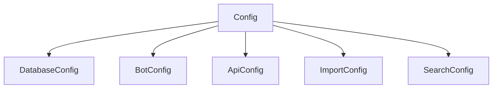
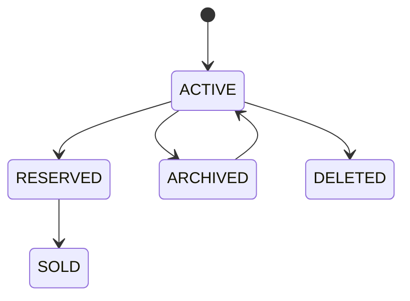
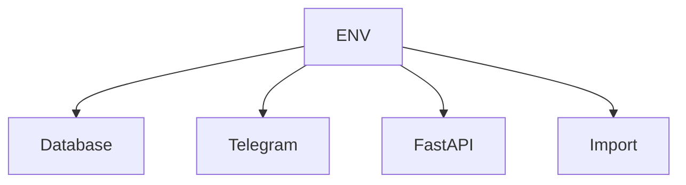
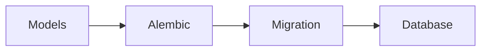
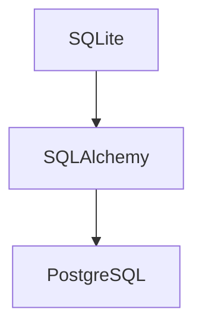
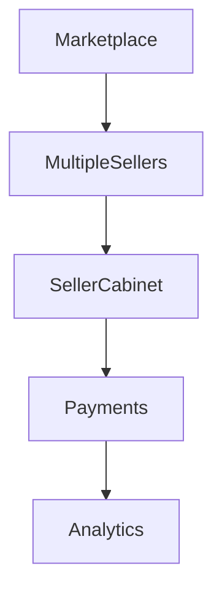

# Constants & Configuration Architecture

## Назначение

Подсистема конфигурации отвечает за:

* централизованное хранение констант;
* настройки приложения;
* ограничения БД;
* лимиты системы;
* настройки Telegram;
* настройки импорта;
* настройки поиска.

---

# Configuration Overview



---

# Constants Structure

```text
app/constants/

├── db_lengths.py
├── limits.py
├── statuses.py
├── price_types.py
├── currencies.py
├── product_conditions.py
├── notification_types.py
└── delivery_types.py
```

---

# Database Length Constants

## db_lengths.py

| Константа                  | Значение | Назначение         |
| -------------------------- | -------- | ------------------ |
| CATEGORY_NAME_MAX_LENGTH   | 80       | Название категории |
| CATEGORY_SLUG_MAX_LENGTH   | 120      | SEO slug категории |
| SEO_TITLE_MAX_LENGTH       | 150      | SEO title          |
| SEO_DESCRIPTION_MAX_LENGTH | 300      | SEO description    |
| PRODUCT_TITLE_MAX_LENGTH   | 500      | Название товара    |
| SKU_MAX_LENGTH             | 50       | Артикул            |
| BARCODE_MAX_LENGTH         | 255      | Штрихкод           |
| SERIAL_NUMBER_MAX_LENGTH   | 255      | Серийный номер     |

---

# System Limits

## limits.py

| Константа                | Значение | Назначение             |
| ------------------------ | -------- | ---------------------- |
| MAX_PRODUCT_IMAGES       | 9        | Фото товара            |
| MAX_FAVORITES            | 30       | Избранное              |
| MAX_ADMIN_PRODUCTS       | 1000     | Товаров администратора |
| MAX_IMPORT_ROWS          | 1000     | Строк XLSX             |
| MAX_SEARCH_RESULTS       | 100      | Результатов поиска     |
| MAX_NOTIFICATION_RETRIES | 5        | Повторных отправок     |

---

# Product Status Constants

## statuses.py



| Статус   |
| -------- |
| ACTIVE   |
| RESERVED |
| SOLD     |
| ARCHIVED |
| DELETED  |

---

# Product Conditions

## product_conditions.py

| Состояние |
| --------- |
| NEW       |
| LIKE_NEW  |
| USED      |
| FOR_PARTS |
| SERVICE   |

---

# Price Types

## price_types.py

| Тип        |
| ---------- |
| FIXED      |
| FROM       |
| RANGE      |
| ON_REQUEST |

---

# Currency Enum

## currencies.py

| Код |
| --- |
| UAH |
| USD |
| EUR |

---

# Delivery Types

## delivery_types.py

| Тип         |
| ----------- |
| NOVA_POSHTA |
| UKRPOSHTA   |
| PICKUP      |

---

# Environment Variables

## Назначение

Хранение секретов и параметров окружения.

---

# Environment Diagram



---

# .env Variables

## Database

| Переменная  | Назначение   |
| ----------- | ------------ |
| DB_HOST     | Сервер БД    |
| DB_PORT     | Порт         |
| DB_NAME     | Имя БД       |
| DB_USER     | Пользователь |
| DB_PASSWORD | Пароль       |

---

## Telegram

| Переменная | Назначение         |
| ---------- | ------------------ |
| BOT_TOKEN  | Telegram Bot Token |
| ADMIN_IDS  | Администраторы     |
| CHANNEL_ID | Канал уведомлений  |

---

## API

| Переменная | Назначение       |
| ---------- | ---------------- |
| API_HOST   | Хост             |
| API_PORT   | Порт             |
| API_DEBUG  | Режим разработки |

---

## Import

| Переменная        | Назначение         |
| ----------------- | ------------------ |
| IMPORT_PATH       | Каталог импорта    |
| PHOTO_IMPORT_PATH | Каталог фотографий |

---

# Database Indexes

## Назначение

Оптимизация поиска и выборок.

---

# Product Indexes

| Таблица  | Поле        |
| -------- | ----------- |
| products | uuid        |
| products | sku         |
| products | slug        |
| products | status      |
| products | category_id |
| products | brand_id    |

---

# Search Indexes

| Таблица    | Поле                   |
| ---------- | ---------------------- |
| products   | search_text_normalized |
| categories | slug                   |
| brands     | slug                   |

---

# Price Indexes

| Таблица        | Поле             |
| -------------- | ---------------- |
| product_prices | price_uah_cached |
| product_prices | currency         |
| product_prices | price_type       |

---

# Order Indexes

| Таблица | Поле       |
| ------- | ---------- |
| orders  | user_id    |
| orders  | status     |
| orders  | created_at |

---

# Favorite Indexes

| Таблица   | Поле       |
| --------- | ---------- |
| favorites | user_id    |
| favorites | product_id |

---

# Migration Architecture

## Alembic



---

# Migration Rules

## Разрешено

* создание таблиц;
* добавление индексов;
* добавление колонок;
* создание ENUM.

## Запрещено

* удаление данных;
* destructive migrations без backup.

---

# PostgreSQL Migration Strategy

## Архитектура



---

## Причины совместимости

| Причина                                |
| -------------------------------------- |
| Async SQLAlchemy                       |
| Repository Pattern                     |
| Alembic                                |
| Отсутствие SQLite-специфичных запросов |

---

# Full Project Tree

```text
app/

├── admin/
├── api/
│   ├── routers/
│   ├── dependencies/
│   ├── middleware/
│   ├── schemas/
│   └── responses/
│
├── bot/
│   ├── handlers/
│   ├── routers/
│   ├── keyboards/
│   ├── states/
│   ├── callbacks/
│   └── middlewares/
│
├── constants/
│
├── database/
│   ├── models/
│   ├── repositories/
│   ├── migrations/
│   └── session.py
│
├── imports/
│   ├── dto/
│   ├── models/
│   ├── parsers/
│   ├── validators/
│   └── services/
│
├── services/
│
├── tasks/
│
├── utils/
│
├── locales/
│
└── seeds/
```

---

# ADR (Architecture Decision Records)

## ADR-001

### Repository Pattern

Решение:

Использовать отдельный слой Repository.

Причины:

* тестируемость;
* замена БД;
* изоляция SQL.

---

## ADR-002

### Integer Money

Решение:

Все денежные значения хранить как Integer.

Причины:

* отсутствие ошибок округления;
* скорость фильтрации;
* простота индексации.

---

## ADR-003

### Weight Storage

Решение:

Вес хранить как Integer.

Единица измерения:

```text
граммы
```

Пример:

```python
1250
```

=

```text
1.25 кг
```

---

## ADR-004

### Currency Storage

Решение:

```python
currency = "USD"
```

а не:

```python
currency_id = 2
```

Причины:

* проще импорт;
* проще экспорт;
* проще работа через DBeaver;
* не нужен JOIN.

---

## ADR-005

### Product Photos

Решение:

Хранить Telegram File ID.

Не хранить бинарные файлы в БД.

---

## ADR-006

### Search Normalization

Поддерживать:

* Ё → Е
* Ъ → Ь
* исправление раскладки

---

# Roadmap

## v1.1

### Готово

* БД
* модели
* Alembic
* Repository Layer
* Import System
* Pricing System
* Notification System

---

## v1.2

### Планируется

* FastAPI
* Mini App
* Product Reviews UI
* Admin Dashboard
* Statistics Dashboard

---

## v2.0

### Планируется



---

# Architecture Status

| Модуль        | Статус |
| ------------- | ------ |
| Database      | ✅      |
| Models        | ✅      |
| Repositories  | ✅      |
| Services      | ✅      |
| Import        | ✅      |
| Search        | ✅      |
| Pricing       | ✅      |
| Notifications | ✅      |
| Telegram Bot  | 🚧     |
| FastAPI       | 🚧     |
| Mini App      | 🚧     |
| Marketplace   | 📋     |

---

# TELESHOP Architecture Version

```text
TELESHOP_ARCHITECTURE_v1.1
```

Статус документа:

```text
WORKING DRAFT BASED ON CURRENT PROJECT STATE
```
