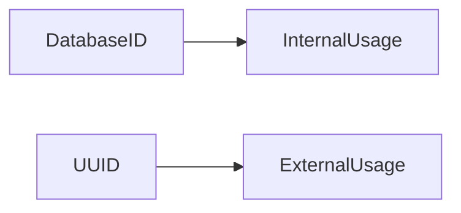
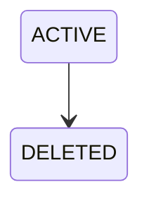
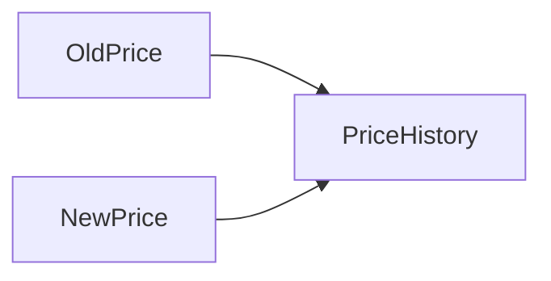
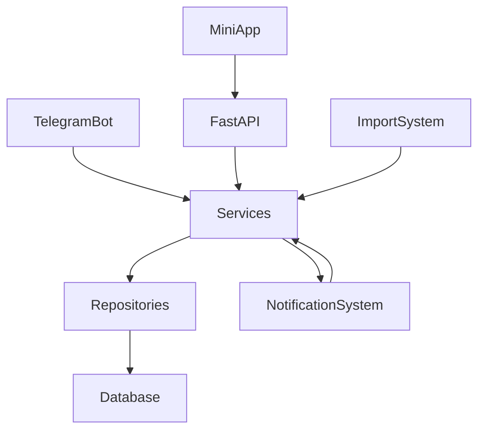

# Database Design Rules

## Назначение

Данный раздел фиксирует архитектурные правила хранения данных TELESHOP.

Изменение этих правил требует отдельного ADR.

---

# Primary Keys

## Правило

Все таблицы используют:

```python
id: Integer
```

---

## Причины

* проще индексация;
* меньше размер индексов;
* быстрее JOIN;
* проще миграция SQLite → PostgreSQL.

---

# UUID Policy

## Product

Дополнительно используется:

```python
uuid: String(36)
```

---

## Назначение

Используется для:

* API
* импорта
* внешних интеграций
* будущего Marketplace

UUID Policy для Product — это архитектурное правило проекта, согласно которому у каждого товара в базе данных, помимо стандартного порядкового номера id (1, 2, 3...), обязательно генерируется глобальный уникальный идентификатор UUID версии 4 (строка из 36 символов, например: 123e4567-e89b-12d3-a456-426614174000).

Зачем это сделано (инженерный разбор):
Безопасность API и Mini App:
Пользователь в веб-интерфейсе (Mini App) не должен видеть обычные id в ссылках (например, teleshop.com/product/15). Если оставить порядковый id, злоумышленник сможет запустить парсер, который просто перебирает числа от 1 до бесконечности, и выкачает всю вашу базу товаров или заказов. Запросы через UUID (teleshop.com/product/4a2f8c...) перебрать невозможно.

Надежный импорт данных (XLSX / ZIP):
Когда вы будете обновлять каталог через импорт, файлу нельзя привязываться к внутренним id базы SQLite. Если выгрузить товары, изменить цены и залить обратно — UUID выступает сквозным "ключом-мостом". Скрипт импорта проверяет: "Есть ли в базе товар с таким UUID? Да — обновляем цену. Нет — создаем новый товар".

Внешние интеграции и Marketplace:
Если в будущем к вашему магазину будут подключаться внешние поставщики, CRM-системы (например, CRM для учета остатков) или другие боты, обмен данными между разными базами без конфликтов возможен только через UUID. Порядковые id у всех баз разные, а UUID уникален во всей вселенной.

Как это хранится в SQLite:
Так как в SQLite нет родного типа UUID, SQLAlchemy сохраняет его как String(36). При создании нового товара в слое репозитория или в самой модели по умолчанию вызывается функция uuid.uuid4(). Изменять его вручную после создания товара нельзя — он генерируется один раз и на всю жизнь товара.

---

## Диаграмма



---

# Money Rules

## Обязательное правило

Все денежные значения хранятся как:

```python
Integer
```

---

## Используется

| Таблица               | Поле             |
| --------------------- | ---------------- |
| product_prices        | price_from_value |
| product_prices        | price_to_value   |
| product_prices        | price_uah_cached |
| product_price_history | old_price        |
| product_price_history | new_price        |
| orders                | total_price      |
| order_items           | price            |
| order_items           | total            |
| promo_codes           | discount_amount  |

---

## Запрещено

```python
Float
```

---

# Weight Rules

## Правило

Вес хранится только в граммах.

---

## Тип

```python
Integer
```

---

## Примеры

```text
250
500
1250
10000
```

---

## Интерпретация

| Значение | Вес     |
| -------- | ------- |
| 250      | 250 г   |
| 1250     | 1.25 кг |
| 10000    | 10 кг   |

---

# Rating Rules

## Исключение из правила Money

Рейтинг хранится как:

```python
Numeric(3,2)
```

---

## Примеры

```python
5.00

4.95

4.50

3.75
```

---

## Почему

Средняя оценка вычисляется:

```text
5
5
4
5
4
```

↓

```text
4.60
```

---

# Soft Delete Policy

## Правило

Физическое удаление не используется.

---

## Вместо этого

```python
status = DELETED
```

---

## Диаграмма



---

# Photo Storage Policy

## Запрещено

Хранение изображений в БД.

---

## Разрешено

Хранение Telegram File ID.

---

## Структура

```python
telegram_file_id

telegram_file_unique_id

original_filename
```

---

# Search Storage Policy

## Правило

Для каждого товара хранится:

```python
search_text

search_text_normalized
```

---

## Назначение

Быстрый поиск без вычислений во время запроса.

---

# JSON Storage Policy

## Разрешённые JSON поля

| Поле            |
| --------------- |
| attributes_json |
| payload_json    |

---

## Назначение

Гибкое хранение характеристик.

---

# Audit Policy

## Изменения цены

Всегда сохраняются.

---

## Таблица

```python
product_price_history
```

---

## Изменение цены



---

# Foreign Key Rules

## Все связи должны использовать FK

Примеры:

```python
category_id

brand_id

product_id

user_id

order_id
```

---

## Запрещено

Хранение строковых ссылок.

Пример:

```python
category_name
brand_name
```

вместо FK.

---

# Timestamp Policy

## Все основные сущности содержат

```python
created_at

updated_at
```

---

## Используется

| Таблица              |
| -------------------- |
| products             |
| users                |
| categories           |
| brands               |
| orders               |
| promo_codes          |
| notify_subscriptions |

---

# Repository Rule

## Запрещено

SQL внутри Handler.

---

## Запрещено

SQL внутри Service.

---

## Разрешено

Только через Repository.

---

## Схема


---

# Service Rule

## Service отвечает за

* бизнес-логику;
* валидацию;
* транзакции;
* интеграции.

---

## Repository отвечает за

* SQL;
* выборки;
* сохранение.

---

# Architecture Principles

## Principle 1

Single Source Of Truth.

---

## Principle 2

Repository Pattern.

---

## Principle 3

Service Layer.

---

## Principle 4

Soft Delete.

---

## Principle 5

Integer Money Storage.

---

## Principle 6

Telegram File Storage.

---

## Principle 7

SQLite First, PostgreSQL Ready.

---

# Final Architecture Diagram


