# API Architecture

## Общая схема запросов

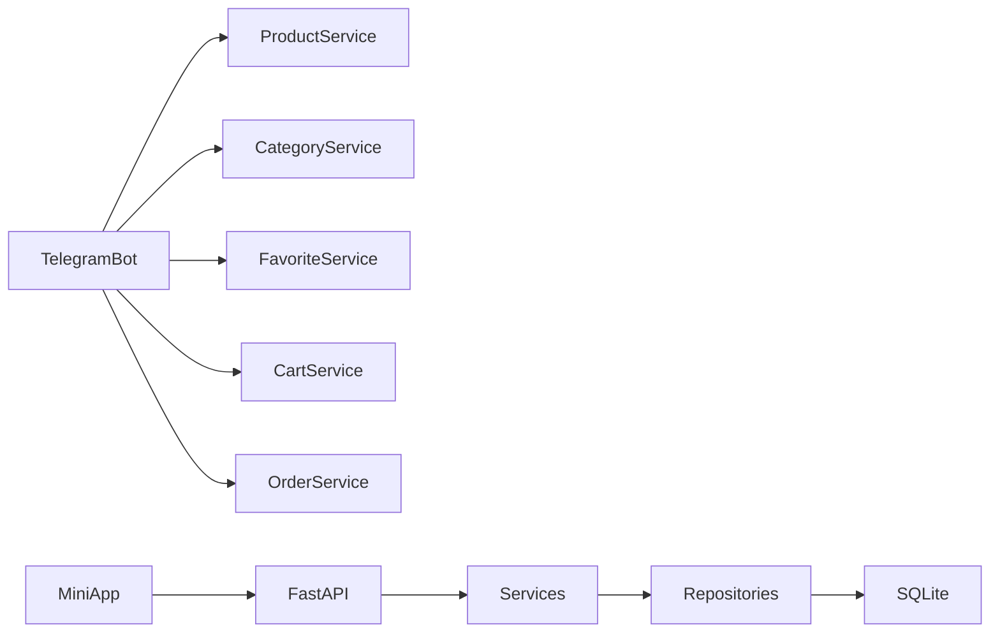

---

# Product API

## Диаграмма

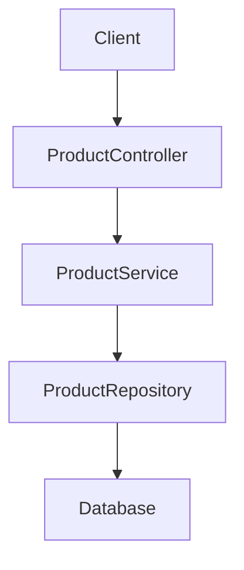

---

## Endpoints

| Method | URL                         | Назначение           |
| ------ | --------------------------- | -------------------- |
| GET    | /api/products               | Список товаров       |
| GET    | /api/products/{id}          | Карточка товара      |
| GET    | /api/products/slug/{slug}   | Получить по slug     |
| GET    | /api/products/sku/{sku}     | Получить по SKU      |
| POST   | /api/products               | Создать товар        |
| PATCH  | /api/products/{id}          | Изменить товар       |
| DELETE | /api/products/{id}          | Удалить товар        |
| GET    | /api/products/featured      | Рекомендуемые товары |
| GET    | /api/products/category/{id} | Товары категории     |

---

# Category API

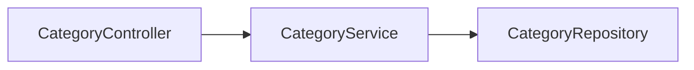

## Endpoints

| Method | URL                  |
| ------ | -------------------- |
| GET    | /api/categories      |
| GET    | /api/categories/tree |
| GET    | /api/categories/{id} |
| POST   | /api/categories      |
| PATCH  | /api/categories/{id} |
| DELETE | /api/categories/{id} |

---

# Brand API

## Endpoints

| Method | URL              |
| ------ | ---------------- |
| GET    | /api/brands      |
| GET    | /api/brands/{id} |
| POST   | /api/brands      |
| PATCH  | /api/brands/{id} |
| DELETE | /api/brands/{id} |

---

# Search API

## Диаграмма

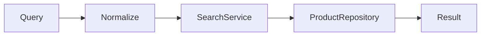

---

## Endpoints

| Method | URL                    |
| ------ | ---------------------- |
| GET    | /api/search            |
| GET    | /api/search/products   |
| GET    | /api/search/categories |

---

# Favorites API

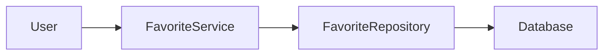

---

## Endpoints

| Method | URL                         |
| ------ | --------------------------- |
| GET    | /api/favorites              |
| POST   | /api/favorites              |
| DELETE | /api/favorites/{product_id} |

---

# Cart API

## Диаграмма

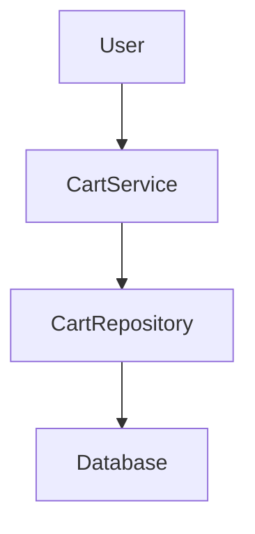

---

## Endpoints

| Method | URL                   |
| ------ | --------------------- |
| GET    | /api/cart             |
| POST   | /api/cart/add         |
| PATCH  | /api/cart/update      |
| DELETE | /api/cart/remove/{id} |
| DELETE | /api/cart/clear       |

---

# Order API

## Диаграмма

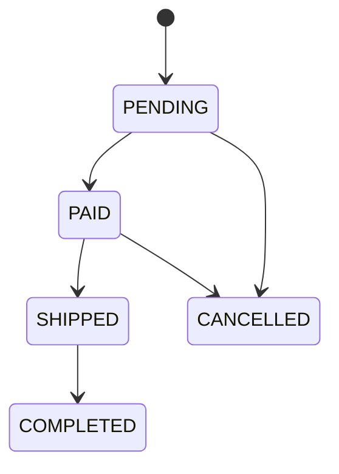

---

## Endpoints

| Method | URL                       |
| ------ | ------------------------- |
| GET    | /api/orders               |
| GET    | /api/orders/{id}          |
| POST   | /api/orders               |
| POST   | /api/orders/{id}/pay      |
| POST   | /api/orders/{id}/ship     |
| POST   | /api/orders/{id}/complete |
| POST   | /api/orders/{id}/cancel   |

---

# Notification API

## Диаграмма

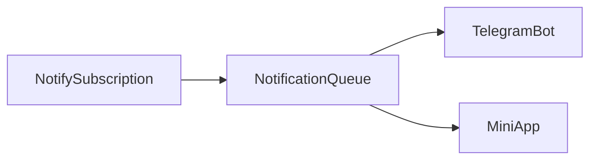

---

## Endpoints

| Method | URL                            |
| ------ | ------------------------------ |
| GET    | /api/notifications             |
| POST   | /api/notifications/subscribe   |
| POST   | /api/notifications/unsubscribe |

---

# DTO Layer

## Общая схема

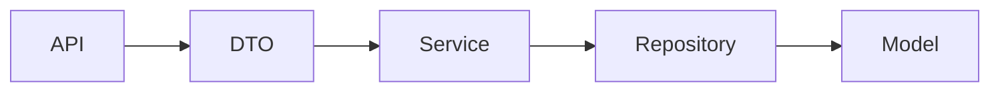

---

# ProductCreateDTO

| Поле              | Тип | Назначение       |
| ----------------- | --- | ---------------- |
| title             | str | Название товара  |
| category_id       | int | Категория        |
| brand_id          | int | Бренд            |
| sku               | str | Артикул          |
| short_description | str | Краткое описание |
| full_description  | str | Полное описание  |
| quantity          | int | Остаток          |
| weight_g          | int | Вес              |
| condition         | str | Состояние        |

---

# ProductUpdateDTO

| Поле              | Тип |
| ----------------- | --- |
| title             | str |
| category_id       | int |
| brand_id          | int |
| short_description | str |
| full_description  | str |
| quantity          | int |
| weight_g          | int |

---

# ProductImportDTO

## Используется

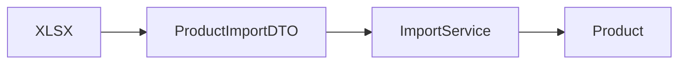

---

| Поле        | Тип     | Назначение |
| ----------- | ------- | ---------- |
| sku         | str     | Артикул    |
| title       | str     | Название   |
| category    | str     | Категория  |
| brand       | str     | Бренд      |
| price       | decimal | Цена       |
| currency    | str     | Валюта     |
| condition   | str     | Состояние  |
| description | str     | Описание   |
| weight_g    | int     | Вес        |

---

# Import Architecture

## Полная схема импорта

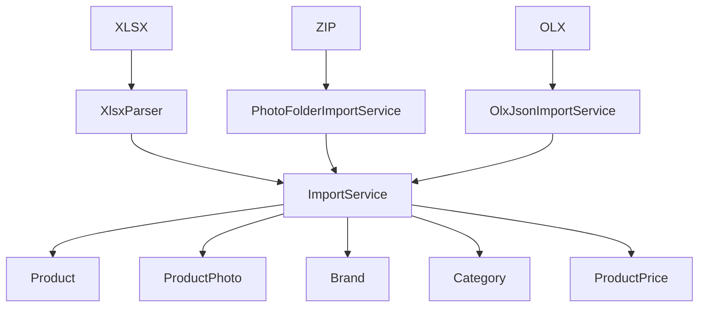

---

# Import Services

| Сервис                   | Назначение               |
| ------------------------ | ------------------------ |
| ImportService            | Основной импорт          |
| ImportPreviewService     | Предварительная проверка |
| BrandImportService       | Импорт брендов           |
| CategoryImportService    | Импорт категорий         |
| PhotoFolderImportService | Импорт фотографий        |
| OlxJsonImportService     | Импорт выгрузки OLX      |
| XlsxParser               | Разбор XLSX              |

---

# XLSX Структура

| Колонка     | Назначение |
| ----------- | ---------- |
| sku         | Артикул    |
| title       | Название   |
| category    | Категория  |
| brand       | Бренд      |
| price       | Цена       |
| currency    | Валюта     |
| condition   | Состояние  |
| description | Описание   |
| weight_g    | Вес        |

---

# ZIP Структура

```text
photos.zip

SKU0001/
 ├─ 1.jpg
 ├─ 2.jpg
 └─ 3.jpg

SKU0002/
 ├─ 1.jpg

SKU0003/
 ├─ 1.jpg
 ├─ 2.jpg
```

---

# Полная схема TELESHOP

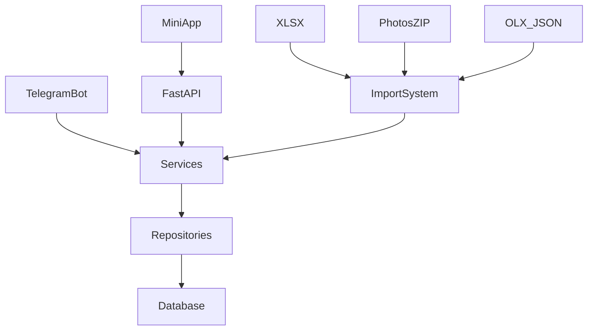
