# Telegram Bot Architecture

## Общая схема

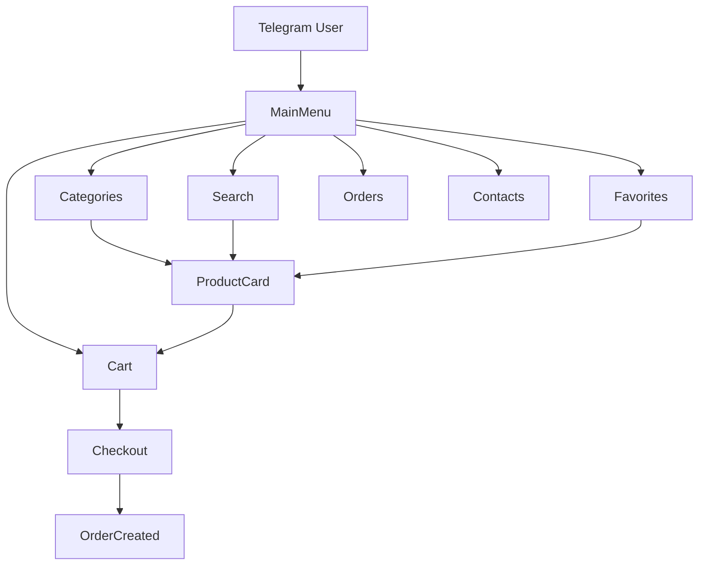

---

# Структура Bot Layer

```text
app/bot/

├── handlers/
├── keyboards/
├── middlewares/
├── filters/
├── states/
├── callbacks/
├── utils/
└── routers.py
```

---

# Handler Architecture

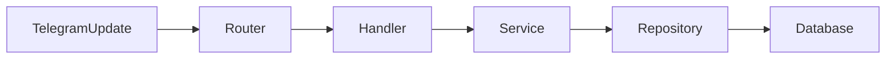

---

# Главный экран

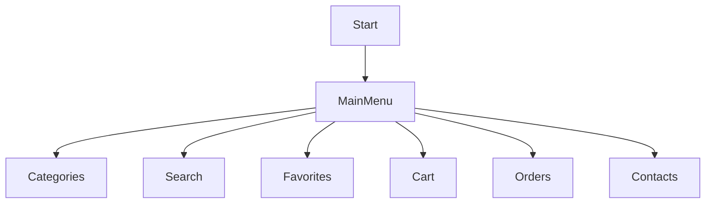

---

## Главное меню

| Кнопка       | Действие          |
| ------------ | ----------------- |
| 🏪 Категории | Каталог товаров   |
| 🔍 Поиск     | Поиск товаров     |
| ⭐ Избранное  | Избранное         |
| 🛒 Корзина   | Корзина           |
| 📦 Заказы    | История заказов   |
| ☎️ Контакты  | Контакты магазина |

---

# Каталог

## Навигация

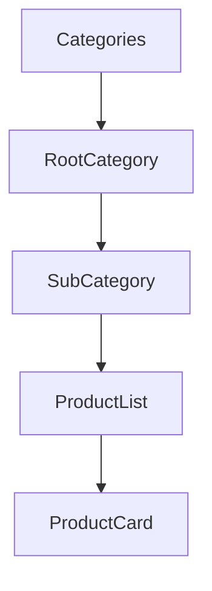

---

# Карточка товара

## Сценарий

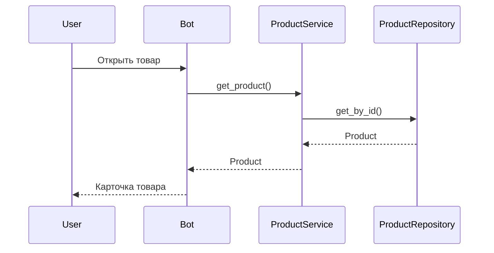

---

## Кнопки товара

| Кнопка        | Действие             |
| ------------- | -------------------- |
| 🛒 В корзину  | Добавить товар       |
| ⭐ В избранное | Добавить в избранное |
| 📷 Фото       | Галерея              |
| 🎥 Видео      | Видеообзор           |
| 🔗 Поделиться | Ссылка               |
| 📞 Связаться  | Контакты продавца    |

---

# Поиск

## Архитектура

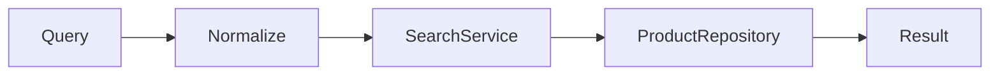

---

## Поддержка поиска

| Возможность        | Поддержка |
| ------------------ | --------- |
| По названию        | Да        |
| По SKU             | Да        |
| По бренду          | Да        |
| По описанию        | Да        |
| По тегам           | Да        |
| Без регистра       | Да        |
| Ё → Е              | Да        |
| Ъ → Ь              | Да        |
| Неверная раскладка | Да        |

---

# FSM Поиск

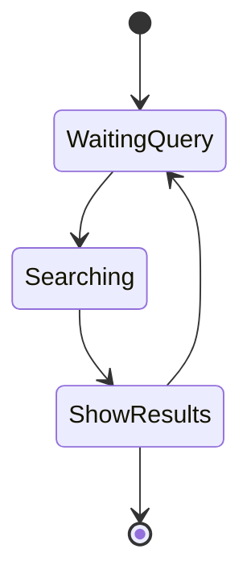

---

# Избранное

## Сценарий

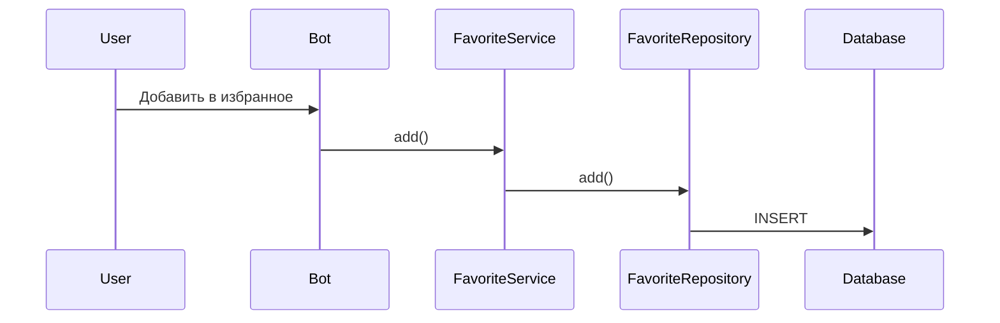

---

## Ограничения

```python
MAX_FAVORITES = 30
```

---

# Корзина

## Сценарий

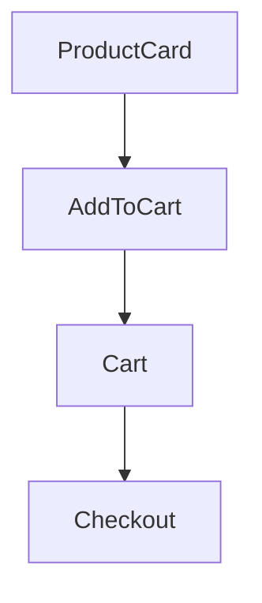

---

## Кнопки корзины

| Кнопка | Действие             |
| ------ | -------------------- |
| ➕      | Увеличить количество |
| ➖      | Уменьшить количество |
| ❌      | Удалить товар        |
| 🧹     | Очистить корзину     |
| ✅      | Оформить заказ       |

---

# FSM Корзина

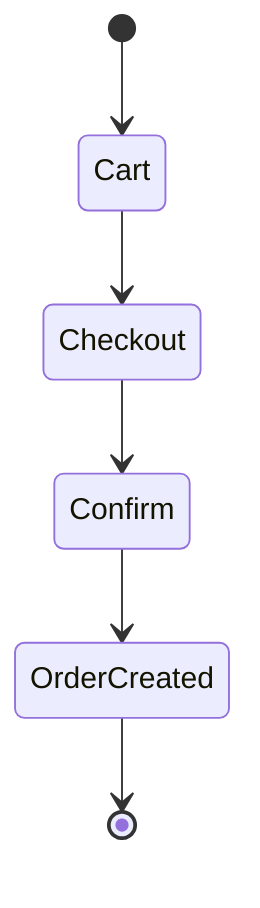

---

# Оформление заказа

## Сценарий

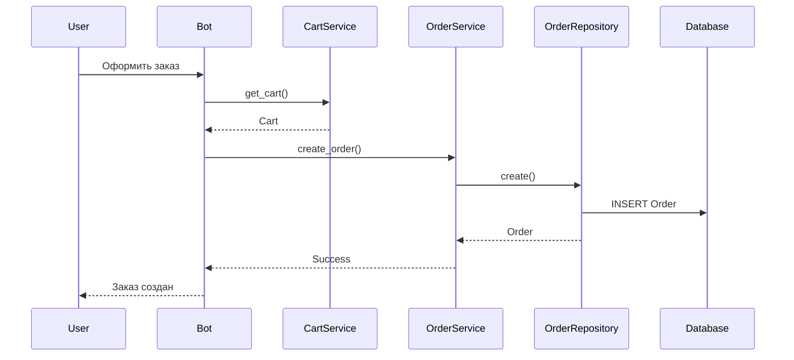

---

# История заказов

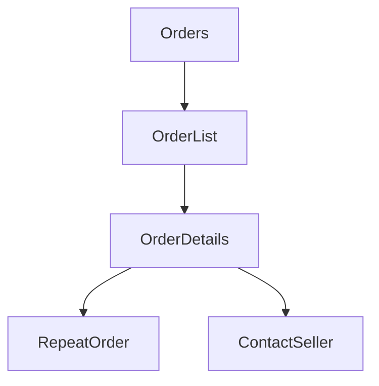

---

# Статусы заказа

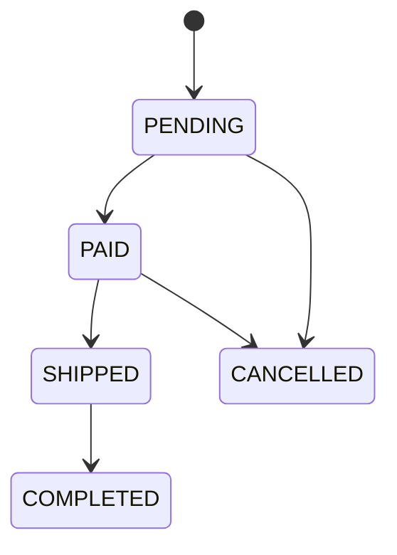

---

# Уведомления

## Архитектура

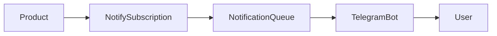

---

# Фото товара

## Архитектура

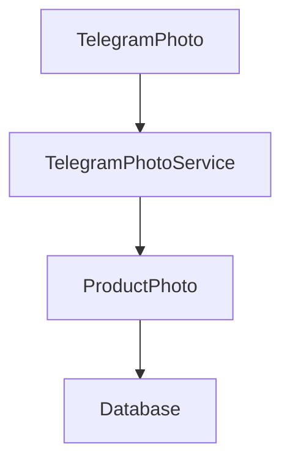

---

# Альбом фотографий

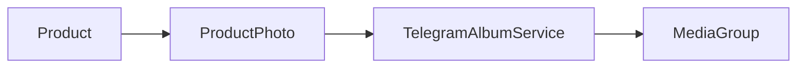

---

# Административный раздел

## Возможности

| Раздел       | Функция                   |
| ------------ | ------------------------- |
| Товары       | Управление товарами       |
| Категории    | Управление категориями    |
| Бренды       | Управление брендами       |
| Импорт       | XLSX импорт               |
| Фото         | Импорт ZIP                |
| Заказы       | Управление заказами       |
| Промокоды    | Управление скидками       |
| Пользователи | Управление пользователями |
| Уведомления  | Массовые рассылки         |

---

# Admin Flow

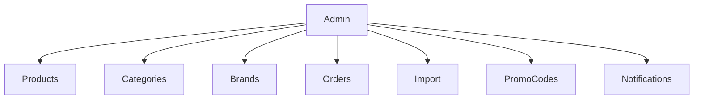

---

# Полная схема Telegram Bot

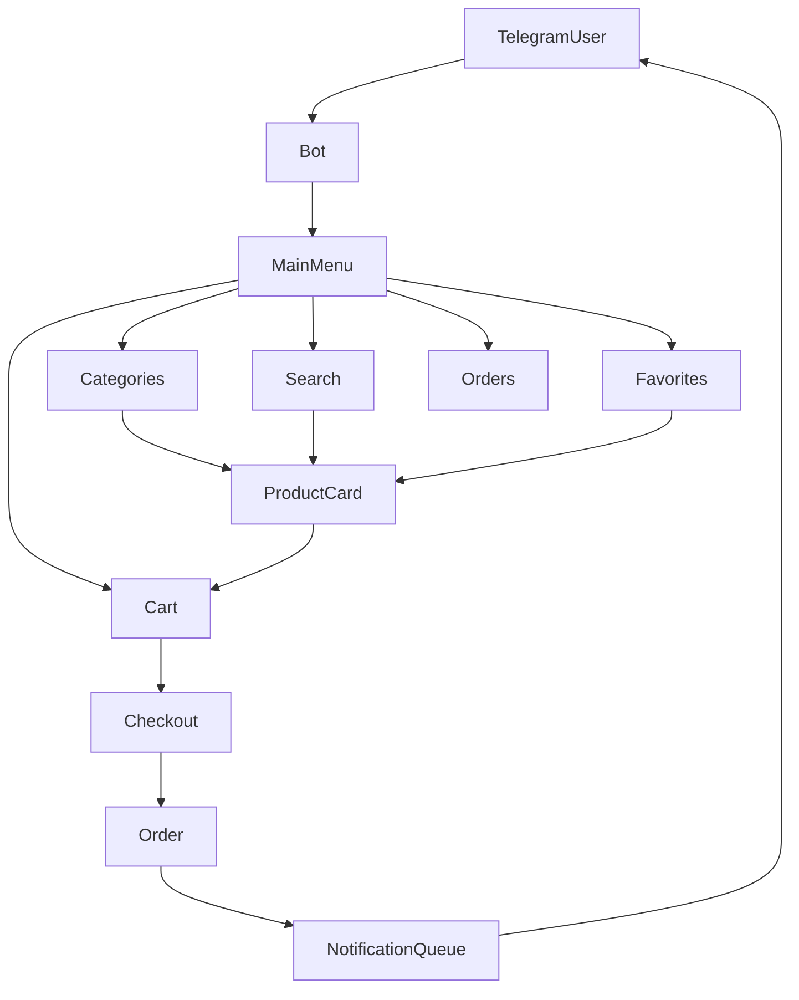
