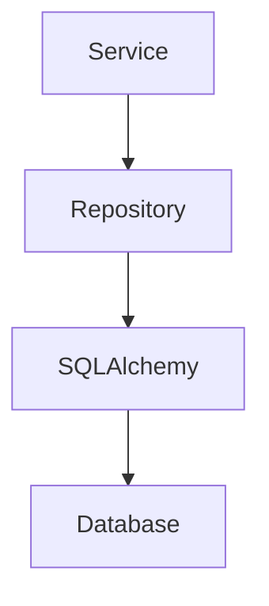

# Repository Layer

## Общая схема



---

# BaseRepository

Базовый репозиторий.

Используется всеми остальными репозиториями.

## Методы

| Метод       | Назначение             |
| ----------- | ---------------------- |
| create()    | Создание записи        |
| get_by_id() | Получение по ID        |
| update()    | Обновление записи      |
| delete()    | Удаление записи        |
| exists()    | Проверка существования |
| count()     | Количество записей     |
| paginate()  | Постраничная выборка   |

---

# ProductRepository

Работа с товарами.

## Методы

| Метод                         | Назначение                 |
| ----------------------------- | -------------------------- |
| create()                      | Создать товар              |
| update()                      | Обновить товар             |
| delete()                      | Удалить товар              |
| get_by_id()                   | Найти по ID                |
| get_by_uuid()                 | Найти по UUID              |
| get_by_sku()                  | Найти по SKU               |
| get_by_slug()                 | Найти по SEO URL           |
| get_by_status()               | Получить товары по статусу |
| get_by_category()             | Получить товары категории  |
| get_featured()                | Рекомендуемые товары       |
| search()                      | Поиск товаров              |
| get_products_without_photos() | Товары без фотографий      |
| increment_views()             | Увеличить просмотры        |

---

# ProductPhotoRepository

Работа с фотографиями.

## Методы

| Метод              | Назначение             |
| ------------------ | ---------------------- |
| create()           | Добавить фото          |
| delete()           | Удалить фото           |
| get_by_product()   | Фото товара            |
| get_main_photo()   | Главное фото           |
| set_main_photo()   | Назначить главное фото |
| reorder()          | Изменить порядок фото  |
| count_by_product() | Количество фото        |

---

# ProductPriceRepository

Работа с ценами.

## Методы

| Метод                | Назначение               |
| -------------------- | ------------------------ |
| create()             | Создать цену             |
| update_price()       | Изменить цену            |
| get_current_price()  | Получить актуальную цену |
| get_history()        | История цен              |
| add_history_record() | Добавить запись истории  |

---

# CategoryRepository

## Методы

| Метод                 | Назначение         |
| --------------------- | ------------------ |
| create()              | Создать категорию  |
| update()              | Обновить категорию |
| delete()              | Удалить категорию  |
| get_by_id()           | Получить категорию |
| get_by_slug()         | Найти по slug      |
| get_root_categories() | Корневые категории |
| get_children()        | Дочерние категории |
| get_tree()            | Дерево категорий   |

---

# BrandRepository

## Методы

| Метод         | Назначение     |
| ------------- | -------------- |
| create()      | Создать бренд  |
| update()      | Обновить бренд |
| delete()      | Удалить бренд  |
| get_by_id()   | Найти бренд    |
| get_by_name() | Найти бренд    |
| get_all()     | Все бренды     |

---

# FavoriteRepository

## Методы

| Метод                | Назначение             |
| -------------------- | ---------------------- |
| add()                | Добавить в избранное   |
| remove()             | Удалить из избранного  |
| exists()             | Проверить наличие      |
| get_user_favorites() | Избранное пользователя |
| count_by_product()   | Количество добавлений  |

---

# CartRepository

## Методы

| Метод             | Назначение          |
| ----------------- | ------------------- |
| add_item()        | Добавить товар      |
| remove_item()     | Удалить товар       |
| clear_cart()      | Очистить корзину    |
| get_user_cart()   | Получить корзину    |
| update_quantity() | Изменить количество |
| calculate_total() | Подсчитать сумму    |

---

# OrderRepository

## Методы

| Метод             | Назначение          |
| ----------------- | ------------------- |
| create_order()    | Создать заказ       |
| get_by_id()       | Получить заказ      |
| get_user_orders() | Заказы пользователя |
| add_item()        | Добавить товар      |
| add_note()        | Добавить заметку    |
| update_status()   | Изменить статус     |
| cancel_order()    | Отменить заказ      |

---

# NotificationQueueRepository

## Методы

| Метод         | Назначение            |
| ------------- | --------------------- |
| enqueue()     | Добавить уведомление  |
| get_pending() | Очередь отправки      |
| mark_sent()   | Пометить отправленным |
| mark_failed() | Пометить ошибкой      |
| retry()       | Повторная отправка    |

---

# NotifyRepository

## Методы

| Метод                     | Назначение         |
| ------------------------- | ------------------ |
| subscribe()               | Создать подписку   |
| unsubscribe()             | Отписаться         |
| get_subscriptions()       | Получить подписки  |
| get_product_subscribers() | Подписчики товара  |
| activate()                | Включить подписку  |
| deactivate()              | Выключить подписку |

````

---

```md
# Service Layer

## Схема

```mermaid
flowchart TD

TelegramBot --> Services

MiniApp --> Services

Services --> Repositories
````

# ProductService

## Ответственность

* создание товаров
* изменение товаров
* резервирование
* продажа
* управление фото
* управление ценами

## Методы

| Метод             |
| ----------------- |
| create_product()  |
| update_product()  |
| delete_product()  |
| reserve_product() |
| mark_as_sold()    |
| archive_product() |
| add_photo()       |
| remove_photo()    |
| change_price()    |
| increment_views() |

---

# CategoryService

| Метод                 |
| --------------------- |
| create_category()     |
| update_category()     |
| delete_category()     |
| get_tree()            |
| get_menu_categories() |

---

# FavoriteService

| Метод                   |
| ----------------------- |
| add_to_favorites()      |
| remove_from_favorites() |
| get_user_favorites()    |

---

# CartService

| Метод             |
| ----------------- |
| add_item()        |
| remove_item()     |
| clear_cart()      |
| get_cart()        |
| calculate_total() |

---

# OrderService

| Метод            |
| ---------------- |
| create_order()   |
| pay_order()      |
| ship_order()     |
| complete_order() |
| cancel_order()   |

---

# SearchService

| Метод                 |
| --------------------- |
| search_products()     |
| normalize_query()     |
| replace_yo()          |
| replace_hard_sign()   |
| fix_keyboard_layout() |

---

# ImportService

| Метод            |
| ---------------- |
| import_xlsx()    |
| import_photos()  |
| validate_rows()  |
| preview_import() |

---

# TelegramPhotoService

| Метод            |
| ---------------- |
| upload_photo()   |
| download_photo() |
| save_file_id()   |

---

# TelegramAlbumService

| Метод          |
| -------------- |
| create_album() |
| send_album()   |

---

# SKUService

| Метод          |
| -------------- |
| generate_sku() |
| validate_sku() |
| reserve_sku()  |

```
```
