# Database Schema

## Полная ERD диаграмма

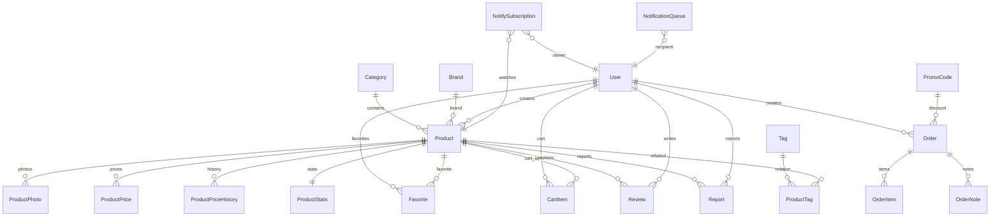

---

# Database Modules

```mermaid
flowchart TD

ProductsModule

OrdersModule

CatalogModule

UsersModule

NotificationsModule

ImportModule

ProductsModule --> Product

ProductsModule --> ProductPhoto

ProductsModule --> ProductPrice

ProductsModule --> ProductPriceHistory

ProductsModule --> ProductStats

CatalogModule --> Category

CatalogModule --> Brand

CatalogModule --> Tag

CatalogModule --> ProductTag

UsersModule --> User

UsersModule --> Favorite

UsersModule --> CartItem

UsersModule --> Review

UsersModule --> Report

OrdersModule --> Order

OrdersModule --> OrderItem

OrdersModule --> OrderNote

OrdersModule --> PromoCode

NotificationsModule --> NotificationQueue

NotificationsModule --> NotifySubscription

ImportModule --> Product

ImportModule --> Category

ImportModule --> Brand
```

---

# ENUMS

## ProductStatus

Используется для управления жизненным циклом товара.

| Значение | Назначение     |
| -------- | -------------- |
| ACTIVE   | Активный товар |
| RESERVED | Зарезервирован |
| SOLD     | Продан         |
| ARCHIVED | Архив          |
| DELETED  | Удалён         |

---

## Диаграмма состояний товара

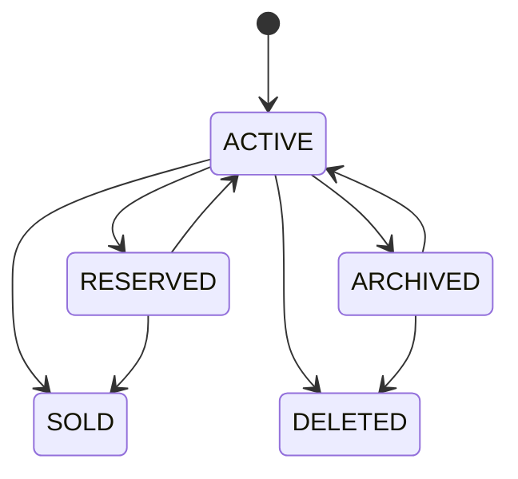

---

## ProductCondition

| Значение  | Назначение            |
| --------- | --------------------- |
| NEW       | Новый товар           |
| LIKE_NEW  | Состояние нового      |
| USED      | Бывший в употреблении |
| FOR_PARTS | На запчасти           |
| SERVICE   | Услуга                |

---

## PriceType

| Значение   | Назначение         |
| ---------- | ------------------ |
| FIXED      | Фиксированная цена |
| NEGOTIABLE | Возможен торг      |
| FROM       | Цена от            |
| ON_REQUEST | Цена по запросу    |

---

## OrderStatus

| Значение  | Назначение     |
| --------- | -------------- |
| PENDING   | Ожидает оплаты |
| PAID      | Оплачен        |
| SHIPPED   | Отправлен      |
| COMPLETED | Завершён       |
| CANCELLED | Отменён        |

---

## NotificationStatus

| Значение   | Назначение       |
| ---------- | ---------------- |
| PENDING    | Ожидает отправки |
| PROCESSING | Обрабатывается   |
| SENT       | Отправлено       |
| FAILED     | Ошибка отправки  |
| CANCELLED  | Отменено         |

---

# Константы проекта

## Лимиты

| Константа          | Значение | Назначение                   |
| ------------------ | -------- | ---------------------------- |
| MAX_PRODUCT_IMAGES | 9        | Максимум фото товара         |
| MAX_FAVORITES      | 30       | Максимум избранного          |
| MAX_ADMIN_PRODUCTS | 1000     | Лимит товаров администратора |

---

## Ограничения строк

| Константа                  | Значение |
| -------------------------- | -------- |
| CATEGORY_NAME_MAX_LENGTH   | 80       |
| CATEGORY_SLUG_MAX_LENGTH   | 120      |
| SEO_TITLE_MAX_LENGTH       | 150      |
| SEO_DESCRIPTION_MAX_LENGTH | 300      |

---

# SKU Architecture

## Генерация SKU

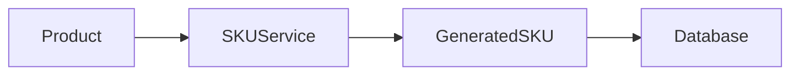

---

## Формат

```text
DA0001
DA0002
DA0003

...

DA9999

DB0001
DB0002
```

---

# Search Architecture

## Общая схема

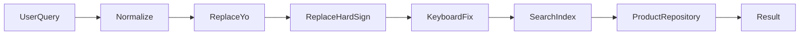

---

## Нормализация

### Ё → Е

```text
ЛЁГКИЙ
ЛЕГКИЙ
```

---

### Ъ → Ь

```text
ОБЪЕКТИВ
ОБЬЕКТИВ
```

---

### Исправление раскладки

```text
ktqrf
leqka
```

↓

```text
лейка
```

---

# Statistics Architecture

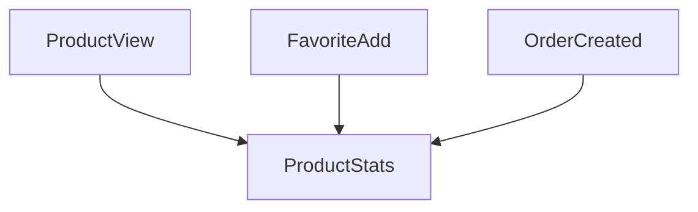

---

# SEO Architecture

## Генерация URL

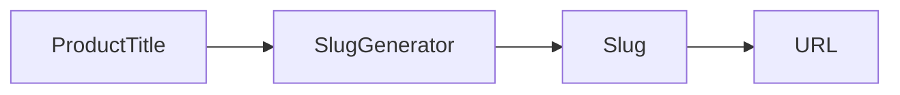

---

## Пример

```text
Leica M500-N
```

↓

```text
leica-m500-n
```

↓

```text
/produkty/leica-m500-n
```

---

# Currency System

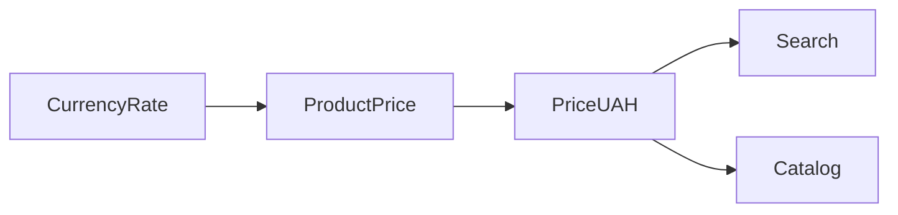

---

## Поддерживаемые валюты

| Валюта     | Код |
| ---------- | --- |
| Гривна     | UAH |
| Доллар США | USD |
| Евро       | EUR |

---

# Notification System

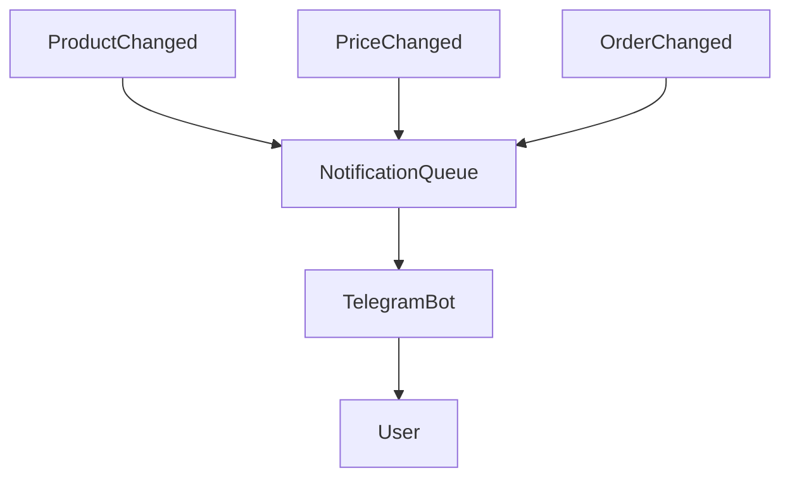

---

# Audit Trail

## История цены

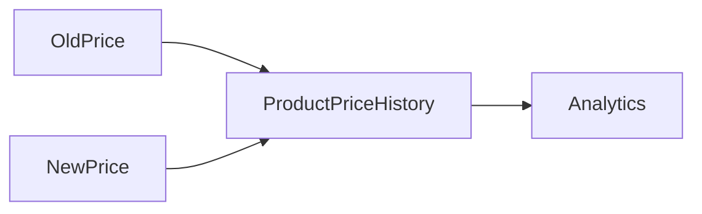

---

# Полная схема ядра TELESHOP

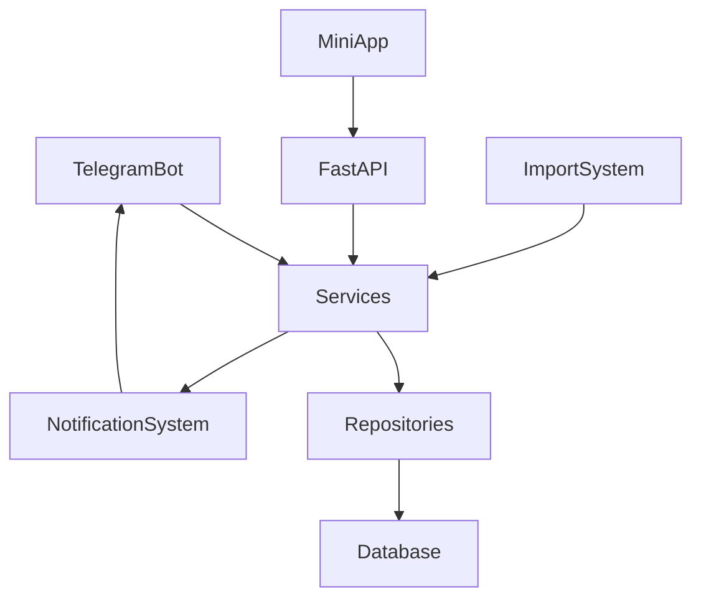
