# Import System Architecture

## Общая схема импорта

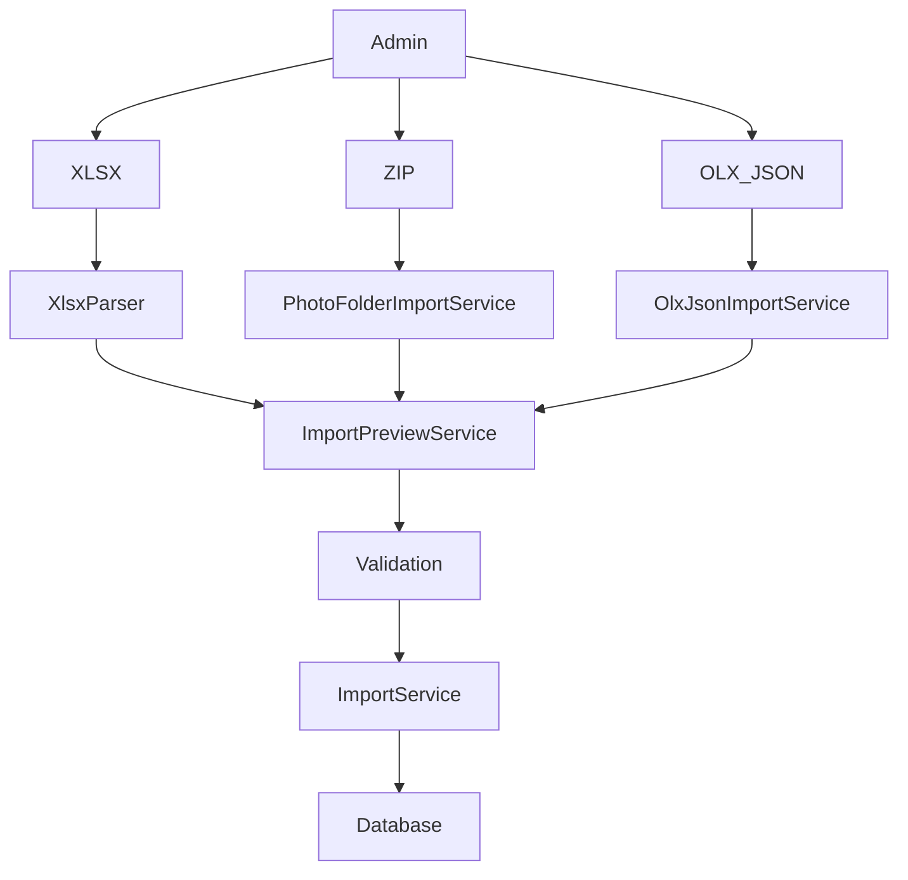

---

# Структура Import Module

```text
app/imports/

├── dto/
│
├── models/
│
├── parsers/
│
├── validators/
│
├── services/
│
└── exceptions/
```

---

# Import Services

## Диаграмма зависимостей

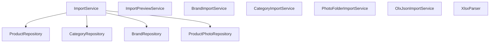

---

# XlsxParser

## Назначение

Разбор XLSX файлов.

## Ответственность

| Функция             | Описание                      |
| ------------------- | ----------------------------- |
| Проверка структуры  | Проверка обязательных колонок |
| Чтение строк        | Чтение XLSX                   |
| Преобразование DTO  | Создание ProductImportDTO     |
| Валидация типов     | Проверка чисел и строк        |
| Формирование ошибок | Список ошибок импорта         |

---

# ProductImportDTO

## Диаграмма

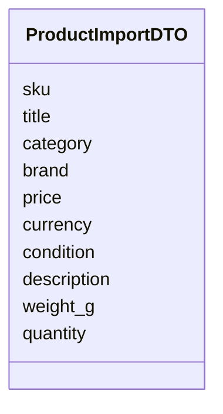

---

## Поля

| Поле        | Тип     | Назначение      |
| ----------- | ------- | --------------- |
| sku         | str     | Артикул         |
| title       | str     | Название товара |
| category    | str     | Категория       |
| brand       | str     | Бренд           |
| price       | decimal | Цена            |
| currency    | str     | Валюта          |
| condition   | str     | Состояние       |
| description | str     | Описание        |
| weight_g    | int     | Вес в граммах   |
| quantity    | int     | Остаток         |

---

# XLSX Формат

## Минимальная структура

| Колонка     | Обязательна | Описание  |
| ----------- | ----------- | --------- |
| sku         | Да          | Артикул   |
| title       | Да          | Название  |
| category    | Да          | Категория |
| brand       | Нет         | Бренд     |
| price       | Да          | Цена      |
| currency    | Да          | Валюта    |
| condition   | Да          | Состояние |
| description | Нет         | Описание  |
| weight_g    | Нет         | Вес       |
| quantity    | Нет         | Остаток   |

---

## Пример

```csv
sku,title,category,brand,price,currency

DA0001,Leica M500-N,Microscopes,Leica,150000,UAH

DA0002,Zeiss Pico,Dental Microscopes,Zeiss,90000,UAH
```

---

# Import Preview

## Архитектура

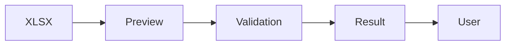

---

## Назначение

Позволяет увидеть ошибки до записи в БД.

---

## Возможные ошибки

| Код                | Описание              |
| ------------------ | --------------------- |
| SKU_DUPLICATE      | SKU уже существует    |
| CATEGORY_NOT_FOUND | Категория отсутствует |
| BRAND_NOT_FOUND    | Бренд отсутствует     |
| INVALID_PRICE      | Некорректная цена     |
| INVALID_WEIGHT     | Некорректный вес      |
| EMPTY_TITLE        | Пустое название       |

---

# BrandImportService

## Схема

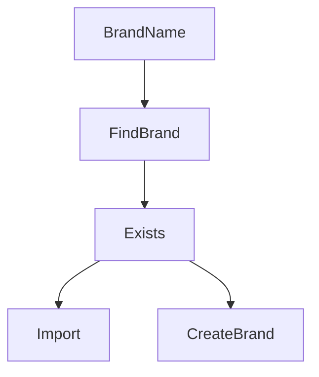

---

## Логика

1. Поиск бренда.
2. Если бренд найден — использовать.
3. Если отсутствует — создать автоматически.

---

# CategoryImportService

## Схема

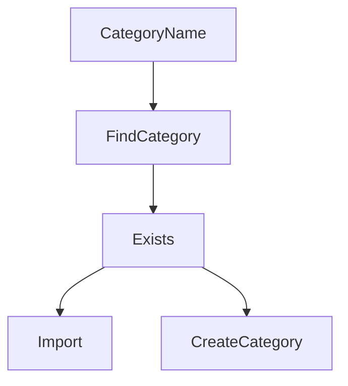

---

# PhotoFolderImportService

## Назначение

Импорт фотографий товаров из ZIP архива.

---

## Формат ZIP

```text
photos.zip

DA0001/
 ├─ 1.jpg
 ├─ 2.jpg
 ├─ 3.jpg

DA0002/
 ├─ 1.jpg

DA0003/
 ├─ 1.jpg
 ├─ 2.jpg
```

---

## Диаграмма

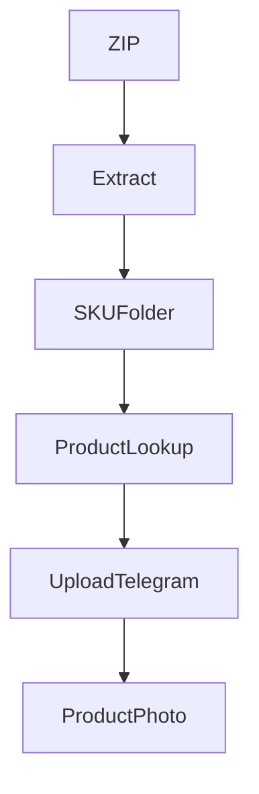

---

# Правила фотографий

| Проверка               | Значение     |
| ---------------------- | ------------ |
| Максимум фото          | 9            |
| Главное фото           | Первое фото  |
| Поддерживаемые форматы | JPG PNG WEBP |
| Дубликаты              | Игнорируются |

---

# OlxJsonImportService

## Назначение

Импорт товаров из выгрузки OLX.

---

## Схема

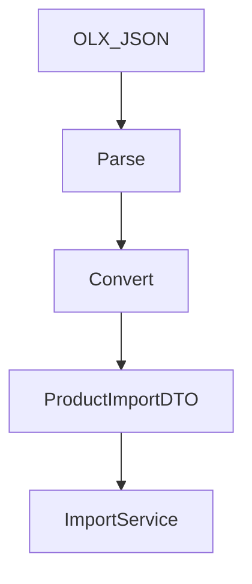

---

## Преобразование

| OLX         | TELESHOP         |
| ----------- | ---------------- |
| title       | title            |
| description | full_description |
| category    | category         |
| price       | price            |
| photos      | ProductPhoto     |
| location    | location_area    |

---

# ImportService

## Центральный сервис импорта

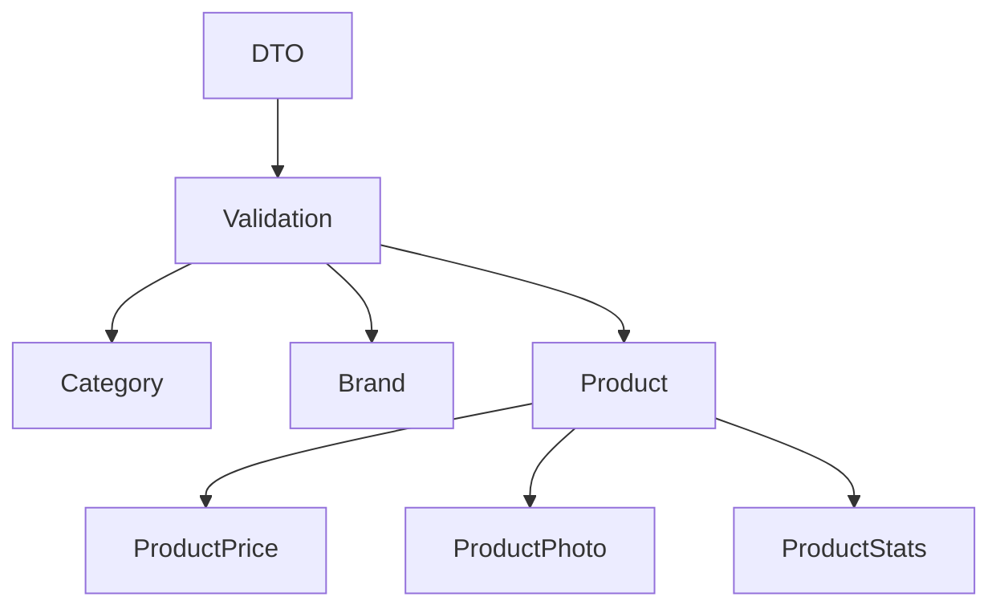

---

## Этапы импорта

| Этап | Описание            |
| ---- | ------------------- |
| 1    | Чтение файла        |
| 2    | Валидация           |
| 3    | Создание категорий  |
| 4    | Создание брендов    |
| 5    | Создание товаров    |
| 6    | Создание цен        |
| 7    | Создание фотографий |
| 8    | Создание статистики |

---

# Import Transaction

## Последовательность

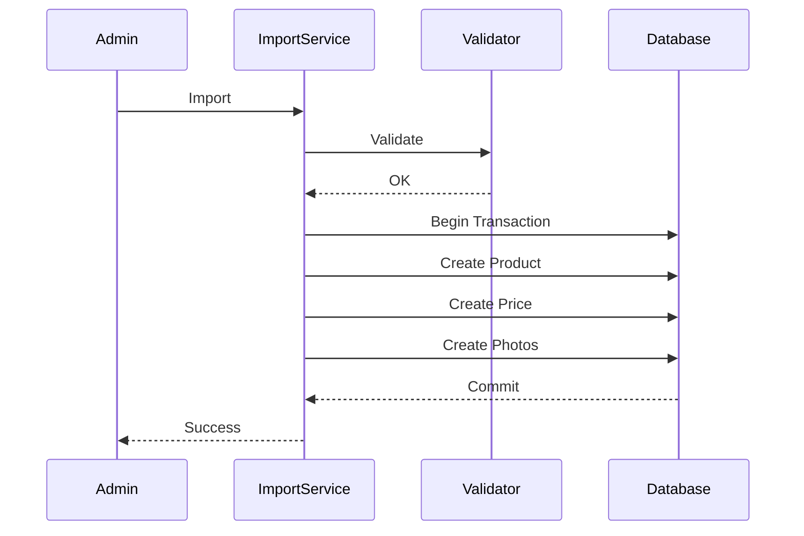

---

# Rollback Strategy

## Диаграмма


---

# Import Performance

## Рекомендуемые лимиты

| Параметр          | Значение |
| ----------------- | -------- |
| Товаров за импорт | 1000     |
| Фото на товар     | 9        |
| Размер ZIP        | 1 GB     |
| Размер XLSX       | 20 MB    |

---

# Полная схема Import System

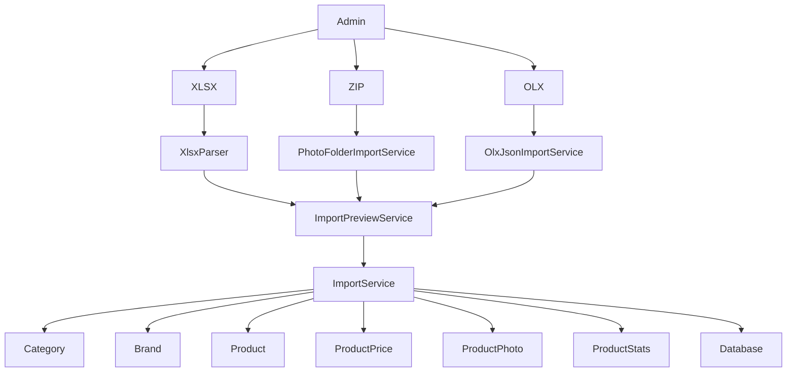
