# Search Engine Architecture

## Общая схема поиска

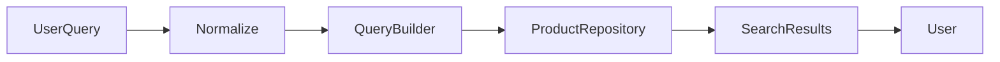

---

# SearchService

## Назначение

Центральный сервис поиска TELESHOP.

Обеспечивает:

* поиск товаров
* поиск категорий
* поиск брендов
* исправление раскладки
* нормализацию текста
* фильтрацию результатов

---

## Методы

| Метод                 | Назначение                     |
| --------------------- | ------------------------------ |
| search_products()     | Поиск товаров                  |
| search_categories()   | Поиск категорий                |
| search_brands()       | Поиск брендов                  |
| normalize_query()     | Нормализация текста            |
| replace_yo()          | Замена Ё→Е                     |
| replace_hard_sign()   | Замена Ъ→Ь                     |
| fix_keyboard_layout() | Исправление раскладки          |
| build_search_vector() | Формирование поискового текста |

---

# Поисковые поля

## Product

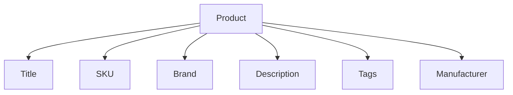

---

## Индексируемые поля

| Поле              | Используется |
| ----------------- | ------------ |
| title             | Да           |
| sku               | Да           |
| manufacturer_name | Да           |
| manufacturer_sku  | Да           |
| barcode           | Да           |
| short_description | Да           |
| full_description  | Да           |
| search_text       | Да           |
| tags              | Да           |
| brand_name        | Да           |

---

# Нормализация

## Этапы

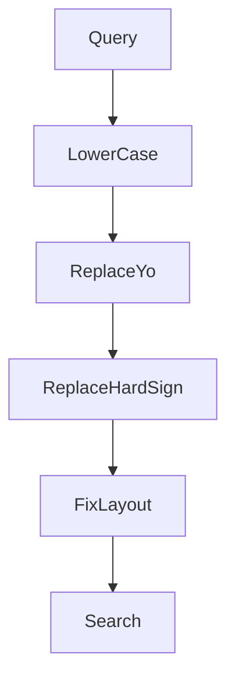

---

## Примеры

### Ё → Е

```text
ЛЁГКИЙ

↓

ЛЕГКИЙ
```

---

### Ъ → Ь

```text
ОБЪЕКТИВ

↓

ОБЬЕКТИВ
```

---

### Исправление раскладки

```text
ktqrf

↓

лейка
```

---

# Каталог

## Архитектура

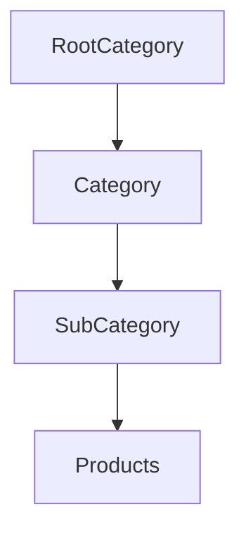

---

# Category Tree

## Пример

```text
Электроника
 ├─ Телефоны
 │   ├─ Apple
 │   ├─ Samsung
 │   └─ Xiaomi
 │
 ├─ Компьютеры
 │   ├─ Ноутбуки
 │   ├─ ПК
 │   └─ Мониторы
 │
 └─ Фото и Видео
```

---

# Фильтры каталога

## Диаграмма

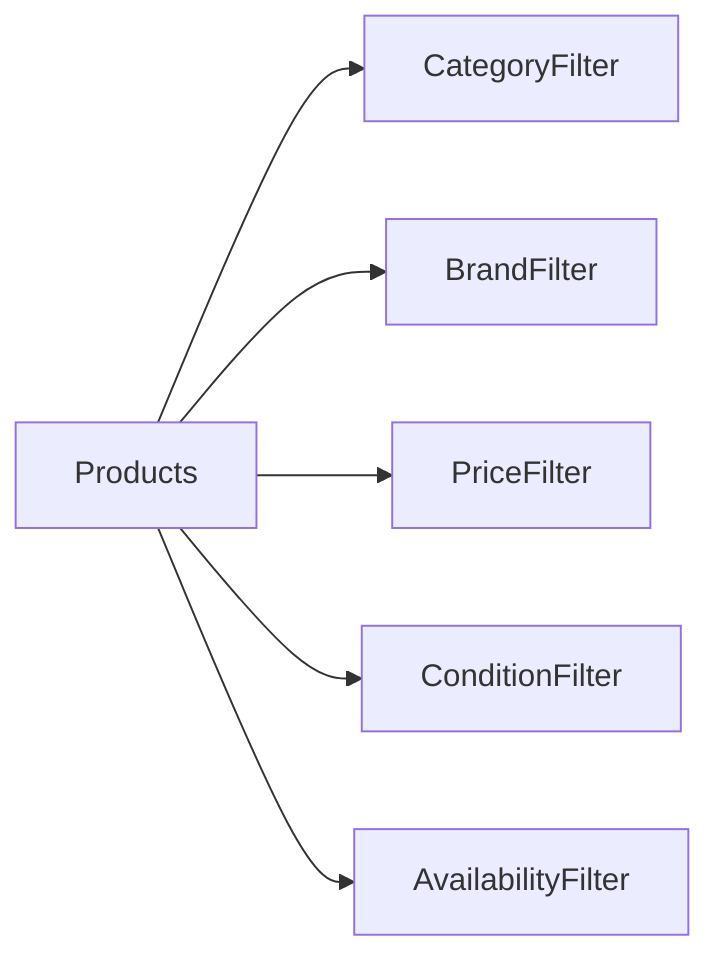

---

## Фильтры

| Фильтр       | Назначение    |
| ------------ | ------------- |
| Category     | Категория     |
| Brand        | Бренд         |
| Price        | Цена          |
| Condition    | Состояние     |
| Availability | Наличие       |
| Featured     | Рекомендуемые |
| Discount     | Со скидкой    |
| Tag          | По тегу       |

---

# Price Filter

## Диапазон

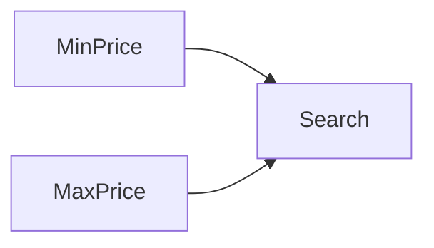

---

## Пример

```text
От 1000 грн

До 5000 грн
```

---

# Brand Filter

## Схема

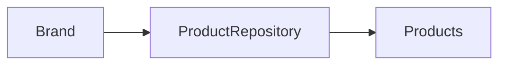

---

# Tag Filter

## Схема

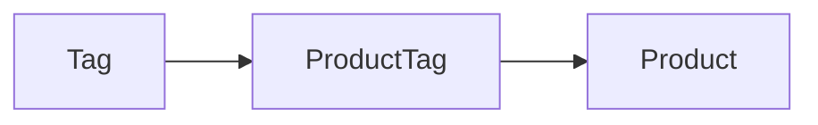

---

# Favorites Architecture

## Общая схема

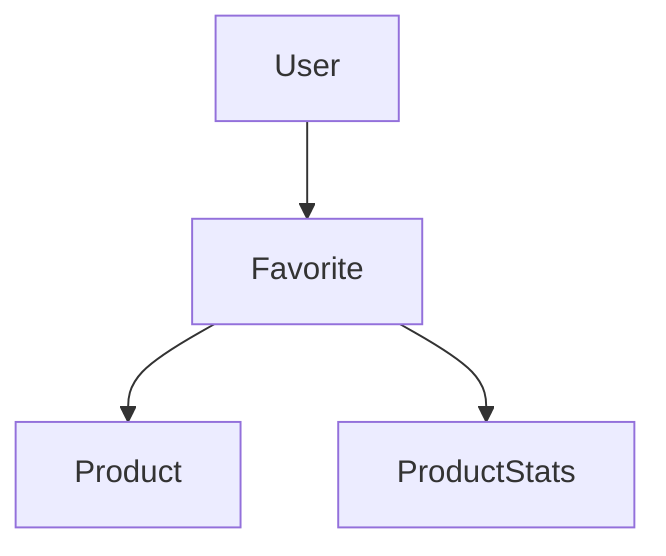

---

# FavoriteService

## Методы

| Метод                     | Назначение      |
| ------------------------- | --------------- |
| add_to_favorites()        | Добавить        |
| remove_from_favorites()   | Удалить         |
| exists()                  | Проверка        |
| get_user_favorites()      | Получить список |
| count_product_favorites() | Подсчёт         |

---

## Ограничение

```python
MAX_FAVORITES = 30
```

---

# Recommendation System

## Архитектура

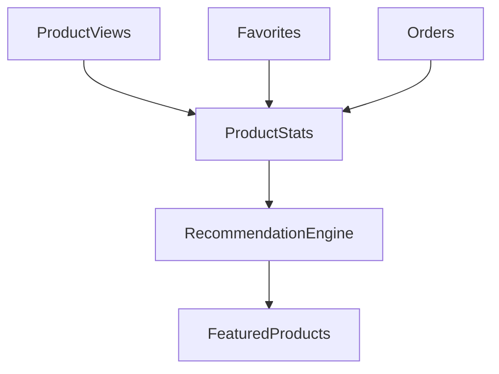

---

# Источники рекомендаций

| Источник  | Вес           |
| --------- | ------------- |
| Просмотры | Высокий       |
| Продажи   | Очень высокий |
| Избранное | Высокий       |
| Новинка   | Средний       |
| Featured  | Максимальный  |

---

# ProductStats

## Формирование статистики

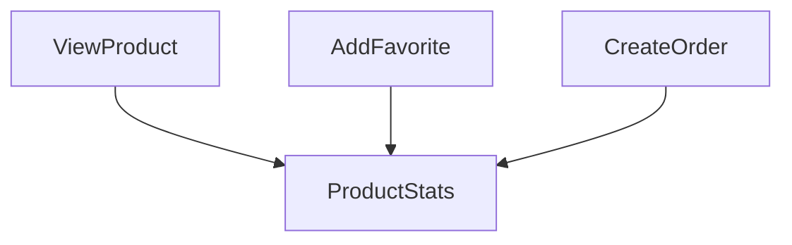

---

## Показатели

| Поле            | Назначение         |
| --------------- | ------------------ |
| views_count     | Просмотры          |
| favorites_count | Избранное          |
| orders_count    | Продажи            |
| last_view_at    | Последний просмотр |

---

# Featured Products

## Логика

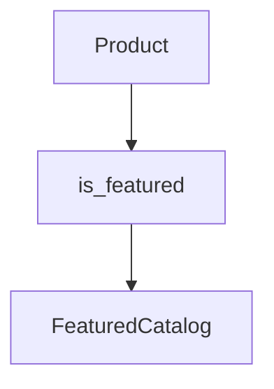

---

## Используемые поля

| Поле           | Назначение                 |
| -------------- | -------------------------- |
| is_featured    | Показывать в рекомендациях |
| featured_until | Дата окончания продвижения |
| sort_priority  | Приоритет отображения      |

---

# Search Performance

## Схема

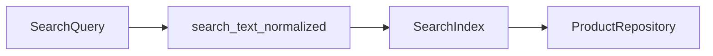

---

# Search Ranking

## Приоритет выдачи

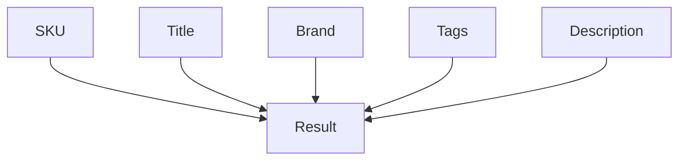

---

## Порядок релевантности

| Приоритет | Поле         |
| --------- | ------------ |
| 1         | SKU          |
| 2         | Title        |
| 3         | Brand        |
| 4         | Tags         |
| 5         | Manufacturer |
| 6         | Description  |

---

# Полная схема Search System

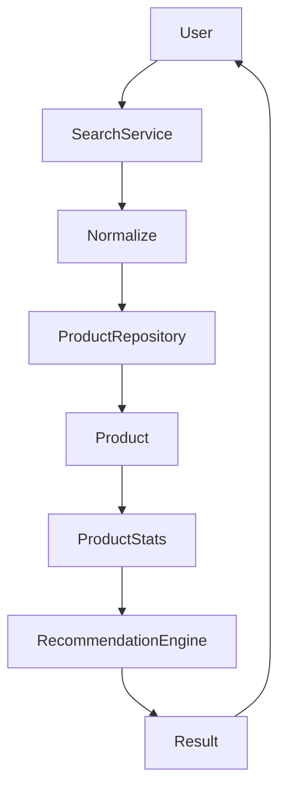
