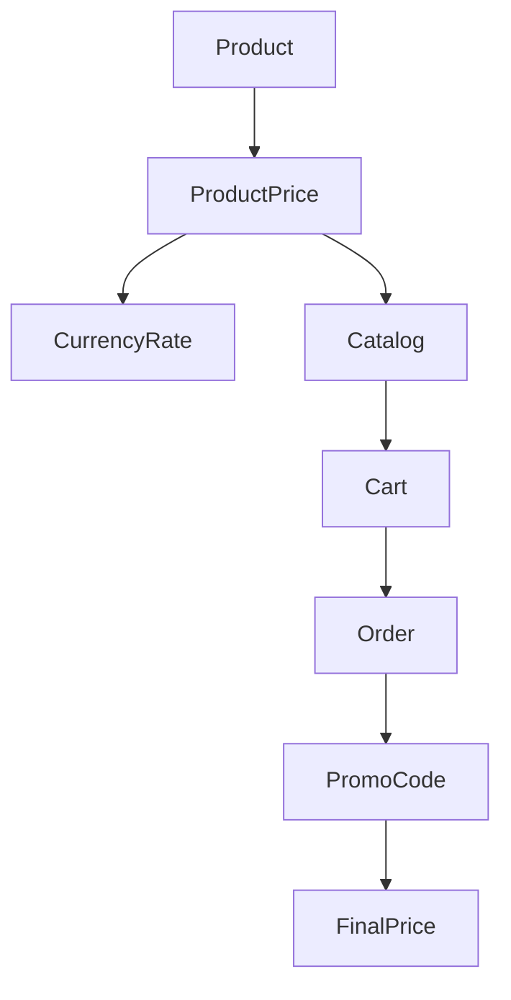
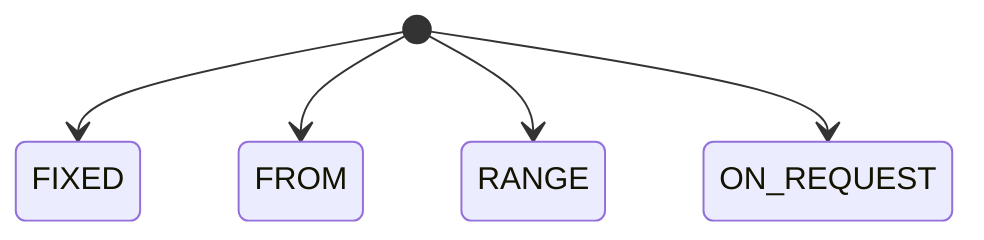
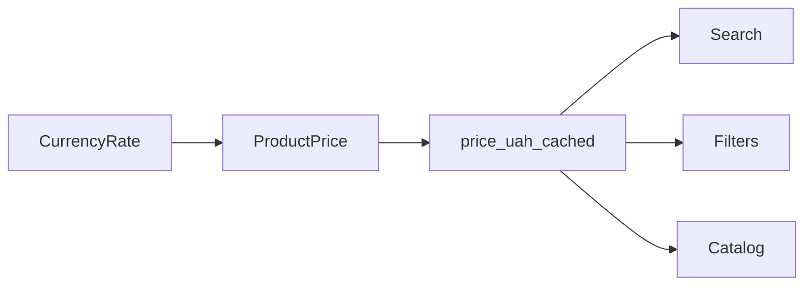
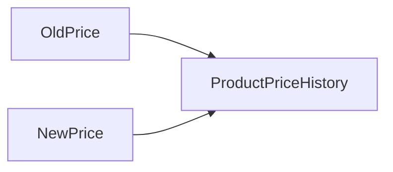
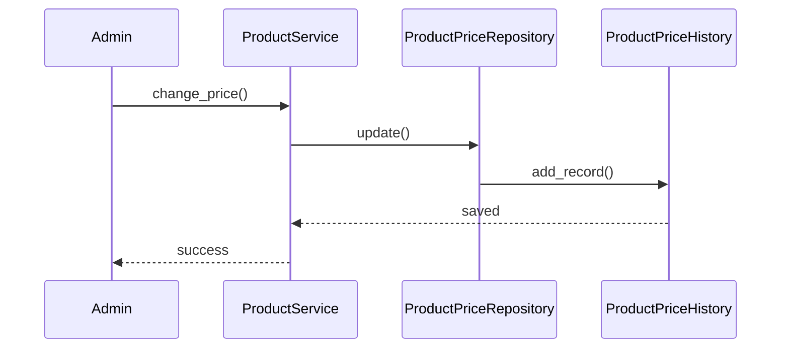
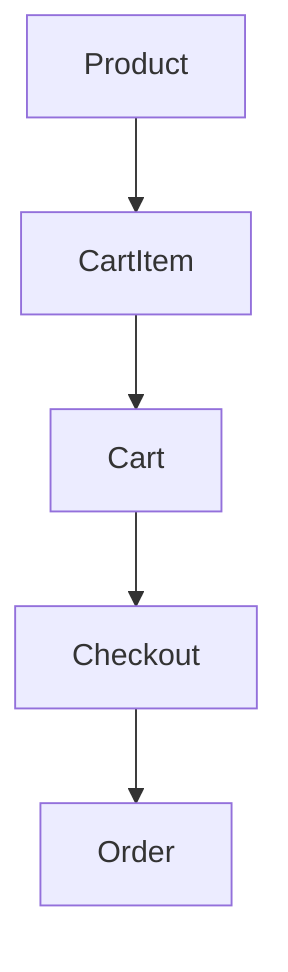
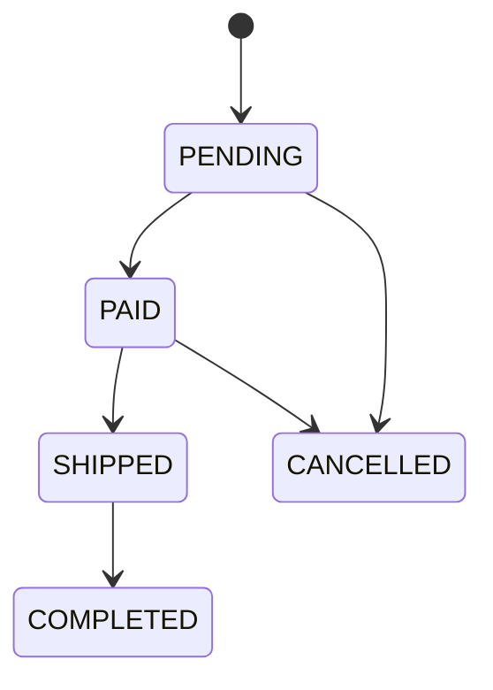
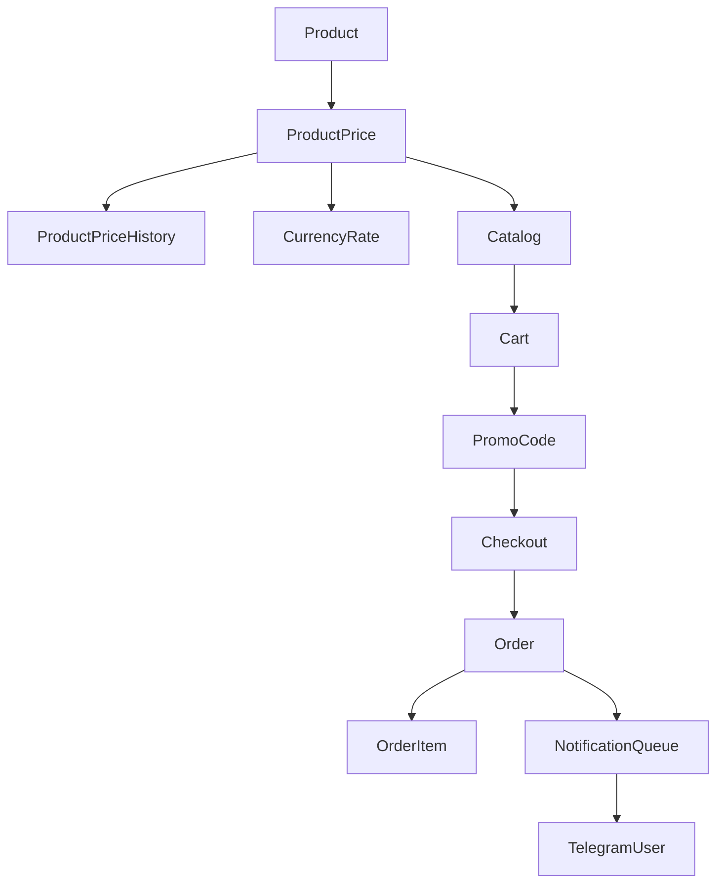

# Pricing_Commerce_Architecture

## Назначение

Подсистема отвечает за:

* хранение цен товаров;
* поддержку нескольких валют;
* фильтрацию каталога по цене;
* кэширование цены в гривне;
* промокоды;
* корзину;
* оформление заказов;
* историю изменения цен.

---

# Общая схема



---

# ProductPrice

## Назначение

Хранение актуальной цены товара.

Цена вынесена в отдельную таблицу.

Каждый товар имеет одну активную запись ProductPrice.

---

## Таблица product_prices

| Поле             | Тип            | Назначение                                 |
| ---------------- | -------------- | ------------------------------------------ |
| id               | Integer PK     | Идентификатор записи                       |
| product_id       | Integer FK     | Товар                                      |
| price_type       | Enum           | Тип цены                                   |
| currency         | String(3)      | Валюта                                     |
| price_uah_cached | Integer        | Кэшированная цена в гривне                 |
| price_from_value | Integer        | Основная цена или нижняя граница диапазона |
| price_to_value   | Integer | NULL | Верхняя граница диапазона                  |
| created_at       | DateTime       | Дата создания                              |
| updated_at       | DateTime       | Дата обновления                            |

---

# PriceType

## FIXED

Фиксированная цена.

Пример:

```json
{
  "price_type": "FIXED",
  "currency": "UAH",
  "price_from_value": 25000,
  "price_to_value": null,
  "price_uah_cached": 25000
}
```

Отображение:

```text
25 000 грн
```

---

## FROM

Цена от.

Пример:

```json
{
  "price_type": "FROM",
  "currency": "USD",
  "price_from_value": 500,
  "price_to_value": null,
  "price_uah_cached": 21000
}
```

Отображение:

```text
от 500 USD
```

---

## RANGE

Диапазон цен.

Пример:

```json
{
  "price_type": "RANGE",
  "currency": "USD",
  "price_from_value": 500,
  "price_to_value": 800,
  "price_uah_cached": 21000
}
```

Отображение:

```text
500–800 USD
```

---

## ON_REQUEST

Цена по запросу.

Пример:

```json
{
  "price_type": "ON_REQUEST",
  "currency": "USD",
  "price_from_value": null,
  "price_to_value": null,
  "price_uah_cached": null
}
```

Отображение:

```text
Цена по запросу
```

---

# PriceType Diagram



---

# Currency System

## Currency Enum

```python
class Currency(str, Enum):
    UAH = "UAH"
    USD = "USD"
    EUR = "EUR"
```

---

## Хранение в БД

```sql
currency VARCHAR(3)
```

---

## Причины выбора VARCHAR(3)

Плюсы:

* читается напрямую в БД;
* не требуется таблица currencies;
* не нужен JOIN;
* проще импорт XLSX;
* проще импорт OLX;
* проще работа через DBeaver;
* проще экспорт.

---

## Поддерживаемые валюты

| Код | Валюта            |
| --- | ----------------- |
| UAH | Украинская гривна |
| USD | Доллар США        |
| EUR | Евро              |

---

# CurrencyRate

## Назначение

Хранение курсов валют.

Используется для пересчёта цен в гривну.

---

## Таблица currency_rates

| Поле        | Тип        | Назначение               |
| ----------- | ---------- | ------------------------ |
| id          | Integer PK | Идентификатор записи     |
| currency    | String(3)  | Код валюты               |
| rate_to_uah | Integer    | Курс относительно гривны |
| source      | String     | Источник курса           |
| updated_at  | DateTime   | Время обновления         |

---

## Архитектура



---

# Почему нужен price_uah_cached

Используется для:

* фильтрации по цене;
* сортировки по цене;
* поиска;
* рекомендаций;
* сравнения товаров в разных валютах.

---

## Пример

```text
500 USD
```

Курс:

```text
42
```

Получаем:

```text
21000 грн
```

Записываем:

```python
price_uah_cached = 21000
```

---

# ProductPriceHistory

## Назначение

История изменения стоимости товара.

---

## Таблица product_price_history

| Поле       | Тип        | Назначение           |
| ---------- | ---------- | -------------------- |
| id         | Integer PK | Идентификатор записи |
| product_id | Integer FK | Товар                |
| old_price  | Integer    | Старая цена          |
| new_price  | Integer    | Новая цена           |
| currency   | String(3)  | Валюта               |
| changed_by | Integer FK | Кто изменил          |
| changed_at | DateTime   | Когда изменил        |

---

## Диаграмма



---

# Изменение цены



---

# PromoCode

## Назначение

Предоставление скидки при оформлении заказа.

---

## Таблица promo_codes

| Поле             | Тип        | Назначение               |
| ---------------- | ---------- | ------------------------ |
| id               | Integer PK | Идентификатор            |
| code             | String     | Код купона               |
| discount_percent | Integer    | Процент скидки           |
| discount_amount  | Integer    | Фиксированная скидка     |
| active_from      | DateTime   | Начало действия          |
| active_to        | DateTime   | Конец действия           |
| usage_limit      | Integer    | Лимит использования      |
| used_count       | Integer    | Количество использований |
| is_active        | Boolean    | Активен ли купон         |

---

# Cart Architecture



---

# CartItem

| Поле       | Тип        | Назначение    |
| ---------- | ---------- | ------------- |
| id         | Integer PK | Идентификатор |
| user_id    | Integer FK | Пользователь  |
| product_id | Integer FK | Товар         |
| quantity   | Integer    | Количество    |

---

# Order

## Таблица orders

| Поле          | Тип        | Назначение     |
| ------------- | ---------- | -------------- |
| id            | Integer PK | Заказ          |
| user_id       | Integer FK | Покупатель     |
| promo_code_id | Integer FK | Промокод       |
| status        | Enum       | Статус заказа  |
| total_price   | Integer    | Итоговая сумма |
| comment       | Text       | Комментарий    |
| created_at    | DateTime   | Создан         |
| updated_at    | DateTime   | Изменён        |

---

# OrderItem

## Таблица order_items

| Поле       | Тип        | Назначение             |
| ---------- | ---------- | ---------------------- |
| id         | Integer PK | Идентификатор          |
| order_id   | Integer FK | Заказ                  |
| product_id | Integer FK | Товар                  |
| quantity   | Integer    | Количество             |
| price      | Integer    | Цена на момент покупки |
| total      | Integer    | Стоимость позиции      |

---

# Order Status



---

# Money Storage Rule

## Основное правило

Все денежные значения в TELESHOP хранятся как Integer.

---

## Используется в

* ProductPrice
* ProductPriceHistory
* Order
* OrderItem
* PromoCode

---

## Не используется

Запрещено:

```python
float
```

---

## Исключение

Рейтинг товара.

```python
rating_avg = Numeric(3,2)
```

Поскольку рейтинг вычисляется как среднее значение отзывов.

---

# Полная Commerce Diagram


