# Notification System Architecture

## Назначение

Подсистема уведомлений отвечает за:

* уведомления по заказам;
* уведомления по изменению цены;
* уведомления о появлении товара;
* сервисные уведомления;
* массовые рассылки;
* отложенные уведомления.

---

# Общая схема

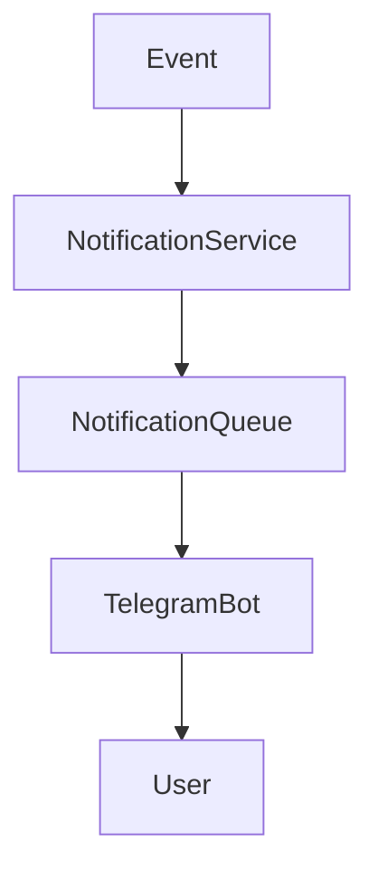

---

# Notification Types

| Тип               | Назначение        |
| ----------------- | ----------------- |
| ORDER_CREATED     | Заказ создан      |
| ORDER_PAID        | Заказ оплачен     |
| ORDER_SHIPPED     | Заказ отправлен   |
| ORDER_COMPLETED   | Заказ завершён    |
| PRICE_CHANGED     | Изменилась цена   |
| PRODUCT_AVAILABLE | Товар появился    |
| PROMO_STARTED     | Началась акция    |
| ADMIN_BROADCAST   | Массовая рассылка |

---

# NotificationQueue

## Назначение

Очередь уведомлений.

Позволяет отправлять сообщения асинхронно.

---

## Таблица notification_queue

| Поле              | Тип        | Назначение           |
| ----------------- | ---------- | -------------------- |
| id                | Integer PK | Идентификатор задачи |
| user_id           | Integer FK | Получатель           |
| notification_type | String     | Тип уведомления      |
| payload_json      | JSON/Text  | Полезная нагрузка    |
| status            | String     | Статус               |
| attempts          | Integer    | Попытки отправки     |
| error_message     | Text       | Последняя ошибка     |
| scheduled_at      | DateTime   | Планируемое время    |
| sent_at           | DateTime   | Фактическая отправка |
| created_at        | DateTime   | Создание             |

---

# Notification Status

| Статус     | Назначение         |
| ---------- | ------------------ |
| PENDING    | Ожидает отправки   |
| PROCESSING | Обрабатывается     |
| SENT       | Успешно отправлено |
| FAILED     | Ошибка             |
| CANCELLED  | Отменено           |

---

# Жизненный цикл уведомления

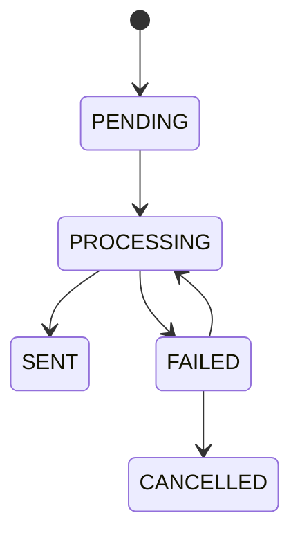

---

# NotifySubscription

## Назначение

Подписки пользователей на события.

---

## Таблица notify_subscriptions

| Поле              | Тип        | Назначение    |
| ----------------- | ---------- | ------------- |
| id                | Integer PK | Идентификатор |
| user_id           | Integer FK | Пользователь  |
| product_id        | Integer FK | Товар         |
| subscription_type | String     | Тип подписки  |
| active            | Boolean    | Активность    |
| created_at        | DateTime   | Создание      |
| updated_at        | DateTime   | Обновление    |

---

# Типы подписок

| Тип               | Назначение         |
| ----------------- | ------------------ |
| BACK_IN_STOCK     | Появился в наличии |
| PRICE_CHANGED     | Изменилась цена    |
| DISCOUNT_APPEARED | Появилась скидка   |

---

# Подписка на цену

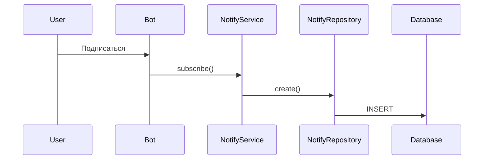

---

# Изменение цены

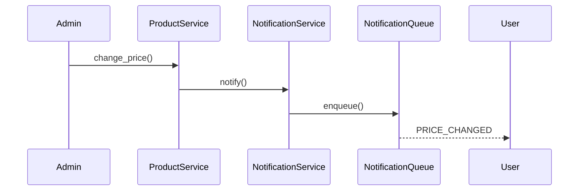

---

# Уведомление о наличии

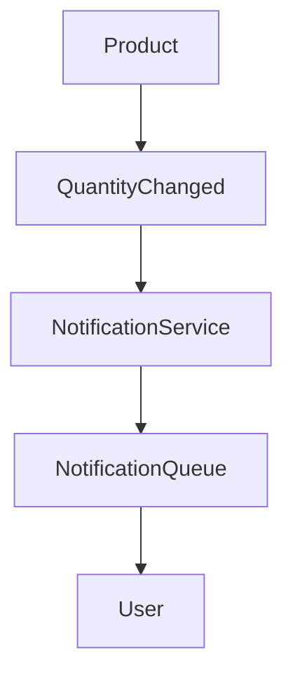

---

# Массовая рассылка

## Архитектура

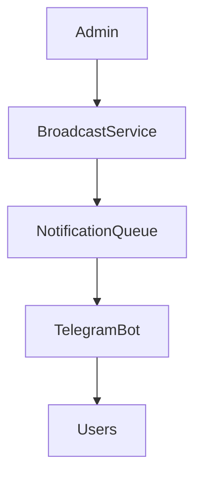

---

# Retry Mechanism

## Повторная отправка

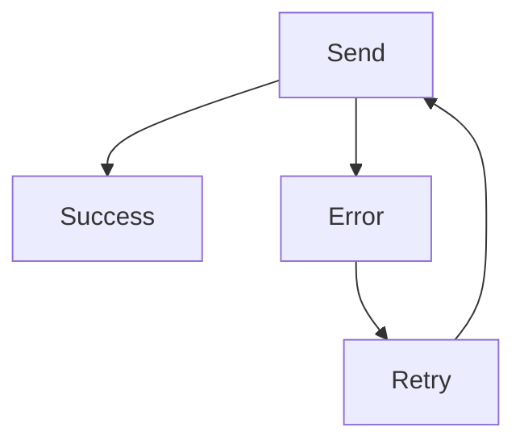

---

# NotificationService

## Методы

| Метод            | Назначение           |
| ---------------- | -------------------- |
| enqueue()        | Добавить уведомление |
| send()           | Отправить            |
| retry()          | Повторить            |
| cancel()         | Отменить             |
| process_queue()  | Обработка очереди    |
| send_broadcast() | Массовая рассылка    |

---

# NotificationQueueRepository

## Методы

| Метод                | Назначение             |
| -------------------- | ---------------------- |
| enqueue()            | Добавить задачу        |
| get_pending()        | Получить очередь       |
| mark_sent()          | Пометить отправленным  |
| mark_failed()        | Ошибка                 |
| increment_attempts() | Увеличить счётчик      |
| delete_old()         | Очистка старых записей |

---

# NotifyRepository

## Методы

| Метод                     | Назначение        |
| ------------------------- | ----------------- |
| subscribe()               | Подписка          |
| unsubscribe()             | Отписка           |
| get_subscriptions()       | Получить подписки |
| get_product_subscribers() | Подписчики товара |
| activate()                | Активировать      |
| deactivate()              | Деактивировать    |

---

# Notification Events

## Источники событий

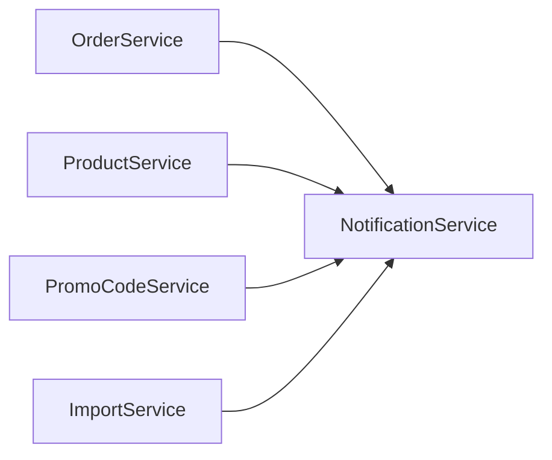

---

# Telegram Delivery Flow

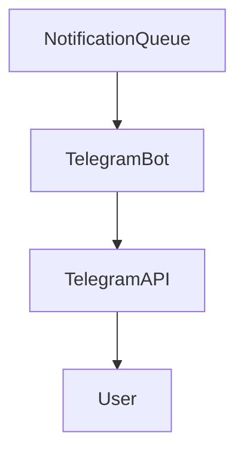

---

# Cleanup Strategy

## Очистка очереди

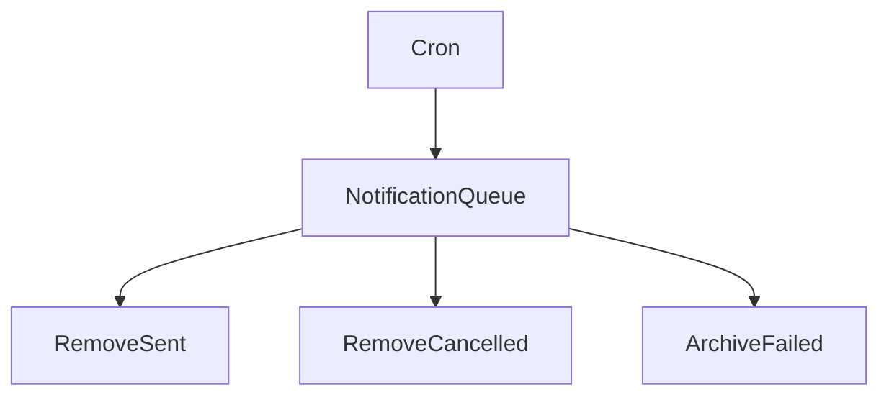

---

# Полная схема Notification System

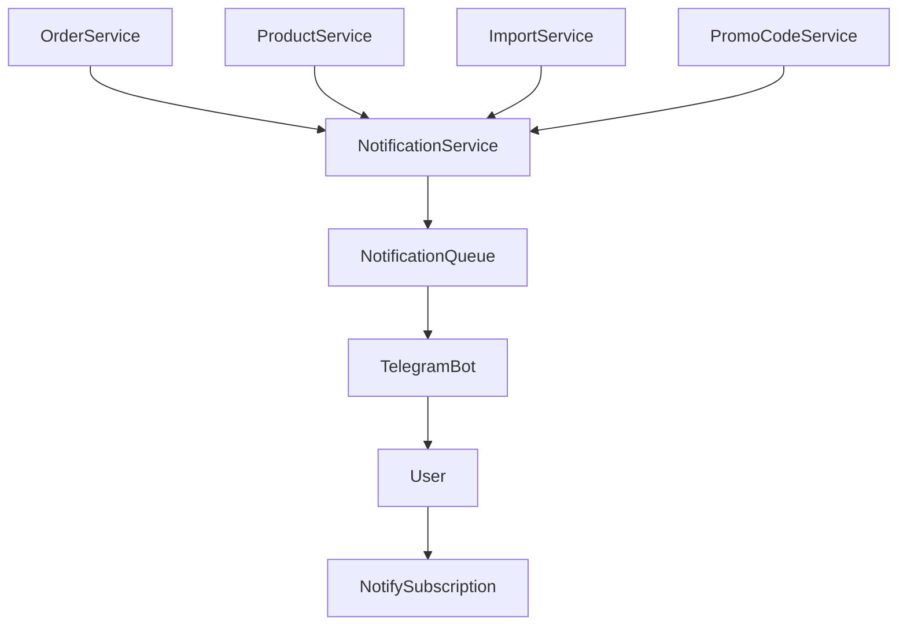
