# Admin Panel Architecture

## Назначение

Административный контур TELESHOP предназначен для управления:

* товарами;
* категориями;
* брендами;
* фотографиями;
* ценами;
* заказами;
* пользователями;
* промокодами;
* импортом;
* уведомлениями.

---

# Общая схема

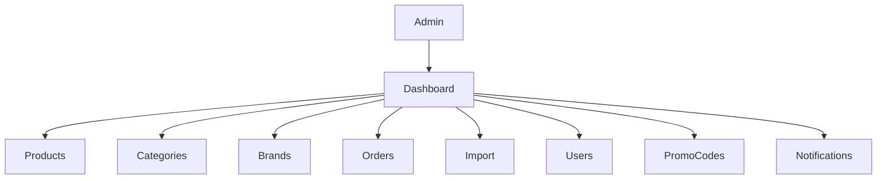

---

# Admin Roles

## Роли системы

| Роль            | Описание                     |
| --------------- | ---------------------------- |
| SUPER_ADMIN     | Полный доступ                |
| ADMIN           | Управление магазином         |
| MANAGER         | Работа с товарами и заказами |
| CONTENT_MANAGER | Работа с каталогом           |
| IMPORT_OPERATOR | Импорт данных                |

---

# Permission Matrix

| Раздел       | SUPER_ADMIN | ADMIN | MANAGER | CONTENT |
| ------------ | ----------- | ----- | ------- | ------- |
| Товары       | ✅           | ✅     | ✅       | ✅       |
| Категории    | ✅           | ✅     | ❌       | ✅       |
| Бренды       | ✅           | ✅     | ❌       | ✅       |
| Импорт       | ✅           | ✅     | ❌       | ❌       |
| Заказы       | ✅           | ✅     | ✅       | ❌       |
| Пользователи | ✅           | ❌     | ❌       | ❌       |
| Промокоды    | ✅           | ✅     | ❌       | ❌       |
| Настройки    | ✅           | ❌     | ❌       | ❌       |

---

# Dashboard

## Архитектура

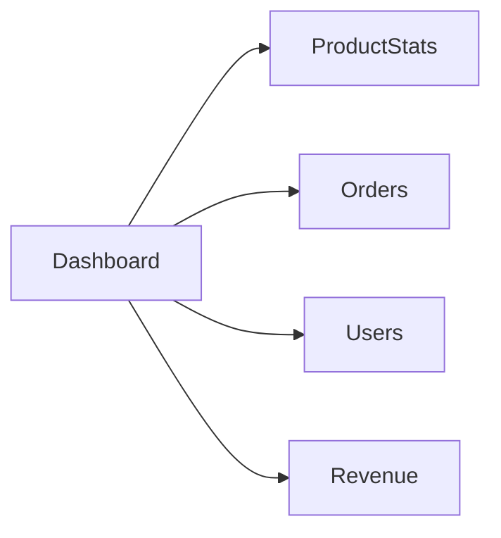

---

## Виджеты

| Виджет           | Назначение               |
| ---------------- | ------------------------ |
| Всего товаров    | Количество товаров       |
| Активные товары  | Активный каталог         |
| Проданные товары | Статистика продаж        |
| Заказы           | Количество заказов       |
| Пользователи     | Количество пользователей |
| Избранное        | Активность каталога      |
| Просмотры        | Посещаемость             |

---

# Product Management

## Архитектура

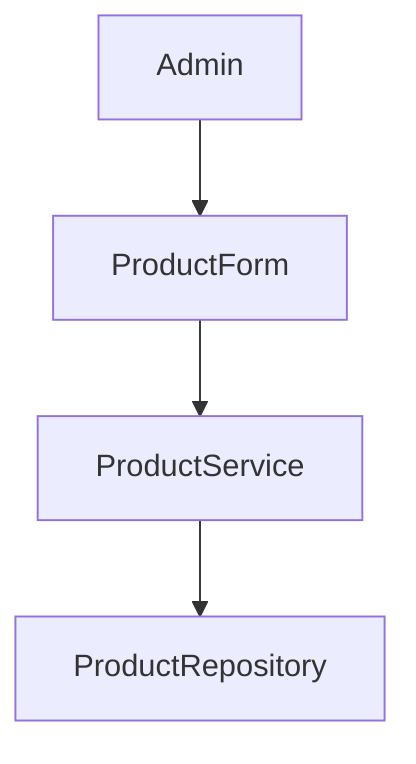

---

## Возможности

| Действие      | Описание            |
| ------------- | ------------------- |
| Создать       | Новый товар         |
| Редактировать | Изменение товара    |
| Архивировать  | Переместить в архив |
| Продать       | Статус SOLD         |
| Резервировать | Статус RESERVED     |
| Удалить       | Логическое удаление |

---

# Product Lifecycle

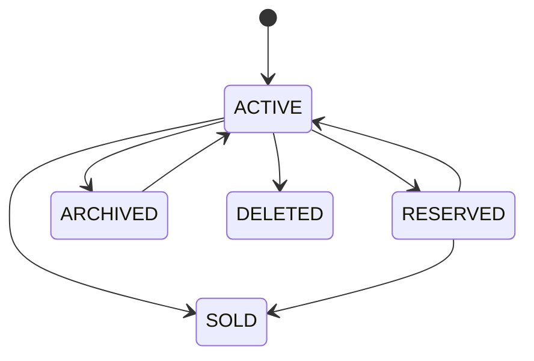

---

# Category Management

## Архитектура

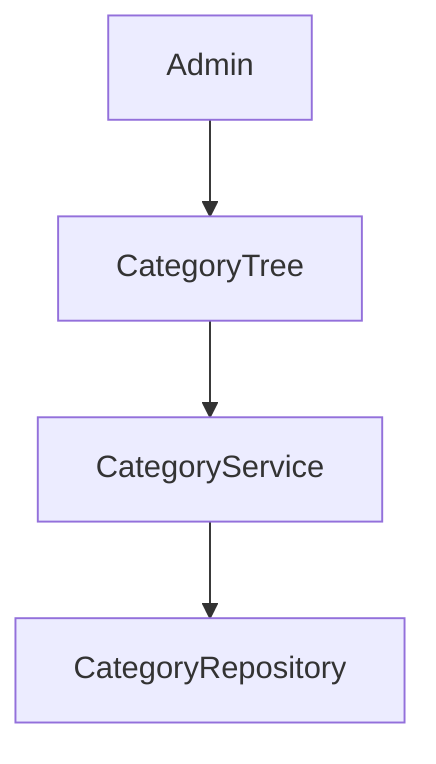

---

## Дерево категорий

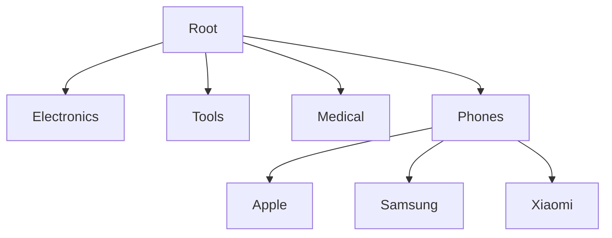

---

# Brand Management

## Архитектура

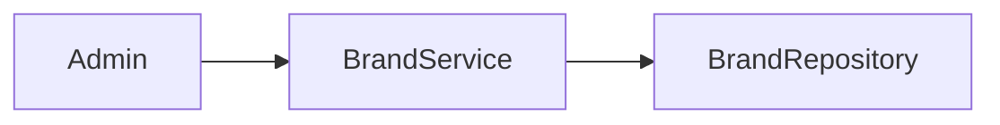

---

## Возможности

| Действие        | Описание            |
| --------------- | ------------------- |
| Создание бренда | Новый бренд         |
| Редактирование  | Изменение данных    |
| Объединение     | Слияние дублей      |
| Удаление        | Логическое удаление |

---

# Photo Management

## Архитектура

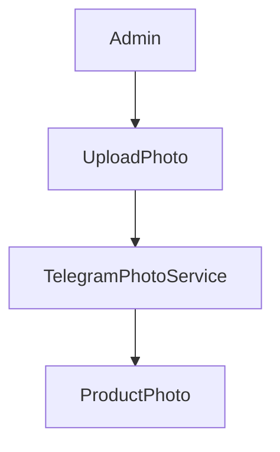

---

## Возможности

| Действие      | Описание            |
| ------------- | ------------------- |
| Добавить фото | Загрузка            |
| Удалить фото  | Удаление            |
| Главное фото  | Назначение          |
| Сортировка    | Порядок отображения |

---

## Ограничения

```python
MAX_PRODUCT_IMAGES = 9
```

---

# Price Management

## Архитектура

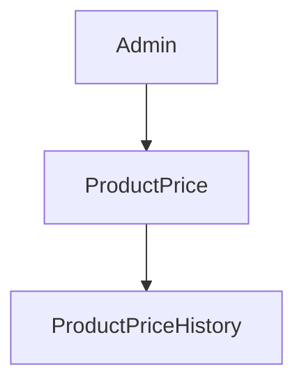

---

## Возможности

| Действие            | Описание          |
| ------------------- | ----------------- |
| Изменить цену       | Новая цена        |
| Изменить валюту     | UAH/USD/EUR       |
| Изменить тип цены   | FIXED/FROM/RANGE  |
| Просмотреть историю | История изменений |

---

# Order Management

## Архитектура

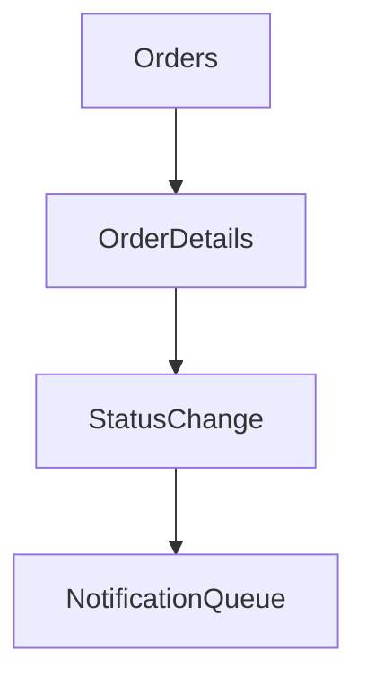

---

## Доступные действия

| Действие    | Статус              |
| ----------- | ------------------- |
| Подтвердить | PENDING → PAID      |
| Отправить   | PAID → SHIPPED      |
| Завершить   | SHIPPED → COMPLETED |
| Отменить    | PENDING → CANCELLED |

---

# Order Workflow

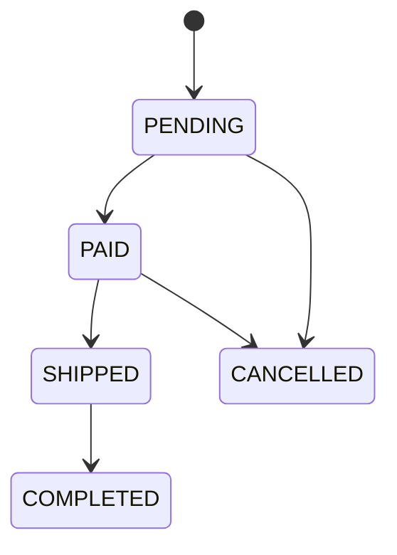

---

# User Management

## Архитектура

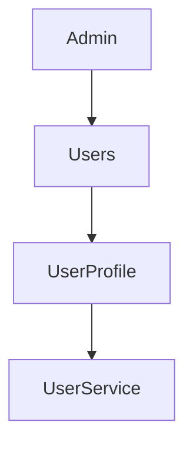

---

## Возможности

| Действие         | Описание            |
| ---------------- | ------------------- |
| Просмотр профиля | Информация          |
| Блокировка       | is_blocked          |
| Разблокировка    | Снять блокировку    |
| История заказов  | Заказы пользователя |
| Избранное        | Список избранного   |

---

# Promo Code Management

## Архитектура

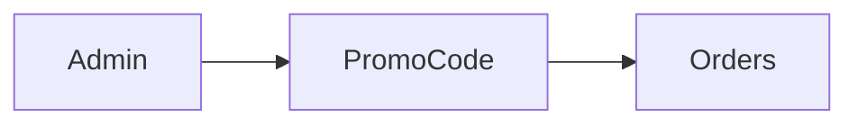

---

## Возможности

| Действие                 | Описание        |
| ------------------------ | --------------- |
| Создать купон            | Новый промокод  |
| Изменить скидку          | Процент/сумма   |
| Ограничить использование | usage_limit     |
| Отключить                | is_active=False |

---

# Import Management

## Архитектура

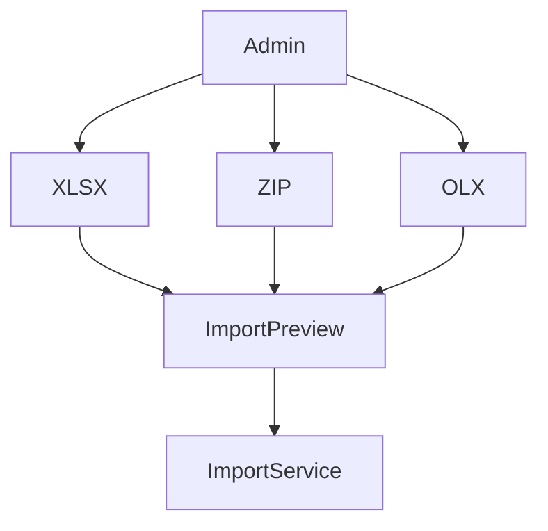

---

## Возможности

| Действие    | Описание        |
| ----------- | --------------- |
| Импорт XLSX | Товары          |
| Импорт ZIP  | Фото            |
| Импорт OLX  | Выгрузка        |
| Preview     | Проверка ошибок |
| Rollback    | Откат импорта   |

---

# Notification Management

## Архитектура

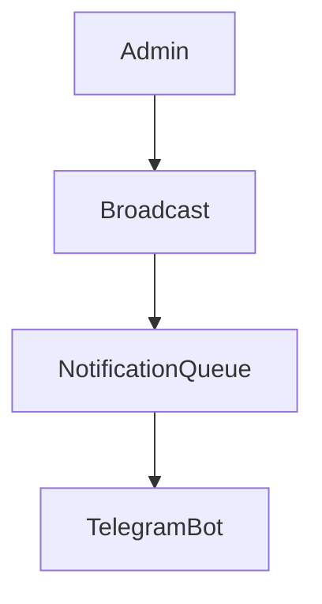

---

## Возможности

| Действие           | Описание           |
| ------------------ | ------------------ |
| Массовая рассылка  | Всем пользователям |
| По категории       | Выбранной группе   |
| По подписке        | Подписчикам        |
| Повторить отправку | Retry              |

---

# Audit Logging

## Архитектура

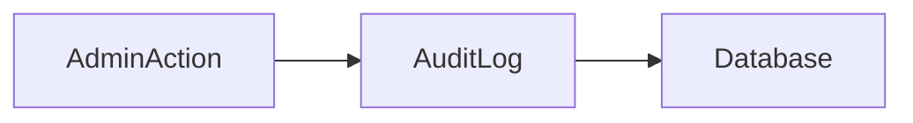

---

## Логируемые действия

| Событие                  |
| ------------------------ |
| Создание товара          |
| Изменение товара         |
| Изменение цены           |
| Изменение категории      |
| Создание заказа          |
| Изменение статуса заказа |
| Импорт                   |
| Массовая рассылка        |
| Блокировка пользователя  |

---

# Полная схема Admin System

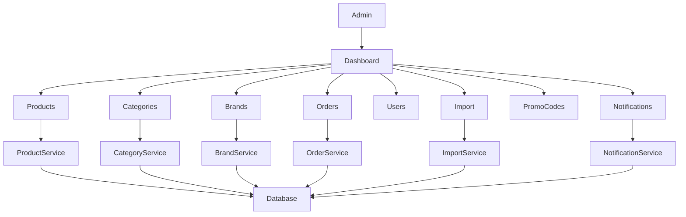
