# Telegram Bot FSM Architecture

## Назначение

Telegram Bot является основным пользовательским интерфейсом TELESHOP.

Построен на:

```text
aiogram 3.x
FSM
Router-based architecture
```

---

# Общая схема

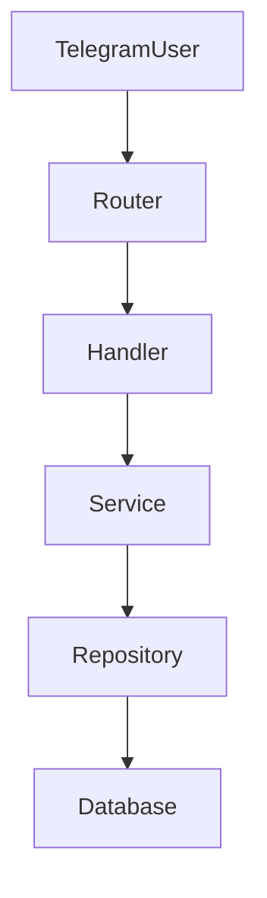

---

# Bot Structure

```text
app/bot/

├── handlers/
│
├── keyboards/
│
├── callbacks/
│
├── states/
│
├── filters/
│
├── middlewares/
│
├── routers/
│
└── utils/
```

---

# Router Architecture

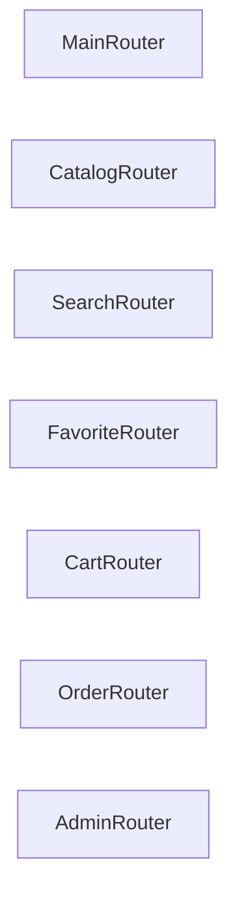

---

# Main Menu FSM

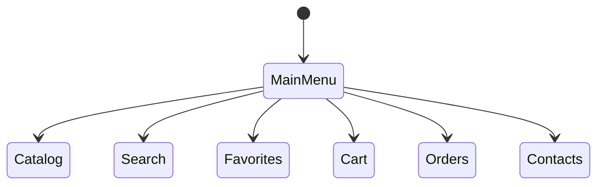

---

# Main Menu Buttons

| Кнопка      | Назначение        |
| ----------- | ----------------- |
| 🏪 Каталог  | Категории товаров |
| 🔍 Поиск    | Поиск товаров     |
| ⭐ Избранное | Избранные товары  |
| 🛒 Корзина  | Корзина           |
| 📦 Заказы   | История заказов   |
| ☎ Контакты  | Контакты          |

---

# Catalog FSM

## Навигация

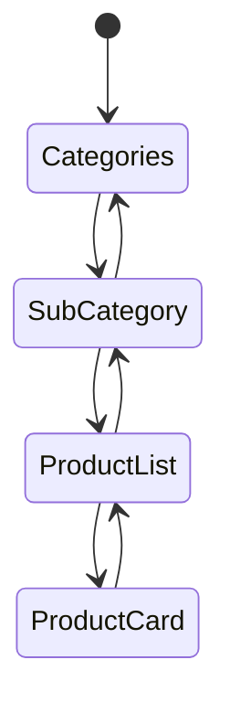

---

# Catalog Flow

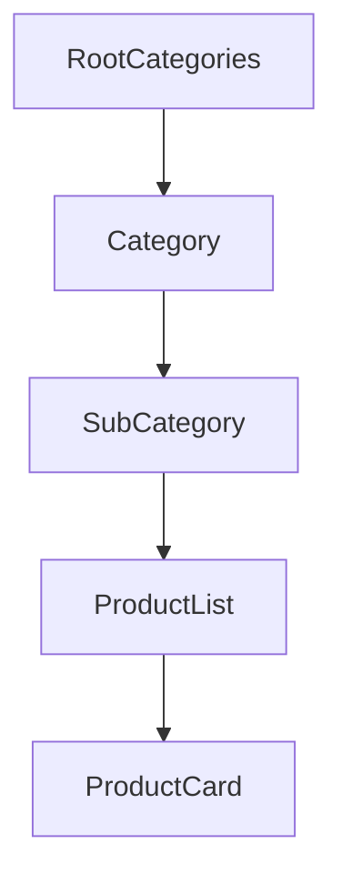

---

# Product Card FSM

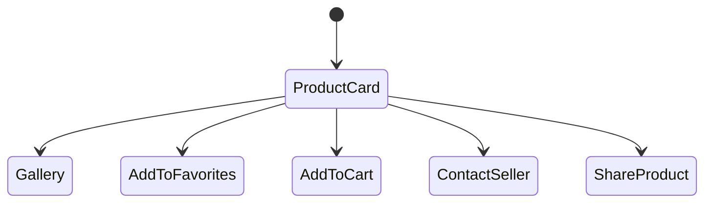

---

# Product Card Buttons

| Кнопка        | Действие             |
| ------------- | -------------------- |
| 🛒 Купить     | Добавить в корзину   |
| ⭐ Избранное   | Добавить в избранное |
| 🖼 Фото       | Галерея              |
| 🎥 Видео      | Видео товара         |
| 📤 Поделиться | Ссылка               |
| ☎ Связаться   | Контакты             |

---

# Search FSM

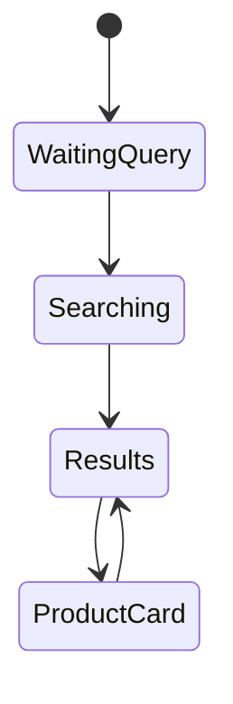

---

# Search Flow

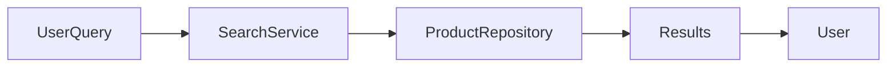

---

# Search States

| State        | Назначение              |
| ------------ | ----------------------- |
| WaitingQuery | Ожидание текста         |
| Searching    | Выполнение поиска       |
| Results      | Отображение результатов |
| ProductCard  | Карточка товара         |

---

# Favorite FSM

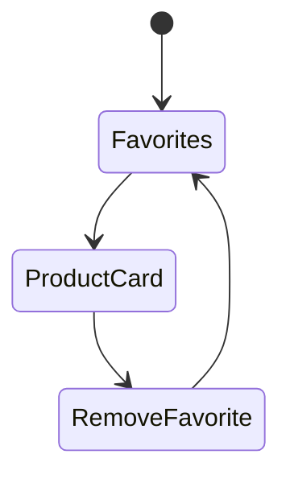

---

# Cart FSM

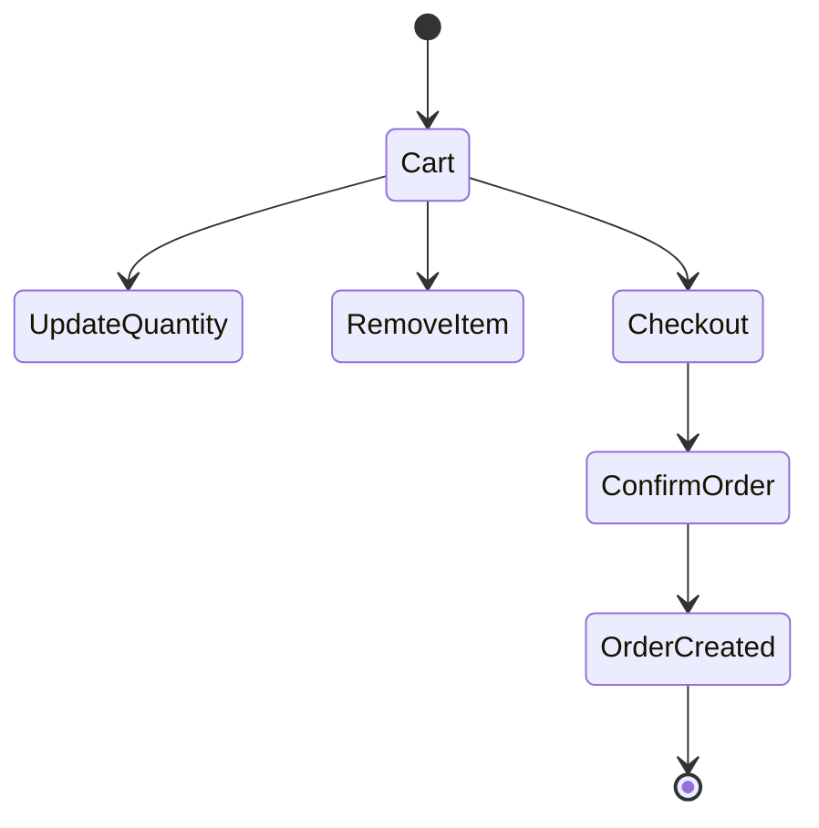

---

# Cart Flow

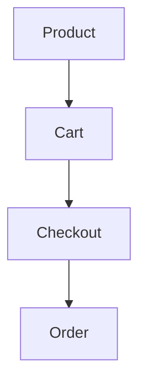

---

# Cart Buttons

| Кнопка | Назначение           |
| ------ | -------------------- |
| ➕      | Увеличить количество |
| ➖      | Уменьшить количество |
| ❌      | Удалить товар        |
| 🧹     | Очистить корзину     |
| ✅      | Оформить заказ       |

---

# Checkout FSM

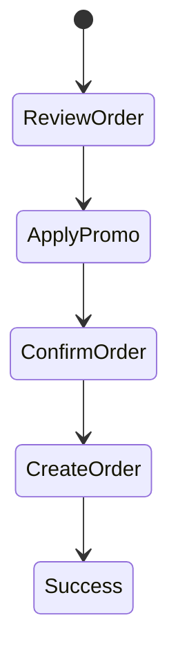

---

# Order FSM

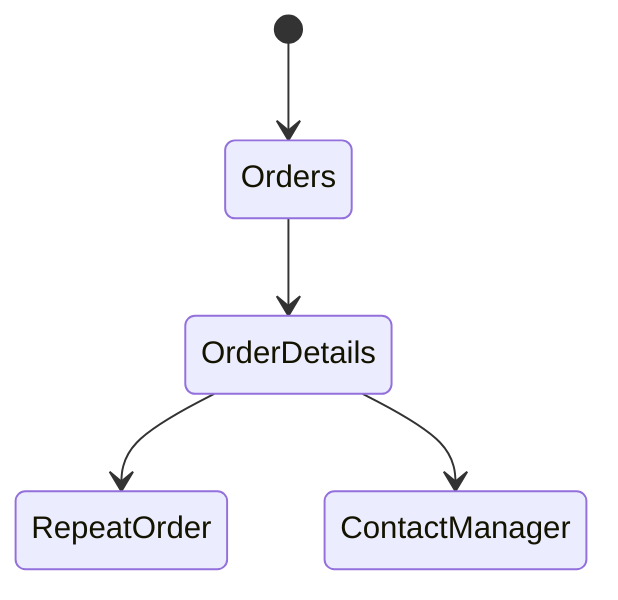

---

# Order Creation Sequence

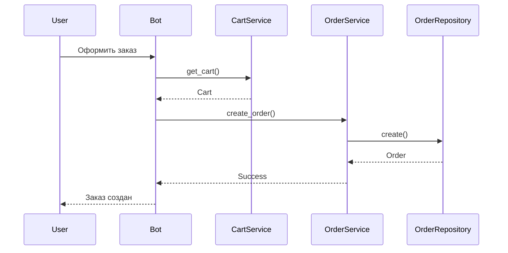

---

# Callback Architecture

## Формат

```text
action:id
```

---

## Примеры

```text
product:125

category:12

favorite:add:125

favorite:remove:125

cart:add:125

cart:remove:125

order:456
```

---

# Callback Flow

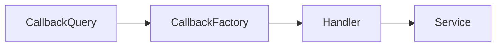

---

# Keyboard Architecture

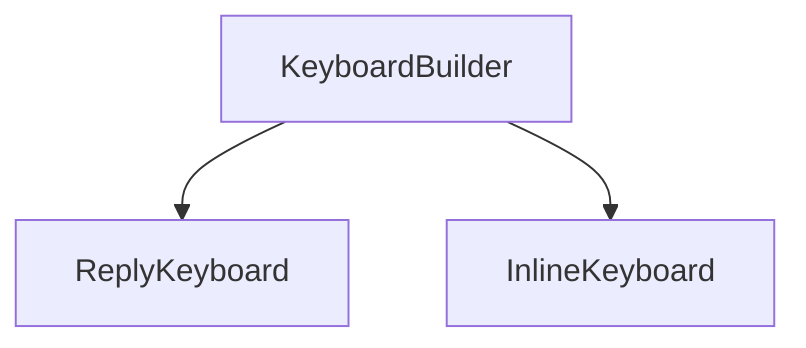

---

# Reply Keyboards

| Клавиатура        | Назначение          |
| ----------------- | ------------------- |
| MainMenuKeyboard  | Главное меню        |
| AdminMenuKeyboard | Меню администратора |
| ContactKeyboard   | Контакты            |

---

# Inline Keyboards

| Клавиатура       | Назначение      |
| ---------------- | --------------- |
| ProductKeyboard  | Карточка товара |
| CategoryKeyboard | Категория       |
| FavoriteKeyboard | Избранное       |
| CartKeyboard     | Корзина         |
| OrderKeyboard    | Заказ           |

---

# Middleware Architecture

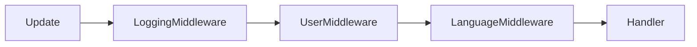

---

# User Middleware

## Задачи

* регистрация пользователя;
* обновление активности;
* загрузка профиля;
* проверка блокировки.

---

# Language Middleware

## Задачи

* выбор языка;
* локализация сообщений;
* перевод интерфейса.

---

# Admin FSM

## Общая схема

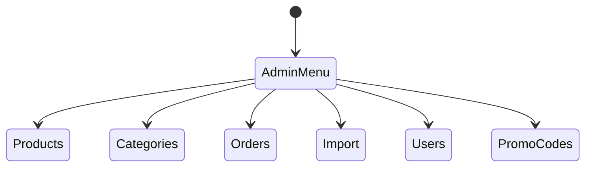

---

# Product Creation FSM

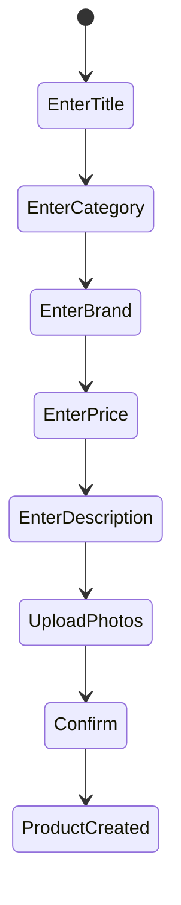

---

# XLSX Import FSM

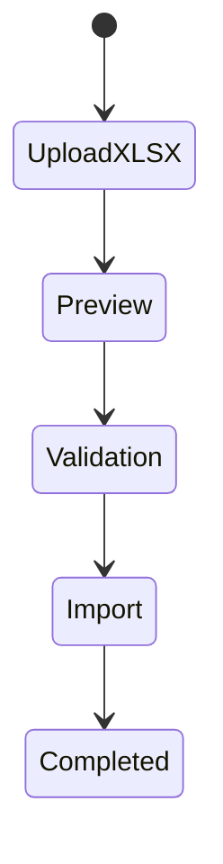

---

# Photo Import FSM

```mermaid
stateDiagram-v2

[*] --> UploadZIP

UploadZIP --> Extract

Extract --> Validation

Validation --> ImportPhotos

ImportPhotos --> Completed
```

---

# Broadcast FSM

```mermaid
stateDiagram-v2

[*] --> CreateMessage

CreateMessage --> Preview

Preview --> Confirm

Confirm --> Send

Send --> Completed
```

---

# Bot Services Interaction

```mermaid
flowchart TD

Bot

Bot --> ProductService

Bot --> SearchService

Bot --> FavoriteService

Bot --> CartService

Bot --> OrderService

Bot --> NotificationService
```

---

# Complete Telegram Bot Diagram

```mermaid
flowchart TD

TelegramUser

TelegramUser --> MainMenu

MainMenu --> Catalog

MainMenu --> Search

MainMenu --> Favorites

MainMenu --> Cart

MainMenu --> Orders

Catalog --> ProductCard

Search --> ProductCard

Favorites --> ProductCard

ProductCard --> Cart

Cart --> Checkout

Checkout --> Order

Order --> NotificationQueue

NotificationQueue --> TelegramUser

Admin --> AdminMenu

AdminMenu --> Products

AdminMenu --> Orders

AdminMenu --> Import

AdminMenu --> Notifications
```
