# Mini App & FastAPI Architecture

## Назначение

Mini App является вторым интерфейсом TELESHOP.

Позволяет работать с магазином через Telegram WebApp.

---

# Общая архитектура

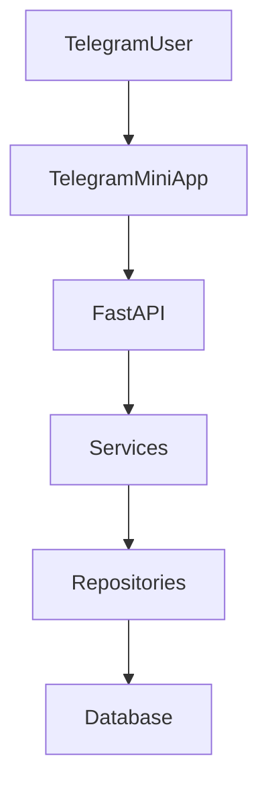

---

# Architecture Overview

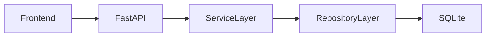

---

# Frontend Stack

## Технологии

| Компонент            | Технология          |
| -------------------- | ------------------- |
| UI                   | HTML                |
| Styles               | CSS                 |
| Logic                | JavaScript          |
| Telegram Integration | Telegram WebApp SDK |
| API                  | REST API            |
| Auth                 | Telegram InitData   |

---

# Mini App Modules

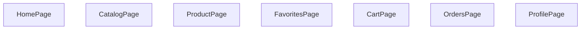

---

# Home Page

## Назначение

Главная страница приложения.

---

## Блоки

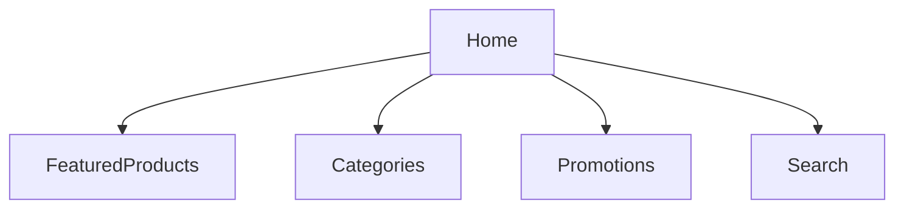

---

# Catalog Page

## Архитектура

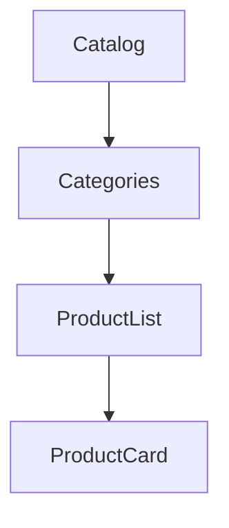

---

## Возможности

| Функция      |
| ------------ |
| Категории    |
| Подкатегории |
| Фильтры      |
| Сортировка   |
| Пагинация    |
| Поиск        |

---

# Product Page

## Архитектура

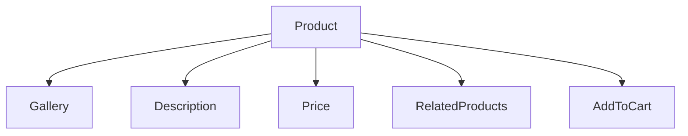

---

## Компоненты

| Блок           |
| -------------- |
| Фото           |
| Цена           |
| Описание       |
| Характеристики |
| Видео          |
| Отзывы         |
| Рекомендации   |

---

# Favorites Page

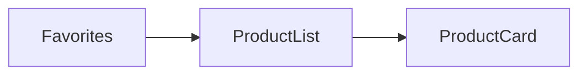

---

# Cart Page

## Архитектура

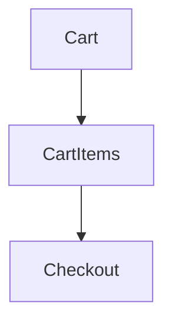

---

# Checkout Page

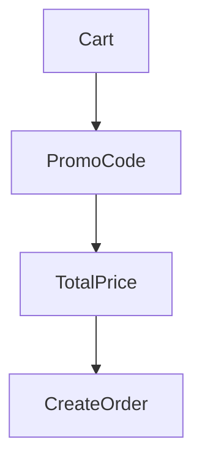

---

# Orders Page

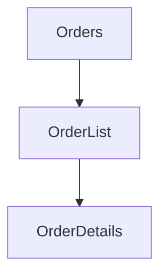

---

# Profile Page

## Данные пользователя

| Поле            |
| --------------- |
| Telegram ID     |
| Username        |
| Телефон         |
| Язык            |
| История заказов |

---

# Authentication

## Схема авторизации

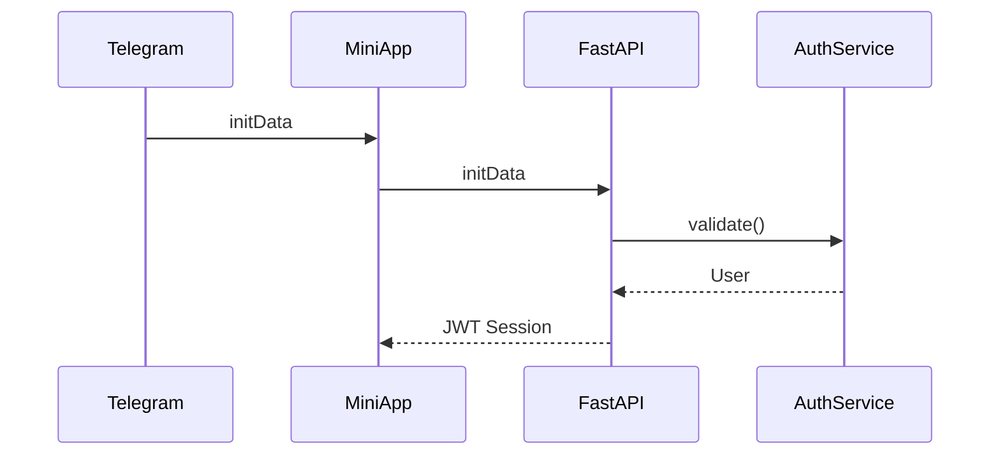

---

# Auth Flow


---

# FastAPI Structure

```text
app/api/

├── routers/
├── dependencies/
├── middleware/
├── schemas/
├── responses/
└── exceptions/
```

---

# API Routers

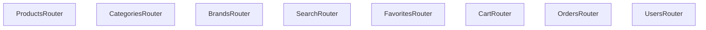

---

# Products Router

## Endpoints

| Method | Endpoint       |
| ------ | -------------- |
| GET    | /products      |
| GET    | /products/{id} |
| POST   | /products      |
| PATCH  | /products/{id} |
| DELETE | /products/{id} |

---

# Categories Router

| Method | Endpoint         |
| ------ | ---------------- |
| GET    | /categories      |
| GET    | /categories/tree |
| GET    | /categories/{id} |

---

# Search Router

| Method | Endpoint         |
| ------ | ---------------- |
| GET    | /search          |
| GET    | /search/products |

---

# Favorites Router

| Method | Endpoint        |
| ------ | --------------- |
| GET    | /favorites      |
| POST   | /favorites      |
| DELETE | /favorites/{id} |

---

# Cart Router

| Method | Endpoint     |
| ------ | ------------ |
| GET    | /cart        |
| POST   | /cart/add    |
| PATCH  | /cart/update |
| DELETE | /cart/remove |

---

# Orders Router

| Method | Endpoint     |
| ------ | ------------ |
| GET    | /orders      |
| GET    | /orders/{id} |
| POST   | /orders      |

---

# API Request Flow

```mermaid
sequenceDiagram

MiniApp->>FastAPI: HTTP Request

FastAPI->>Service

Service->>Repository

Repository->>Database

Database-->>Repository

Repository-->>Service

Service-->>FastAPI

FastAPI-->>MiniApp
```

---

# Service Layer

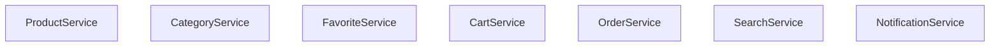

---

# Repository Layer

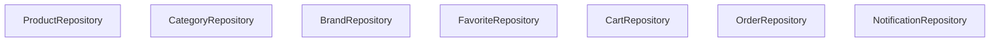

---

# API Error Handling

## Архитектура

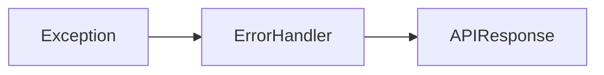

---

## Формат ошибки

```json
{
  "success": false,
  "error": {
    "code": "PRODUCT_NOT_FOUND",
    "message": "Product not found"
  }
}
```

---

# API Success Response

```json
{
  "success": true,
  "data": {}
}
```

---

# Pagination

## Формат

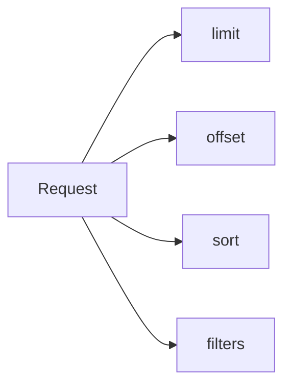

---

## Пример

```http
GET /products?limit=20&offset=0
```

---

# Deployment Architecture

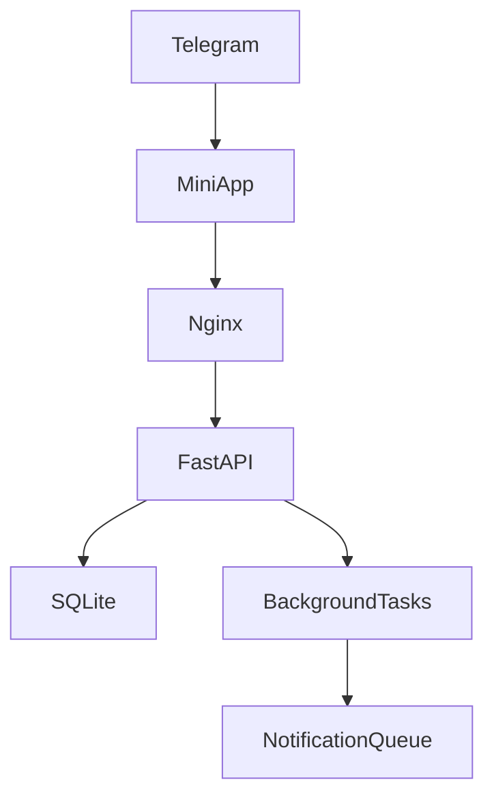

---

# Future PostgreSQL Migration

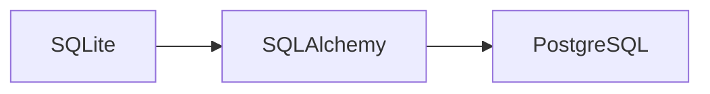

---

# Full Mini App Architecture

```mermaid
flowchart TD

TelegramUser

TelegramUser --> MiniApp

MiniApp --> FastAPI

FastAPI --> ProductService

FastAPI --> SearchService

FastAPI --> CartService

FastAPI --> OrderService

ProductService --> ProductRepository

SearchService --> ProductRepository

CartService --> CartRepository

OrderService --> OrderRepository

ProductRepository --> Database

CartRepository --> Database

OrderRepository --> Database
```

---

# TELESHOP System Overview

```mermaid
flowchart TD

TelegramUser

TelegramUser --> TelegramBot

TelegramUser --> MiniApp

TelegramBot --> ServiceLayer

MiniApp --> FastAPI

FastAPI --> ServiceLayer

ServiceLayer --> RepositoryLayer

RepositoryLayer --> Database

ImportSystem --> ServiceLayer

NotificationSystem --> TelegramBot

AdminPanel --> ServiceLayer
```
