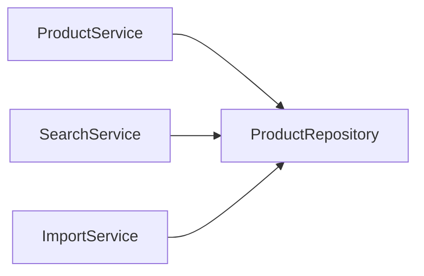
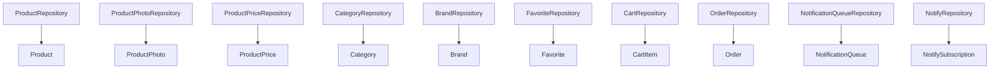
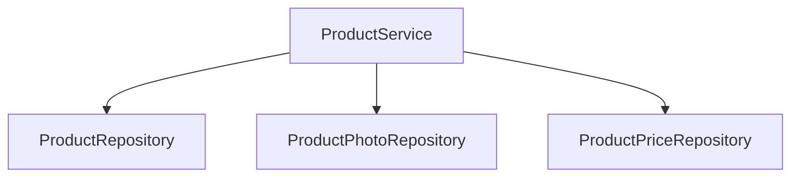
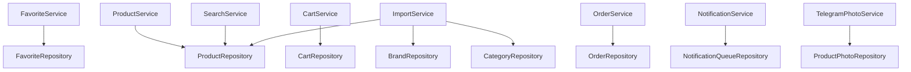
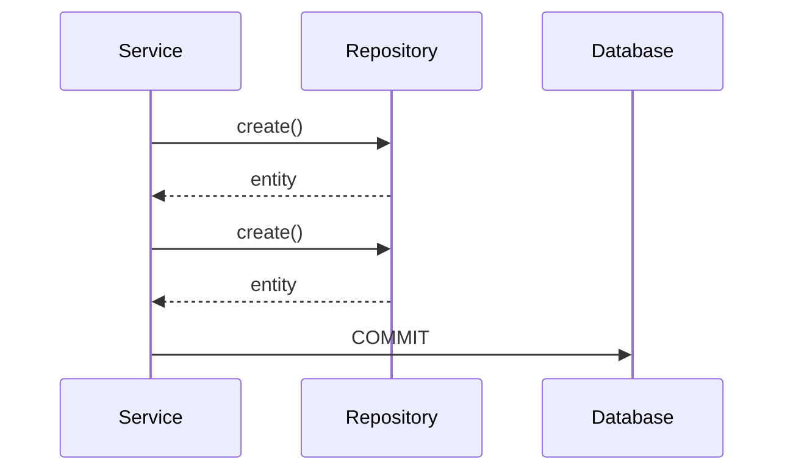
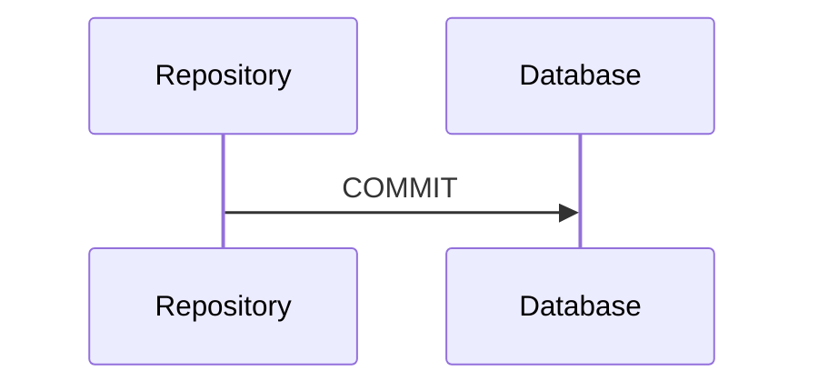

# Repository Contracts

## Назначение

Repository Layer отвечает исключительно за работу с БД.

Repository не содержит:

* бизнес-логику;
* Telegram API;
* валидацию;
* FSM;
* импорт.

---

# BaseRepository

## Интерфейс

```python
class BaseRepository(Generic[T]):

    async def create(
        self,
        data: dict
    ) -> T

    async def get_by_id(
        self,
        entity_id: int
    ) -> T | None

    async def update(
        self,
        entity_id: int,
        data: dict
    ) -> T

    async def delete(
        self,
        entity_id: int
    ) -> None

    async def exists(
        self,
        entity_id: int
    ) -> bool

    async def count() -> int
```

---

# ProductRepository

## Ответственность

Работа с таблицей products.

---

## Контракт

```python
class ProductRepository:
```

| Метод             | Возвращает     | Назначение          |
| ----------------- | -------------- | ------------------- |
| create()          | Product        | Создание товара     |
| update()          | Product        | Обновление          |
| get_by_id()       | Product | None | Поиск по ID         |
| get_by_uuid()     | Product | None | Поиск по UUID       |
| get_by_sku()      | Product | None | Поиск по SKU        |
| get_by_slug()     | Product | None | Поиск по slug       |
| get_by_status()   | list[Product]  | По статусу          |
| get_by_category() | list[Product]  | По категории        |
| search()          | list[Product]  | Поиск               |
| increment_views() | None           | Увеличить просмотры |
| get_featured()    | list[Product]  | Рекомендуемые       |

---

## Используется



---

# ProductPhotoRepository

## Контракт

| Метод            | Возвращает         | Назначение        |
| ---------------- | ------------------ | ----------------- |
| create()         | ProductPhoto       | Создать фото      |
| delete()         | None               | Удалить           |
| get_by_product() | list[ProductPhoto] | Фото товара       |
| get_main_photo() | ProductPhoto       | Главное фото      |
| set_main_photo() | None               | Назначить главное |
| reorder()        | None               | Сортировка        |

---

# ProductPriceRepository

## Контракт

| Метод                | Возвращает                | Назначение        |
| -------------------- | ------------------------- | ----------------- |
| create()             | ProductPrice              | Создать цену      |
| get_current_price()  | ProductPrice              | Актуальная цена   |
| update_price()       | ProductPrice              | Изменить цену     |
| get_history()        | list[ProductPriceHistory] | История           |
| add_history_record() | None                      | История изменения |

---

# CategoryRepository

## Контракт

| Метод                 | Возвращает     |
| --------------------- | -------------- |
| create()              | Category       |
| update()              | Category       |
| delete()              | None           |
| get_by_id()           | Category       |
| get_by_slug()         | Category       |
| get_root_categories() | list[Category] |
| get_children()        | list[Category] |
| get_tree()            | list[Category] |

---

# BrandRepository

## Контракт

| Метод         | Возвращает  |
| ------------- | ----------- |
| create()      | Brand       |
| update()      | Brand       |
| get_by_id()   | Brand       |
| get_by_name() | Brand       |
| get_all()     | list[Brand] |

---

# FavoriteRepository

## Контракт

| Метод                | Возвращает     |
| -------------------- | -------------- |
| add()                | Favorite       |
| remove()             | None           |
| exists()             | bool           |
| get_user_favorites() | list[Favorite] |
| count_by_product()   | int            |

---

# CartRepository

## Контракт

| Метод             | Возвращает     |
| ----------------- | -------------- |
| add_item()        | CartItem       |
| remove_item()     | None           |
| update_quantity() | CartItem       |
| clear_cart()      | None           |
| get_user_cart()   | list[CartItem] |
| calculate_total() | int            |

---

# OrderRepository

## Контракт

| Метод             | Возвращает  |
| ----------------- | ----------- |
| create_order()    | Order       |
| get_by_id()       | Order       |
| get_user_orders() | list[Order] |
| add_item()        | OrderItem   |
| add_note()        | OrderNote   |
| update_status()   | Order       |
| cancel_order()    | Order       |

---

# NotificationQueueRepository

## Контракт

| Метод                | Возвращает              |
| -------------------- | ----------------------- |
| enqueue()            | NotificationQueue       |
| get_pending()        | list[NotificationQueue] |
| mark_sent()          | None                    |
| mark_failed()        | None                    |
| increment_attempts() | None                    |

---

# NotifyRepository

## Контракт

| Метод                     | Возвращает               |
| ------------------------- | ------------------------ |
| subscribe()               | NotifySubscription       |
| unsubscribe()             | None                     |
| get_subscriptions()       | list[NotifySubscription] |
| get_product_subscribers() | list[NotifySubscription] |
| activate()                | None                     |
| deactivate()              | None                     |

---

# Repository Dependency Diagram



---

# Service Contracts

## Назначение

Service Layer содержит всю бизнес-логику проекта.

---

# ProductService

## Ответственность

* создание товара;
* изменение товара;
* работа с фото;
* работа с ценами;
* изменение статуса.

---

## Контракт

| Метод             | Возвращает   |
| ----------------- | ------------ |
| create_product()  | Product      |
| update_product()  | Product      |
| delete_product()  | None         |
| reserve_product() | Product      |
| mark_as_sold()    | Product      |
| archive_product() | Product      |
| add_photo()       | ProductPhoto |
| remove_photo()    | None         |
| change_price()    | ProductPrice |

---

## Диаграмма



---

# SearchService

## Контракт

| Метод                 | Возвращает    |
| --------------------- | ------------- |
| search_products()     | list[Product] |
| normalize_query()     | str           |
| replace_yo()          | str           |
| replace_hard_sign()   | str           |
| fix_keyboard_layout() | str           |

---

# FavoriteService

## Контракт

| Метод                   | Возвращает     |
| ----------------------- | -------------- |
| add_to_favorites()      | Favorite       |
| remove_from_favorites() | None           |
| get_user_favorites()    | list[Favorite] |

---

# CartService

## Контракт

| Метод             | Возвращает     |
| ----------------- | -------------- |
| add_item()        | CartItem       |
| remove_item()     | None           |
| clear_cart()      | None           |
| get_cart()        | list[CartItem] |
| calculate_total() | int            |

---

# OrderService

## Контракт

| Метод            | Возвращает |
| ---------------- | ---------- |
| create_order()   | Order      |
| pay_order()      | Order      |
| ship_order()     | Order      |
| complete_order() | Order      |
| cancel_order()   | Order      |

---

# NotificationService

## Контракт

| Метод            | Возвращает        |
| ---------------- | ----------------- |
| enqueue()        | NotificationQueue |
| send()           | None              |
| retry()          | None              |
| process_queue()  | None              |
| send_broadcast() | int               |

---

# ImportService

## Контракт

| Метод             | Возвращает       |
| ----------------- | ---------------- |
| preview_import()  | ImportPreview    |
| validate_rows()   | ValidationResult |
| import_xlsx()     | ImportResult     |
| import_photos()   | ImportResult     |
| rollback_import() | None             |

---

# TelegramPhotoService

## Контракт

| Метод          | Возвращает   |
| -------------- | ------------ |
| upload_photo() | ProductPhoto |
| save_file_id() | ProductPhoto |
| delete_photo() | None         |

---

# SKUService

## Контракт

| Метод          | Возвращает |
| -------------- | ---------- |
| generate_sku() | str        |
| validate_sku() | bool       |
| reserve_sku()  | str        |

---

# Service Dependency Diagram



---

# Transaction Boundaries

## Правило

Транзакциями управляют только сервисы.

---

## Правильно



---

## Неправильно



---

# Layer Rules


## Запрещено

* Handler → Repository
* Handler → Database
* Service → SQL
* Repository → Telegram API

## Разрешено

* Handler → Service
* Service → Repository
* Repository → Database

```
```
