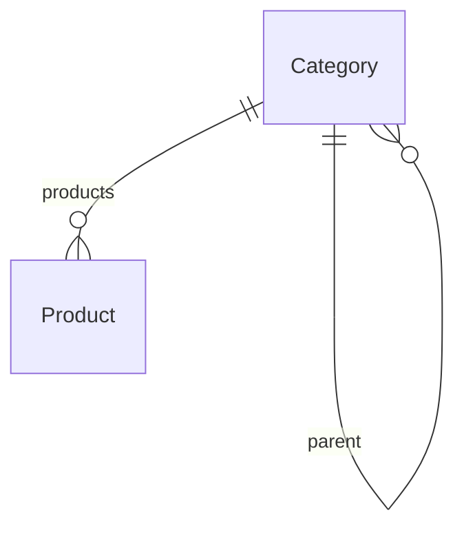

# Database Models Specification

## Category

### Назначение

Категория каталога товаров.

### Таблица

| Поле | Тип | Описание |
|-------|-------|-------|
| id | Integer PK | Первичный ключ |
| parent_id | Integer FK | Родительская категория |
| name_ru | String(80) | Название на русском |
| name_uk | String(80) | Название на украинском |
| name_en | String(80) | Название на английском |
| slug | String(120) | SEO URL |
| seo_title | String(150) | SEO заголовок |
| seo_description | String(300) | SEO описание |
| sort_order | Integer | Порядок сортировки |
| is_service | Boolean | Категория услуг |
| show_in_main_menu | Boolean | Показывать в меню |
| created_at | DateTime | Дата создания |
| updated_at | DateTime | Дата изменения |

### Relationships

### Indexes

| Поле |
|--------|
| slug |
| parent_id |
| sort_order |

### Business Rules

- Корневая категория имеет parent_id = NULL.
- Удаление категории запрещено при наличии товаров.
- Slug должен быть уникальным.