# Service Workflows

## Назначение

Данный раздел описывает основные бизнес-процессы TELESHOP.

Каждая диаграмма показывает полный путь выполнения операции через слои системы:

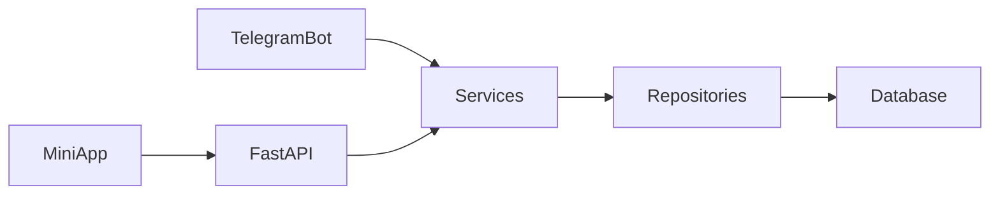

---

# Product Creation Workflow

## Создание товара

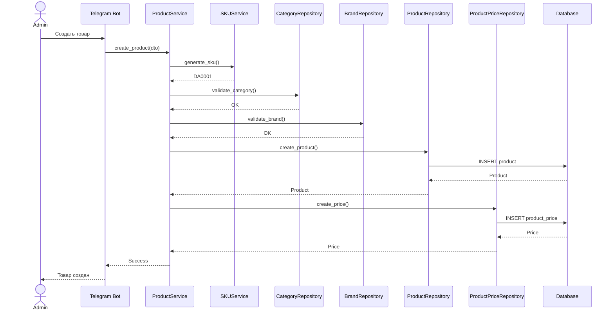

---

# Product Status Workflow

## Жизненный цикл товара

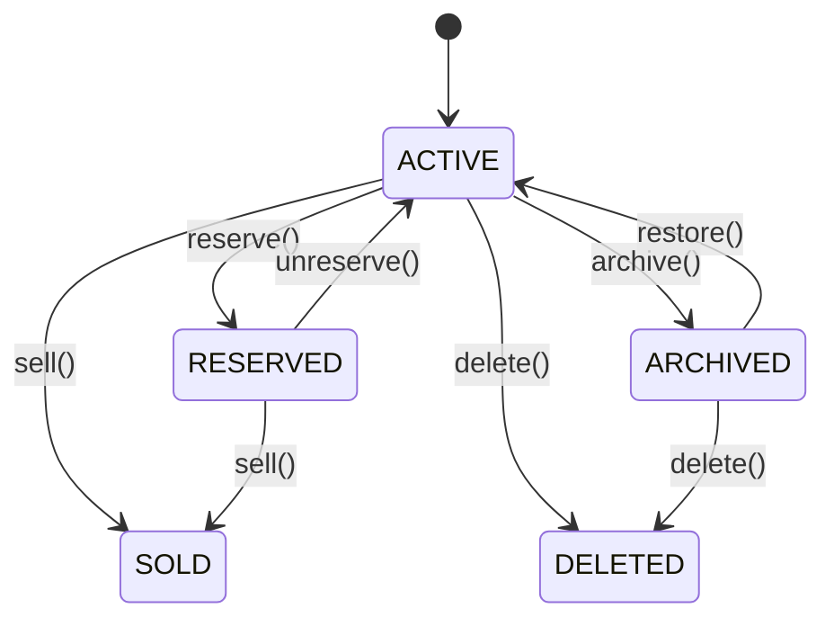

---

# Add To Favorites Workflow

## Добавление в избранное

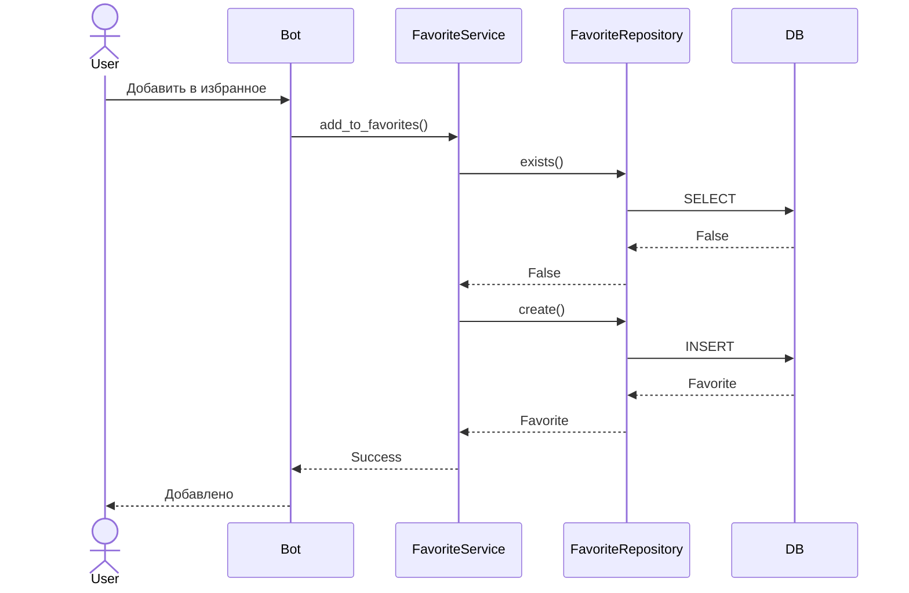

---

# Add To Cart Workflow

## Добавление товара в корзину

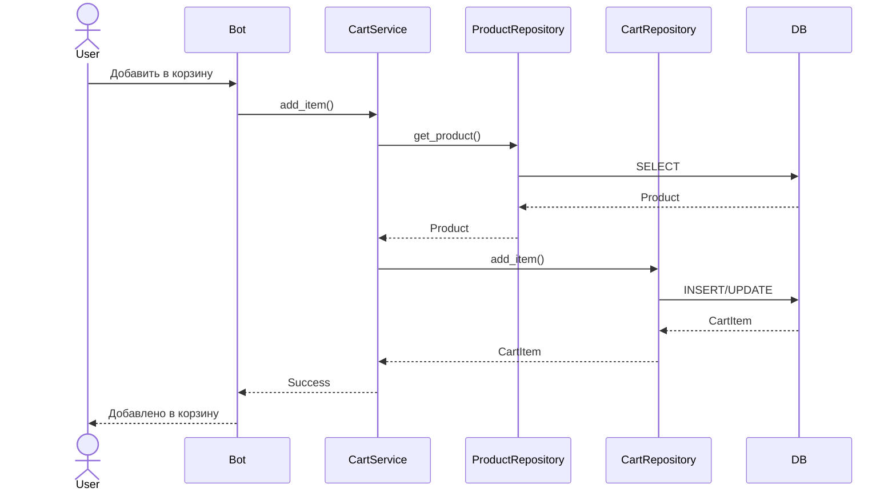

---

# Cart Merge Workflow

## Повторное добавление товара

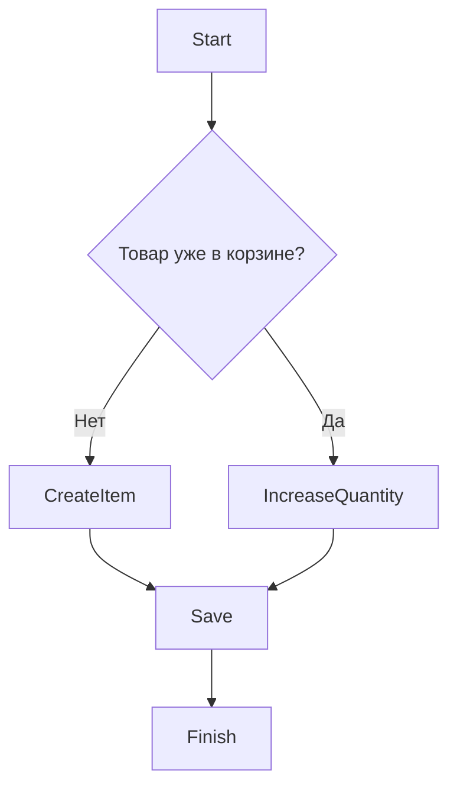

---

# Checkout Workflow

## Оформление заказа

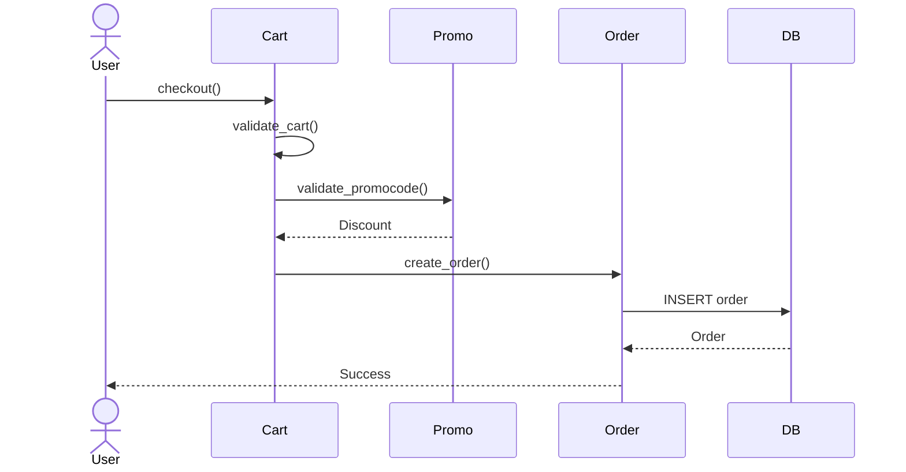

---

# Order Creation Workflow

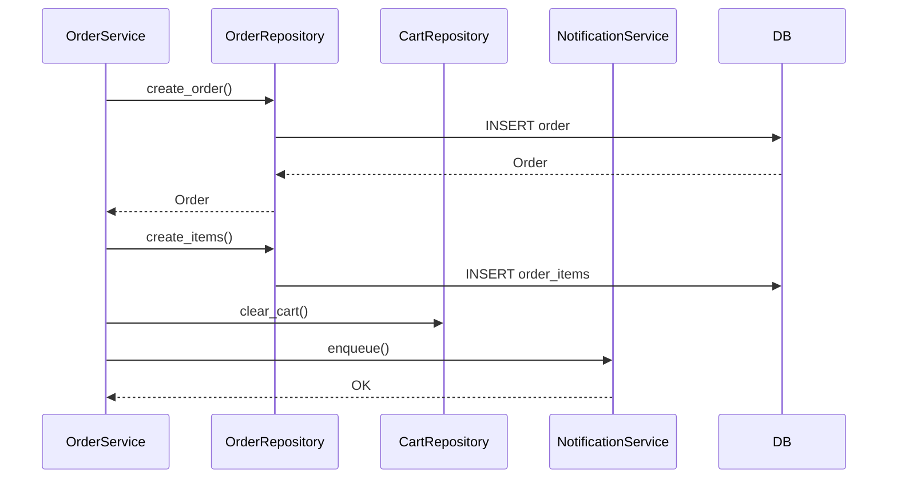

---

# Order Lifecycle Workflow

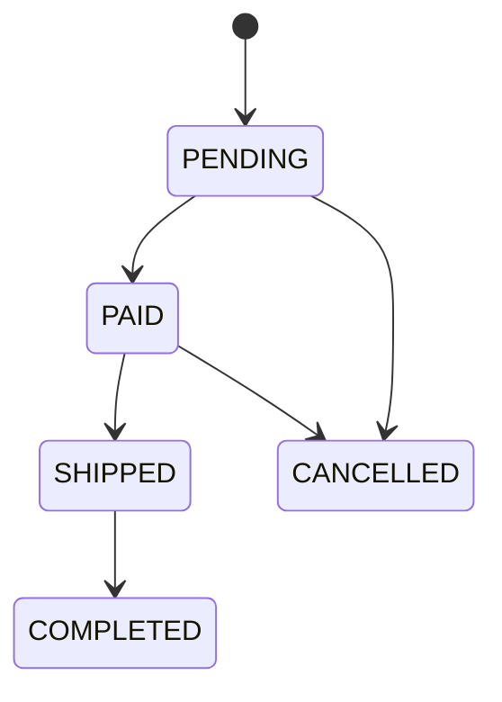

---

# Price Change Workflow

## Изменение цены товара

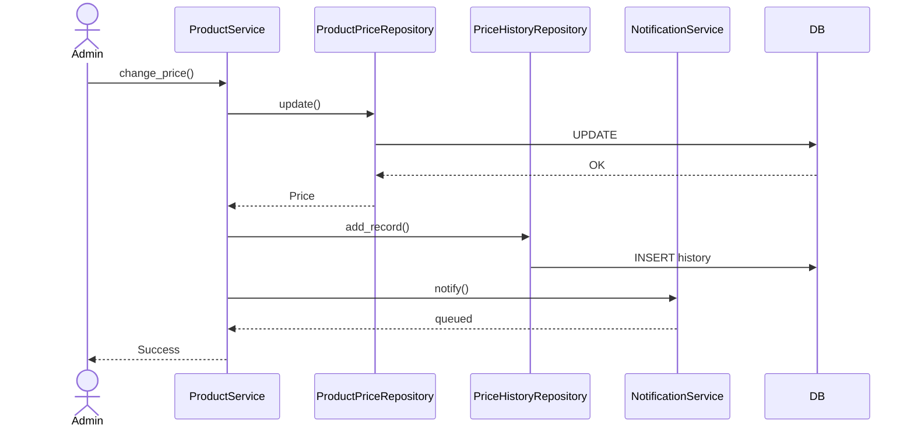

---

# Search Workflow

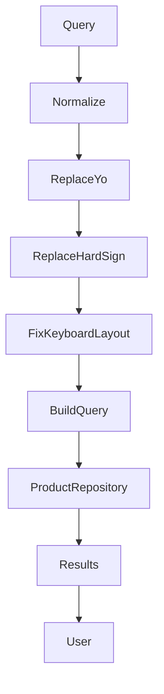

---

# Product View Workflow

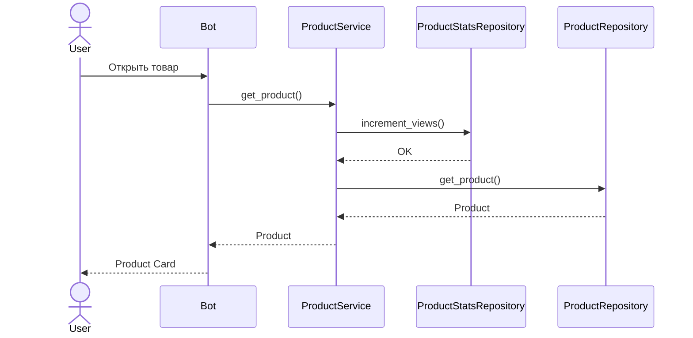

---

# XLSX Import Workflow

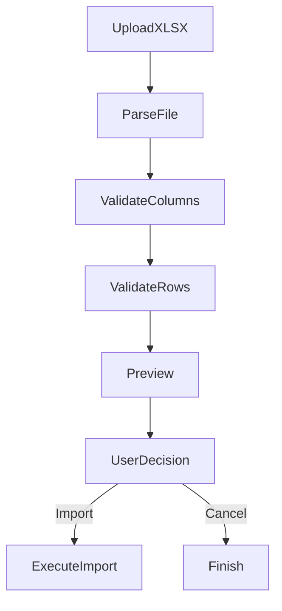

---

# Import Commit Workflow

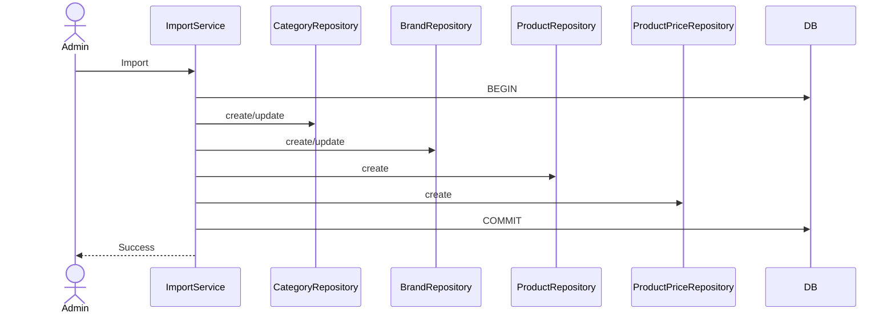

---

# ZIP Photo Import Workflow

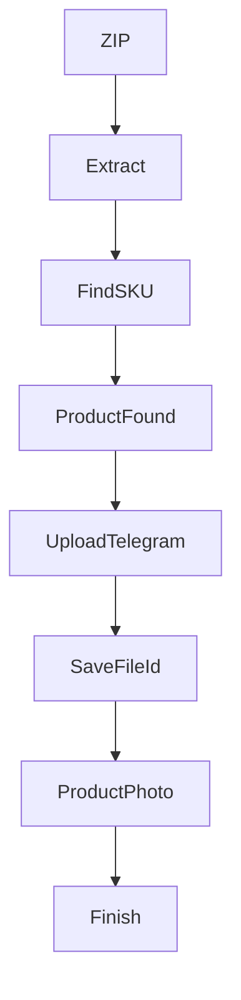

---

# Notification Workflow

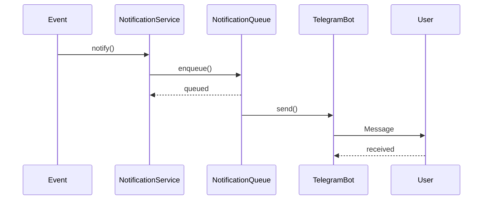

---

# Notification Queue Workflow

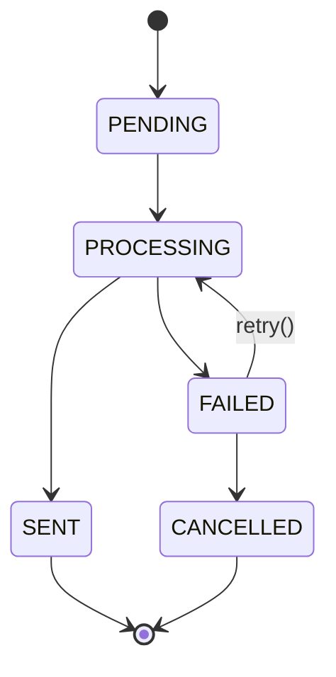

---

# Broadcast Workflow

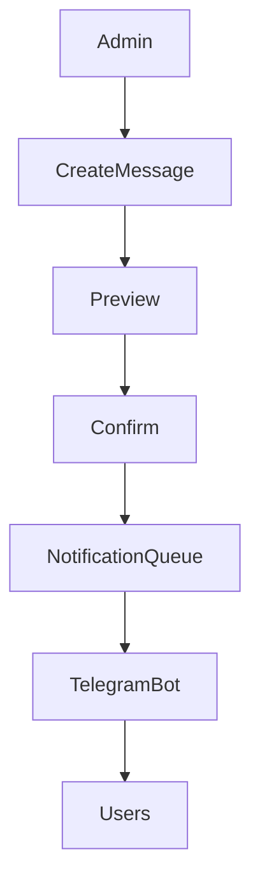

---

# Full TELESHOP Business Process Map

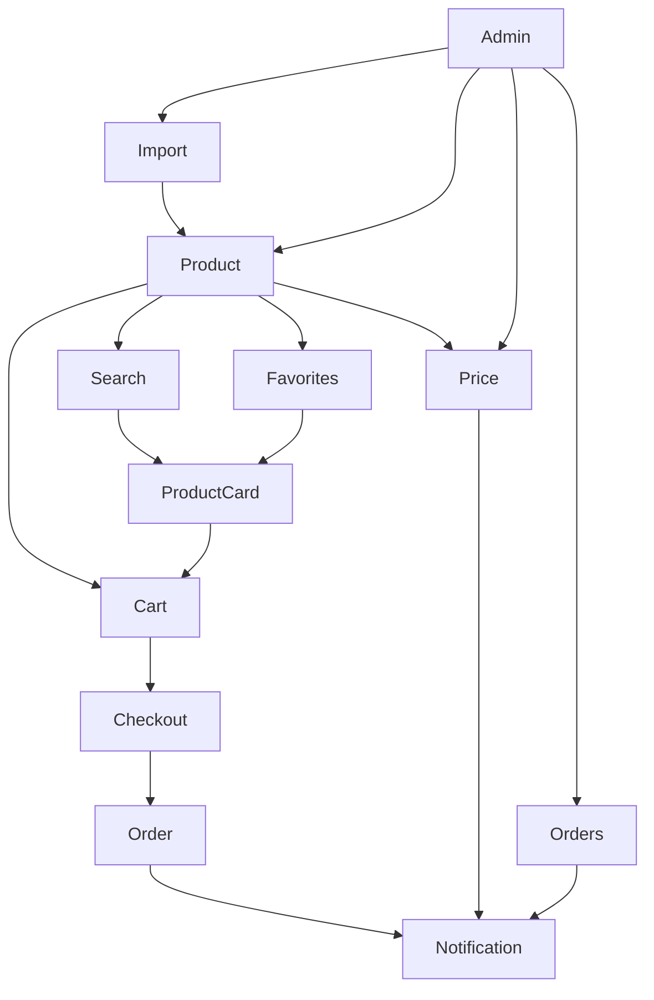