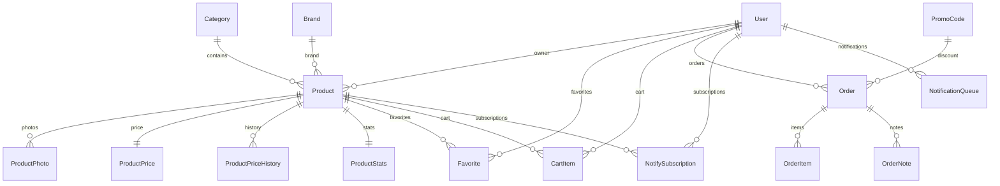
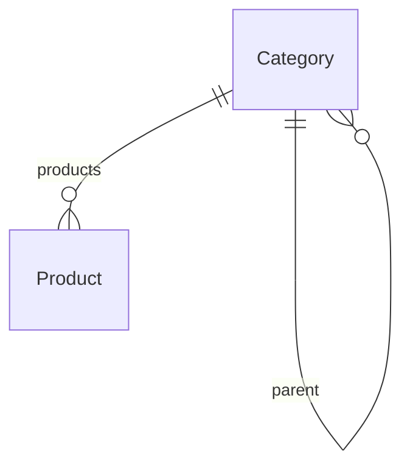
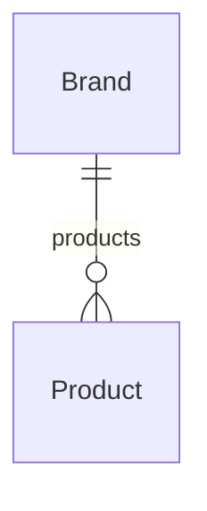
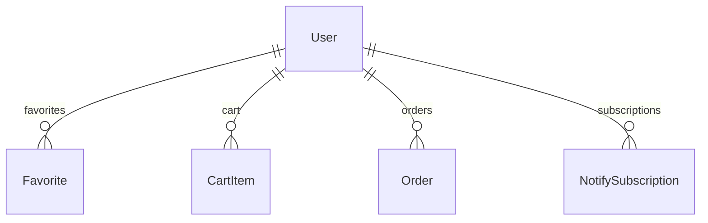
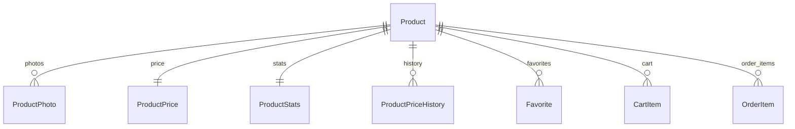

# Database Models Specification

## Model Dependency Diagram



---

# Category

## Назначение

Категория каталога товаров.

Поддерживает древовидную структуру.

---

## Таблица categories

| Поле | Тип | Назначение |
|--------|--------|--------|
| id | Integer PK | Первичный ключ |
| parent_id | Integer FK | Родительская категория |
| name_ru | String(80) | Русское название |
| name_uk | String(80) | Украинское название |
| name_en | String(80) | Английское название |
| slug | String(120) | SEO URL |
| seo_title | String(150) | SEO Title |
| seo_description | String(300) | SEO Description |
| sort_order | Integer | Сортировка |
| is_service | Boolean | Категория услуг |
| show_in_main_menu | Boolean | Показывать в меню |
| created_at | DateTime | Создание |
| updated_at | DateTime | Обновление |

---

## Relationships



---

## Indexes

| Поле |
|--------|
| parent_id |
| slug |
| sort_order |

---

## Constraints

```text
slug UNIQUE
```

---

## Business Rules

- parent_id = NULL для корневых категорий.
- slug обязан быть уникальным.
- удаление запрещено при наличии товаров.
- допускается неограниченная вложенность.

---

# Brand

## Назначение

Производитель товара.

---

## Таблица brands

| Поле | Тип | Назначение |
|--------|--------|--------|
| id | Integer PK | Первичный ключ |
| name | String(255) | Название бренда |
| slug | String(255) | SEO URL |
| description | Text | Описание |
| website | String(500) | Сайт производителя |
| created_at | DateTime | Создание |
| updated_at | DateTime | Обновление |

---

## Relationships



---

## Indexes

| Поле |
|--------|
| slug |
| name |

---

## Constraints

```text
name UNIQUE
slug UNIQUE
```

---

# User

## Назначение

Пользователь Telegram.

---

## Таблица users

| Поле | Тип | Назначение |
|--------|--------|--------|
| id | Integer PK | Первичный ключ |
| telegram_id | BigInteger | Telegram ID |
| username | String(255) | Username |
| first_name | String(255) | Имя |
| last_name | String(255) | Фамилия |
| phone | String(50) | Телефон |
| language | String(10) | Язык |
| is_admin | Boolean | Администратор |
| created_at | DateTime | Создание |
| updated_at | DateTime | Обновление |

---

## Relationships



---

## Indexes

| Поле |
|--------|
| telegram_id |
| username |

---

## Constraints

```text
telegram_id UNIQUE
```

---

## Business Rules

- пользователь создаётся автоматически при первом сообщении боту;
- telegram_id никогда не меняется;
- пользователь может стать администратором только вручную.

---

# Product

## Назначение

Основная сущность каталога.

---

## Таблица products

| Поле | Тип | Назначение |
|--------|--------|--------|
| id | Integer PK | Первичный ключ |
| uuid | String(36) | Публичный идентификатор |
| sku | String(50) | Артикул |
| category_id | Integer FK | Категория |
| brand_id | Integer FK | Бренд |
| owner_id | Integer FK | Владелец |
| title | String(500) | Название |
| short_description | Text | Краткое описание |
| full_description | Text | Полное описание |
| condition | Enum | Состояние |
| status | Enum | Статус |
| manufacturer_name | String(255) | Производитель |
| manufacturer_sku | String(255) | Артикул производителя |
| barcode | String(255) | Штрихкод |
| serial_number | String(255) | Серийный номер |
| quantity | Integer | Остаток |
| weight_g | Integer | Вес в граммах |
| attributes_json | JSON | Характеристики |
| search_text | Text | Поисковый текст |
| search_text_normalized | Text | Нормализованный поиск |
| is_featured | Boolean | Рекомендуемый |
| featured_until | DateTime | До какой даты |
| created_at | DateTime | Создание |
| updated_at | DateTime | Обновление |

---

## Relationships



---

## Indexes

| Поле |
|--------|
| uuid |
| sku |
| category_id |
| brand_id |
| status |
| search_text_normalized |

---

## Constraints

```text
uuid UNIQUE
sku UNIQUE
```

---

## Business Rules

- цена хранится отдельно в ProductPrice;
- фотографии хранятся отдельно в ProductPhoto;
- статистика хранится отдельно в ProductStats;
- вес хранится только в граммах;
- деньги внутри Product запрещены;
- товар может существовать без фотографий;
- товар может существовать без бренда.