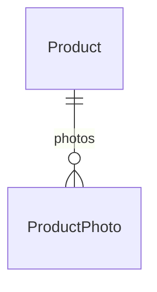
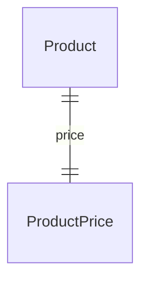
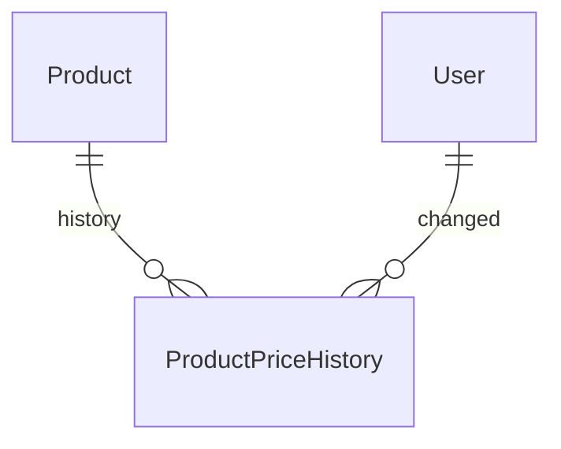
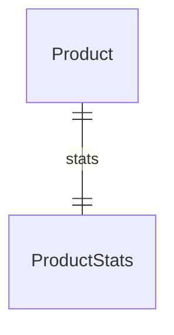
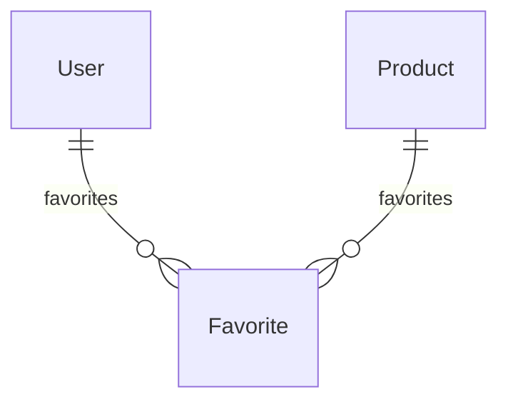
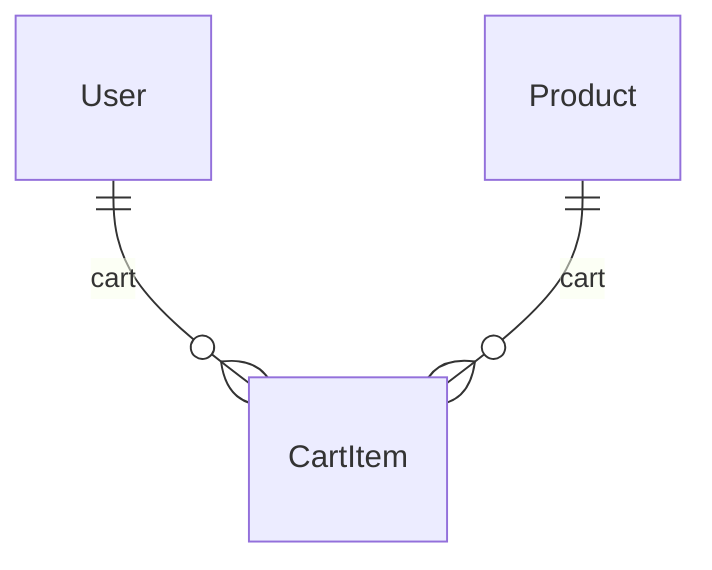
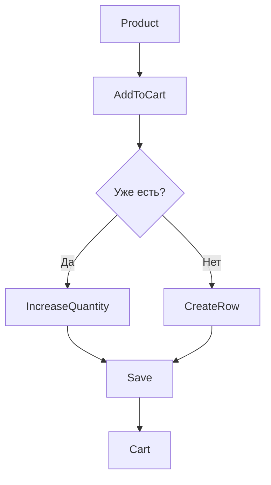
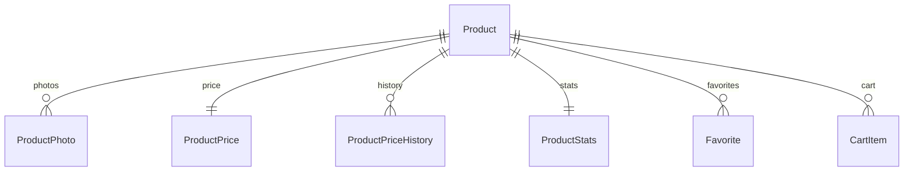

# Database Models Specification

# ProductPhoto

## Назначение

Фотографии товара.

Товар может иметь до 9 фотографий.

---

## Таблица product_photos

| Поле | Тип | Назначение |
|--------|--------|--------|
| id | Integer PK | Первичный ключ |
| product_id | Integer FK | Товар |
| telegram_file_id | String(255) | Telegram File ID |
| telegram_file_unique_id | String(255) | Уникальный идентификатор Telegram |
| original_filename | String(255) | Исходное имя файла |
| sort_order | Integer | Порядок отображения |
| is_main | Boolean | Главное фото |
| created_at | DateTime | Дата создания |

---

## Relationships



---

## Indexes

| Поле |
|--------|
| product_id |
| telegram_file_unique_id |
| sort_order |

---

## Business Rules

- Максимум 9 фотографий на товар.
- Только одно фото может быть главным.
- Первое загруженное фото автоматически становится главным.
- Фото не хранятся в БД.
- Хранятся только Telegram идентификаторы.

---

# ProductPrice

## Назначение

Текущая цена товара.

Все денежные значения хранятся как Integer.

---

## Таблица product_prices

| Поле | Тип | Назначение |
|--------|--------|--------|
| id | Integer PK | Первичный ключ |
| product_id | Integer FK | Товар |
| price_type | Enum | Тип цены |
| currency | String(3) | Валюта |
| price_uah_cached | Integer | Цена в гривне для фильтрации |
| price_from_value | Integer | Основная цена или начало диапазона |
| price_to_value | Integer NULL | Конец диапазона |
| created_at | DateTime | Создание |
| updated_at | DateTime | Обновление |

---

## Relationships



---

## Indexes

| Поле |
|--------|
| product_id |
| currency |
| price_type |
| price_uah_cached |

---

## Price Types

| Тип |
|--------|
| FIXED |
| FROM |
| RANGE |
| ON_REQUEST |

---

## Business Rules

- У товара только одна активная цена.
- Деньги всегда Integer.
- Валюта хранится как VARCHAR(3).
- Для поиска используется price_uah_cached.

---

# ProductPriceHistory

## Назначение

История изменения цены товара.

---

## Таблица product_price_history

| Поле | Тип | Назначение |
|--------|--------|--------|
| id | Integer PK | Первичный ключ |
| product_id | Integer FK | Товар |
| old_price | Integer | Старая цена |
| new_price | Integer | Новая цена |
| currency | String(3) | Валюта |
| changed_by | Integer FK | Пользователь изменивший цену |
| changed_at | DateTime | Время изменения |

---

## Relationships



---

## Indexes

| Поле |
|--------|
| product_id |
| changed_at |

---

## Business Rules

- Записи никогда не удаляются.
- Каждое изменение цены фиксируется.
- История используется для аналитики.

---

# ProductStats

## Назначение

Статистика товара.

Хранится отдельно для ускорения каталога.

---

## Таблица product_stats

| Поле | Тип | Назначение |
|--------|--------|--------|
| id | Integer PK | Первичный ключ |
| product_id | Integer FK UNIQUE | Товар |
| views_count | Integer | Просмотры |
| favorites_count | Integer | Добавления в избранное |
| orders_count | Integer | Количество продаж |
| rating_avg | Numeric(3,2) | Средний рейтинг |
| reviews_count | Integer | Количество отзывов |
| last_view_at | DateTime | Последний просмотр |
| updated_at | DateTime | Обновление статистики |

---

## Relationships



---

## Indexes

| Поле |
|--------|
| product_id |
| views_count |
| orders_count |
| rating_avg |

---

## Business Rules

- Создаётся автоматически вместе с товаром.
- Не удаляется отдельно от товара.
- Используется для рекомендаций.

---

# Favorite

## Назначение

Избранные товары пользователя.

---

## Таблица favorites

| Поле | Тип | Назначение |
|--------|--------|--------|
| id | Integer PK | Первичный ключ |
| user_id | Integer FK | Пользователь |
| product_id | Integer FK | Товар |
| created_at | DateTime | Добавление |

---

## Relationships



---

## Indexes

| Поле |
|--------|
| user_id |
| product_id |

---

## Constraints

```text
UNIQUE(user_id, product_id)
```

---

## Business Rules

- Максимум 30 товаров.
- Один товар нельзя добавить дважды.
- При удалении товара запись удаляется автоматически.

---

# CartItem

## Назначение

Позиция корзины пользователя.

---

## Таблица cart_items

| Поле | Тип | Назначение |
|--------|--------|--------|
| id | Integer PK | Первичный ключ |
| user_id | Integer FK | Пользователь |
| product_id | Integer FK | Товар |
| quantity | Integer | Количество |
| created_at | DateTime | Добавление |
| updated_at | DateTime | Изменение |

---

## Relationships



---

## Indexes

| Поле |
|--------|
| user_id |
| product_id |

---

## Constraints

```text
UNIQUE(user_id, product_id)
```

---

## Business Rules

- Повторное добавление увеличивает quantity.
- Новая строка не создаётся.
- quantity всегда больше 0.
- Корзина очищается после оформления заказа.

---

## Cart Workflow



---

## Catalog Core Diagram

